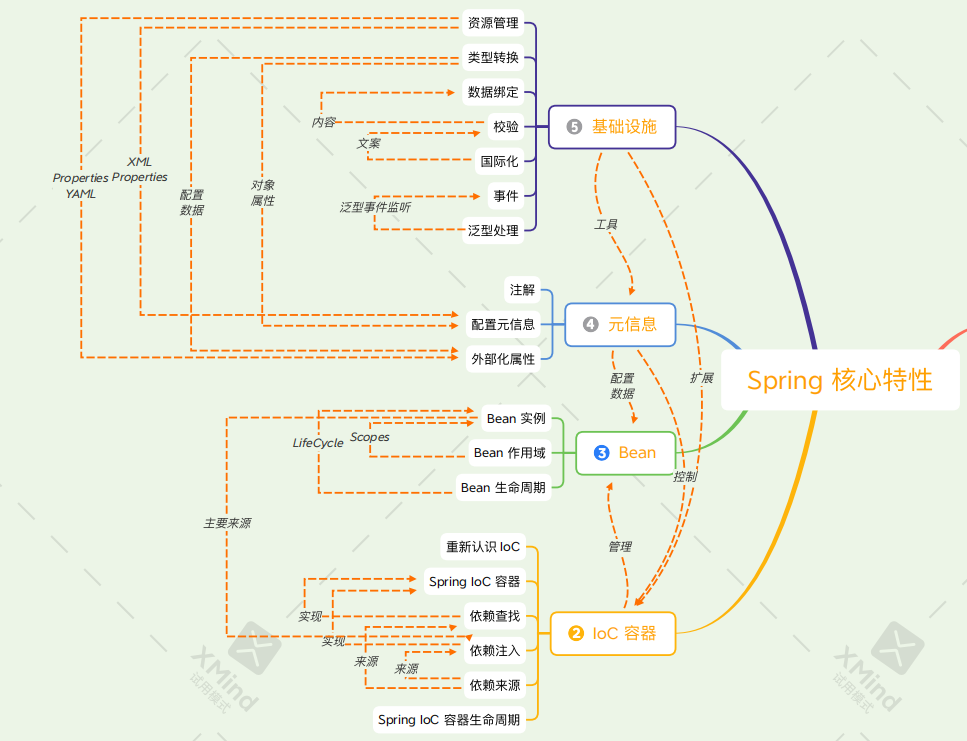
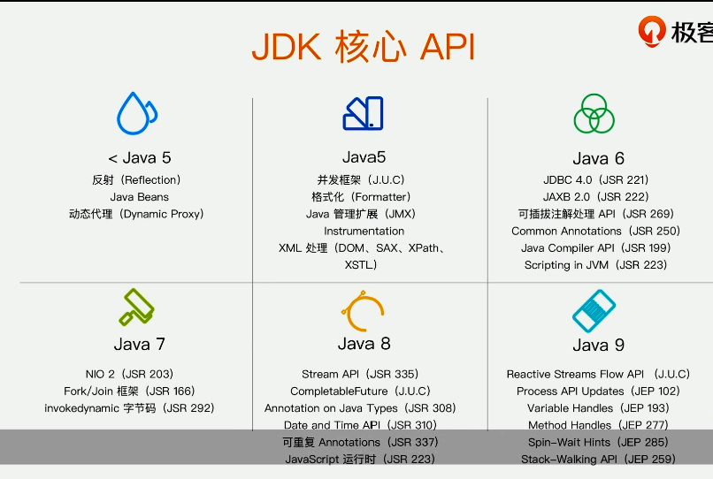

# 1. Spring 总览

1. Java 语言特性：反射，动态代理，枚举，泛型，注解，ARM，lambda
2. 设计思想和模式的实现：OOP，IOC，DDD，TDD，GoF23
3. Java API 的封装与简化：JDBC 事务，Servlet，JPA，JMX，Bean Validation
4. JSR 规范的适配与实现
5. 第三方框架的整合：Mybatis，Redis


> 深入学习 Spring 的难点有哪些？

Spring 在战略层面设计思想和协议规范上被高估，如 OOP，IOC，AOP 设计模式并没有明显突破，都是业界已经成熟的思想。而在战术层面 API 抽象能力，模块化设计，功能的稳定性，可扩展性，可测试性则非常优秀

## 1.1 Spring 5 大核心特性

Spring 共有 5 大 核心特性，如下所示：



### 1. Spring 的 5 种编程模型

1. 面向对象编程，由于 Java 只支持单继承，所以在 Spring 中都是面向接口编程，通过**实现契约接口来**规范每个类需要实现的功能
2. 面向切面编程，利用**动态代理或字节码注入**实现 AOP 编程
3. 面向元编程，通过 **配置元信息，注解，属性配置** 来控制程序
4. 面向模块编程，通过 **Maven，Java9 Modules，Spring @Enable* 注解** 来实现模块化编程，需要使用某个模块时，可以通过这三种方式来引入该模块。@EnableAutoConfiguration 在SpringBoot 中用到，@EnableMvc @EnableCache 在 Mvc 和 缓存时用到
5. 面向函数编程，通过 **lambda 和 Reactive** 来实现函数编程，WebFlux 就是使用了 Reactive，也是未来的趋势

### 2. IoC 容器

1. Spring IOC 容器
2. 依赖查找
3. 依赖注入
4. 依赖来源
5. IOC 容器的生命周期


IOC 容器有两种实现方式：

1. 依赖查找
2. 依赖注入

依赖查找和依赖注入都需要有一个**依赖来源**

IOC 容器可以管理 Bean

### 3 Bean

1. Bean 实例
2. Bean 作用域
3. Bean 生命周期

Bean 实例的主要来源是依赖注入，Bean 实例有两个重要特性：作用域 scope 与 生命周期 lifecycle

Spring Bean 提供了很多扩展点，在实例化，初始化，销毁时都可以有一些自定义方法被执行，

这并不是 Spring 的独创，很多容器也会有这样的实现方式，如 Servlet 容器也有初始化，实例化，销毁时机的扩展点。

### 4 元信息 

1. 注解
2. 配置元信息，可以通过 xml 或 properties 方式配置，
3. 外部化配置


元信息可以配置 Bean：可以在 XML 或 Java 代码里配置一些 Bean

元信息可以为 Bean 提供数据：外部化配置可以提供一些占位符或者阈值供 Bean 使用

元信息可以控制 IOC 容器，比如利用注解 @Autowired 和 @Qulifier 注解来设置依赖注入的方式，是按照类型或者名称进行自动绑定

### 5 基础设施

1. 资源管理
2. 类型转换
3. 数据绑定
4. 校验
5. 国际化
6. 事件
7. 泛型处理


类型转换也能为配置元信息提供支持，将配置的资源文件路径转换为 Resouces 对象，将配置中的字符串属性转换为 Integer，都是 Spring 类型转换提供支持


**学习方法**

基础：夯实基础，了解动态。Java 基础反射注解等，了解 Java 新特性，云原生等新行业动态

思考：保持怀疑，验证一切。源码分析遇到一些问题，不要急于下结论，要对自己的结论保持怀疑，在论证过程中需要从多个方面去验证

分析：不拘小节，观其大意。在分析源码和分析原理时，不要拘泥于细节，应该观其大意，因为每一种写法和细节都有个人的偏好和习惯，太过注重细节，会得不偿失

实践：思辨结合，学以致用。思考的辩论需要结合，在思考的同时，要和自己辩论不断的反驳自己，学懂了要去运用，才能发现自己的知识盲点，才能巩固已经学到的知识


## 1.2 Spring 模块化设计

Spring 将模块划分成细粒度的 jar 包，可以按需分配进行依赖，目前有近 20个模块。

- spring-core ：Spring 核心包

- spring-beans ： bean 的相关，依赖注入，依赖管理

- spring-context ：Spring 上下文，和 spring-beans 就是 IOC 的实现

- spring-aop ：面向切面编程

- spring-aspects ：Spring 对 aspects 的支持

- spring-test ：Mock 对象，测试上下文 TestContext，WebClient 的测试，Maven 引入时设置 scope 为 test，只在测试场景引入

- spring-jdbc ：对 JDBC 的整合

- spring-tx ：对事务的抽象

- spring-orm ：对 JPA 的整合

- spring-web ：对 Servlet API 的整合

- spring-webmvc ：MVC 使用注解驱动的方式开发 REST 服务

- spring-webflux ： 对 Reactive 的支持

- spring-websocket ：对 WebSocket 的整合

- spring-jmx ：对 JMX 规范的整合

- spring-message ：对消息中间件的整合

- spring-instrument ：对 Java agent 装配的支持

- spring-jcl ：统一日志管理

  

## 1.3 Spring 对 Java 新特性的支持

下图展示了 JDK 各个版本引入的新特性




| API                | Spring 支持版本 | 代表实现                                                    |
| ------------------ | --------------- | ----------------------------------------------------------- |
| 反射               | 1.0             | MethodMatcher                                               |
| Java Beans         | 1.0             | CachedIntrospectionResults                                  |
| 动态代理           | 1.0             | JdkDynamicAopProxy                                          |
| XML 处理           | 1.0             | XMLBeanDefinitionReader                                     |
| Java 管理扩展 JMX  | 1.2             | @ManagedResource                                            |
| Instrumentation    | 2.0             | InstrumentationSavingAgent                                  |
| JUC                | 3.0             | ThreadPoolTaskScheduler                                     |
| 格式化 Formatter   | 3.0             | DateFormatter                                               |
| JDBC               | 1.0             | Jdbctemplate                                                |
| Common Annotations | 2.5             | CommonAnnotationBeanPostProcessor @Resource  @PostConstruct |
| 编译时注解处理     | 5.0             | @ComponetScan 可以在编译时扫描到所有@Component              |
| Java Compiler API  | 5.0             | TestCompiler 单元测试                                       |
| Fork-Join 框架     | 3.1             | ForkJoinPoolFactoryBean                                     |
| NIO 2              | 3.0             | PathResource                                                |
| Data Time API      | 4.0             | DateTimeContext                                             |
| 可重复 Anntations  | 4.0             | @PropertySources                                            |
| CompletableFuture  | 4.2             | CompletableToListenableFutureAdapter                        |


## 1.4 Spring 编程模型

### 1. 面向对象编程

契约接口：Aware，BeanPostProcessor

设计模式：观察者模式，组合模式，模板模式

对象继承：Abstract* 类


1. Aware 接口用来规范感知使用 Spring 容器的功能或资源，Spring 框架提供了许多 Aware 接口的实现类，用于辅助访问 Spring 容器的功能或资源，比如使用 ApplicationContextAware 获取 ApplicationContext。

```java
ApplicationContextAware.java

public interface ApplicationContextAware extends Aware {
    
	void setApplicationContext(ApplicationContext applicationContext) 
        throws BeansException;
}
```

ApplicationContextAware 接口实现了 Aware 接口，表示是用来获取 ApplicationContext 的，当我们想要获取 ApplicationContext 时，就可以实现该接口，重写其方法，例如下面我们需要使用 ApplicationContext 获取容器中的某个 Bean，就必须实现 ApplicationContextAware 接口。

```java
@RunWith(SpringRunner.class)
@SpringBootTest(classes = Sb2Application.class)
public class Sb2ApplicationTests3 implements ApplicationContextAware {

    private ApplicationContext applicationContext;
    
    // 该方法会被Spring回调, 传入applicationContext对象供用户使用
    @Override
    public void setApplicationContext(ApplicationContext applicationContext) throws BeansException {
        this.applicationContext = applicationContext;
    }

    // 使用 applicationContext 获取容器中的 bean
    @Test
    public void testCondi() {
        System.out.println(applicationContext.getBean(MoocCondi.class));;
    }
}
```

2. BeanPostProcessor 接口用来规范 bean 的生命周期的后置处理，有两个功能，在bean初始化前进行一些操作，在bean初始化后进行一些操作。

```java
public interface BeanPostProcessor {

   @Nullable
   default Object postProcessBeforeInitialization(Object bean, String beanName) throws BeansException {
      return bean;
   }

   @Nullable
   default Object postProcessAfterInitialization(Object bean, String beanName) throws BeansException {
      return bean;
   }
}
```

具体可以参考这篇文章[Spring之BeanPostProcessor(后置处理器)介绍](https://blog.csdn.net/qq_38526573/article/details/88086752)，写的非常清楚


3. 观察者模式，SimpleApplicationEventMulticaster 就是 Spring 观察者模式的实现。
4. 组合模式，CompositeCacheManager
5. 模板模式，RestTemplate，JdbcTemplate，模板模式参考[设计模式之 - 模板模式](https://www.cnblogs.com/qq-361807535/p/6854191.html)和[图解模板设计模式](https://www.bilibili.com/video/BV1G4411c7N4?p=96)
6. 抽象类 AbstractApplicationContext，AbstractBeanFactory 


### 2. 面向切面编程

动态代理：JDKDynamicAopProxy

字节码增强：ASM，CGLib，AspectJ


### 3. 面向元编程

注解：模式注解 @Component，@Controller，@Service，@Repository

配置：Environment 抽象，PropertySources，BeanDefinition

泛型：GenericTypeResolver，ResolvableType


1. @Repository 是来自 DDD 领域驱动设计的概念

2. @Component 注解作用在类上，在运行时生效，@Indexed 为 Spring 的**模式注解**添加索引，以提升应用启动性能。具体参考文章[Spring @Indexed 注解简单解析](https://www.cnblogs.com/aflyun/p/11992101.html)

```java
@Target(ElementType.TYPE)
@Retention(RetentionPolicy.RUNTIME)
@Documented
@Indexed
public @interface Component {

	String value() default "";
}
```


3. Environment 对应多个数据源 PropertySource

```java
public interface Environment extends PropertyResolver {
    // 激活的配置文件
    String[] getActiveProfiles();

    // 默认的配置文件
    String[] getDefaultProfiles();
}
```

```java
public abstract class PropertySource<T> {

	protected final String name;

	protected final T source;
}
```


4. 泛型 


### 4. 函数式编程

函数式接口：ApplicationListener，ApplicationEventPublisher

Reactive：WebFlux


1. Spring 中也用到了函数式编程，ApplicationListener 就是一个函数式接口，有且仅有一个方法（不包括 Object 方法和 default 方法），针对不同的事件，就可以将处理的函数做为参数传入

```java
@FunctionalInterface
public interface ApplicationListener<E extends ApplicationEvent> 
    extends EventListener {

	void onApplicationEvent(E event);
}
```


### 5. 模块驱动

Maven Artifacts

Spring @Enable*


1. @EnableCaching 启动缓存组件
2. @EnableTransactionManagement 启动事务组件，等同于xml配置方式的`<tx:annotation-driven />`
3. @EnableWebMvc 启动 mvc 

```java
@Retention(RetentionPolicy.RUNTIME)
@Target({ElementType.TYPE})
@Documented
@Import({DelegatingWebMvcConfiguration.class})
public @interface EnableWebMvc {
}
```

## 1.5 面试题

1. 什么是 Spring Framework ？

   Spring 是一个开源应用框架，旨在降低应用程序开发的复杂度。它是轻量级、松散耦合的。它具有分层体系结构，允许用户选择组件，同时还为 J2EE 应用程序开发提供了一个有凝聚力的框架。它可以集成其他框架，如Structs、Hibernate、EJB 等，所以又称为框架的框架。

2. Spring Framework 有哪些核心模块？

   spring-core：基础 API 模块，如资源管理 Resource，泛型处理GenericTypeResolver

   spring-beans：Spring Bean 模块，如依赖查找BeanFactory，依赖注入 AutowiredAnnotationBeanPostProcessor，@Autowired

   spring-aop：Spring AOP 处理，如动态代理，AOP 字节码增强

   spring-context：事件驱动ApplicationEvent，注解驱动@ComponentScan，模块驱动@EnableCaching等，ApplicationContext

   spring-jdbc：对 JDBC 的整合

   spring-tx：事务支持

   spring-test：单元测试

   spring-web ：对 Servlet API 的整合

   

3. Spring Framework 的优势和不足是什么？

   由于 Spring Frameworks 的分层架构，用户可以自由选择自己需要的组件。Spring

   Framework 支持 POJO(Plain Old Java Object) 编程，从而具备持续集成和可测试性。由于

   依赖注入和控制反转，JDBC 得以简化。它是开源免费的。

   