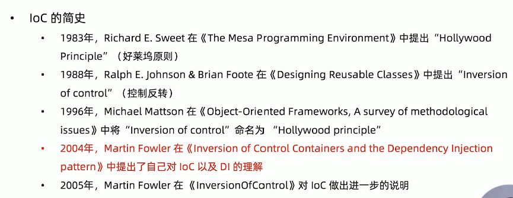

# 1. Spring 总览

1. Java 语言特性：反射，动态代理，枚举，泛型，注解，ARM，lambda
2. 设计思想和模式的实现：OOP，IOC，DDD，TDD，GoF23
3. Java API 的封装与简化：JDBC 事务，Servlet，JPA，JMX，Bean Validation
4. JSR 规范的适配与实现
5. 第三方框架的整合：Mybatis，Redis


> 深入学习 Spring 的难点有哪些？

Spring 在战略层面设计思想和协议规范上被高估，如 OOP，IOC，AOP 设计模式并没有明显突破，都是业界已经成熟的思想。而在战术层面 API 抽象能力，模块化设计，功能的稳定性，可扩展性，可测试性则非常优秀

## 1.1 Spring 5 大核心特性

Spring 共有 5 大 核心特性，如下所示：


### 1. Spring 的 5 种编程模型

1. 面向对象编程，由于 Java 只支持单继承，所以在 Spring 中都是面向接口编程，通过**实现契约接口来**规范每个类需要实现的功能
2. 面向切面编程，利用**动态代理或字节码注入**实现 AOP 编程
3. 面向元编程，通过 **配置元信息，注解，属性配置** 来控制程序
4. 面向模块编程，通过 **Maven，Java9 Modules，Spring @Enable* 注解** 来实现模块化编程，需要使用某个模块时，可以通过这三种方式来引入该模块。@EnableAutoConfiguration 在SpringBoot 中用到，@EnableMvc @EnableCache 在 Mvc 和 缓存时用到
5. 面向函数编程，通过 **lambda 和 Reactive** 来实现函数编程，WebFlux 就是使用了 Reactive，也是未来的趋势

### 2. IoC 容器

1. Spring IOC 容器
2. 依赖查找
3. 依赖注入
4. 依赖来源
5. IOC 容器的生命周期


IOC 容器有两种实现方式：

1. 依赖查找
2. 依赖注入

依赖查找和依赖注入都需要有一个**依赖来源**

IOC 容器可以管理 Bean

### 3 Bean

1. Bean 实例
2. Bean 作用域
3. Bean 生命周期

Bean 实例的主要来源是依赖注入，Bean 实例有两个重要特性：作用域 scope 与 生命周期 lifecycle

Spring Bean 提供了很多扩展点，在实例化，初始化，销毁时都可以有一些自定义方法被执行，

这并不是 Spring 的独创，很多容器也会有这样的实现方式，如 Servlet 容器也有初始化，实例化，销毁时机的扩展点。

### 4 元信息 

1. 注解
2. 配置元信息，可以通过 xml 或 properties 方式配置，
3. 外部化配置


元信息可以配置 Bean：可以在 XML 或 Java 代码里配置一些 Bean

元信息可以为 Bean 提供数据：外部化配置可以提供一些占位符或者阈值供 Bean 使用

元信息可以控制 IOC 容器，比如利用注解 @Autowired 和 @Qulifier 注解来设置依赖注入的方式，是按照类型或者名称进行自动绑定

### 5 基础设施

1. 资源管理
2. 类型转换
3. 数据绑定
4. 校验
5. 国际化
6. 事件
7. 泛型处理


类型转换也能为配置元信息提供支持，将配置的资源文件路径转换为 Resouces 对象，将配置中的字符串属性转换为 Integer，都是 Spring 类型转换提供支持


**学习方法**

基础：夯实基础，了解动态。Java 基础反射注解等，了解 Java 新特性，云原生等新行业动态

思考：保持怀疑，验证一切。源码分析遇到一些问题，不要急于下结论，要对自己的结论保持怀疑，在论证过程中需要从多个方面去验证

分析：不拘小节，观其大意。在分析源码和分析原理时，不要拘泥于细节，应该观其大意，因为每一种写法和细节都有个人的偏好和习惯，太过注重细节，会得不偿失

实践：思辨结合，学以致用。思考的辩论需要结合，在思考的同时，要和自己辩论不断的反驳自己，学懂了要去运用，才能发现自己的知识盲点，才能巩固已经学到的知识


## 1.2 Spring 模块化设计

Spring 将模块划分成细粒度的 jar 包，可以按需分配进行依赖，目前有近 20个模块。

- spring-core ：Spring 核心包

- spring-beans ： bean 的相关，依赖注入，依赖管理

- spring-context ：Spring 上下文，和 spring-beans 就是 IOC 的实现

- spring-aop ：面向切面编程

- spring-aspects ：Spring 对 aspects 的支持

- spring-test ：Mock 对象，测试上下文 TestContext，WebClient 的测试，Maven 引入时设置 scope 为 test，只在测试场景引入

- spring-jdbc ：对 JDBC 的整合

- spring-tx ：对事务的抽象

- spring-orm ：对 JPA 的整合

- spring-web ：对 Servlet API 的整合

- spring-webmvc ：MVC 使用注解驱动的方式开发 REST 服务

- spring-webflux ： 对 Reactive 的支持

- spring-websocket ：对 WebSocket 的整合

- spring-jmx ：对 JMX 规范的整合

- spring-message ：对消息中间件的整合

- spring-instrument ：对 Java agent 装配的支持

- spring-jcl ：统一日志管理

  

## 1.3 Spring 对 Java 新特性的支持

下图展示了 JDK 各个版本引入的新特性


| API                | Spring 支持版本 | 代表实现                                                    |
| ------------------ | --------------- | ----------------------------------------------------------- |
| 反射               | 1.0             | MethodMatcher                                               |
| Java Beans         | 1.0             | CachedIntrospectionResults                                  |
| 动态代理           | 1.0             | JdkDynamicAopProxy                                          |
| XML 处理           | 1.0             | XMLBeanDefinitionReader                                     |
| Java 管理扩展 JMX  | 1.2             | @ManagedResource                                            |
| Instrumentation    | 2.0             | InstrumentationSavingAgent                                  |
| JUC                | 3.0             | ThreadPoolTaskScheduler                                     |
| 格式化 Formatter   | 3.0             | DateFormatter                                               |
| JDBC               | 1.0             | Jdbctemplate                                                |
| Common Annotations | 2.5             | CommonAnnotationBeanPostProcessor @Resource  @PostConstruct |
| 编译时注解处理     | 5.0             | @ComponetScan 可以在编译时扫描到所有@Component              |
| Java Compiler API  | 5.0             | TestCompiler 单元测试                                       |
| Fork-Join 框架     | 3.1             | ForkJoinPoolFactoryBean                                     |
| NIO 2              | 3.0             | PathResource                                                |
| Data Time API      | 4.0             | DateTimeContext                                             |
| 可重复 Anntations  | 4.0             | @PropertySources                                            |
| CompletableFuture  | 4.2             | CompletableToListenableFutureAdapter                        |


## 1.4 Spring 编程模型

### 1. 面向对象编程

契约接口：Aware，BeanPostProcessor

设计模式：观察者模式，组合模式，模板模式

对象继承：Abstract* 类


1. Aware 接口用来规范感知使用 Spring 容器的功能或资源，Spring 框架提供了许多 Aware 接口的实现类，用于辅助访问 Spring 容器的功能或资源，比如使用 ApplicationContextAware 获取 ApplicationContext。

```java
ApplicationContextAware.java

public interface ApplicationContextAware extends Aware {
    
	void setApplicationContext(ApplicationContext applicationContext) 
        throws BeansException;
}
```

ApplicationContextAware 接口实现了 Aware 接口，表示是用来获取 ApplicationContext 的，当我们想要获取 ApplicationContext 时，就可以实现该接口，重写其方法，例如下面我们需要使用 ApplicationContext 获取容器中的某个 Bean，就必须实现 ApplicationContextAware 接口。

```java
@RunWith(SpringRunner.class)
@SpringBootTest(classes = Sb2Application.class)
public class Sb2ApplicationTests3 implements ApplicationContextAware {

    private ApplicationContext applicationContext;
    
    // 该方法会被Spring回调, 传入applicationContext对象供用户使用
    @Override
    public void setApplicationContext(ApplicationContext applicationContext) throws BeansException {
        this.applicationContext = applicationContext;
    }

    // 使用 applicationContext 获取容器中的 bean
    @Test
    public void testCondi() {
        System.out.println(applicationContext.getBean(MoocCondi.class));;
    }
}
```

2. BeanPostProcessor 接口用来规范 bean 的生命周期的后置处理，有两个功能，在bean初始化前进行一些操作，在bean初始化后进行一些操作。

```java
public interface BeanPostProcessor {

   @Nullable
   default Object postProcessBeforeInitialization(Object bean, String beanName) throws BeansException {
      return bean;
   }

   @Nullable
   default Object postProcessAfterInitialization(Object bean, String beanName) throws BeansException {
      return bean;
   }
}
```

具体可以参考这篇文章[Spring之BeanPostProcessor(后置处理器)介绍](https://blog.csdn.net/qq_38526573/article/details/88086752)，写的非常清楚


3. 观察者模式，SimpleApplicationEventMulticaster 就是 Spring 观察者模式的实现。
4. 组合模式，CompositeCacheManager
5. 模板模式，RestTemplate，JdbcTemplate，模板模式参考[设计模式之 - 模板模式](https://www.cnblogs.com/qq-361807535/p/6854191.html)和[图解模板设计模式](https://www.bilibili.com/video/BV1G4411c7N4?p=96)
6. 抽象类 AbstractApplicationContext，AbstractBeanFactory 


### 2. 面向切面编程

动态代理：JDKDynamicAopProxy

字节码增强：ASM，CGLib，AspectJ


### 3. 面向元编程

注解：模式注解 @Component，@Controller，@Service，@Repository

配置：Environment 抽象，PropertySources，BeanDefinition

泛型：GenericTypeResolver，ResolvableType


1. @Repository 是来自 DDD 领域驱动设计的概念

2. @Component 注解作用在类上，在运行时生效，@Indexed 为 Spring 的**模式注解**添加索引，以提升应用启动性能。具体参考文章[Spring @Indexed 注解简单解析](https://www.cnblogs.com/aflyun/p/11992101.html)

```java
@Target(ElementType.TYPE)
@Retention(RetentionPolicy.RUNTIME)
@Documented
@Indexed
public @interface Component {

	String value() default "";
}
```


3. Environment 对应多个数据源 PropertySource

```java
public interface Environment extends PropertyResolver {
    // 激活的配置文件
    String[] getActiveProfiles();

    // 默认的配置文件
    String[] getDefaultProfiles();
}
```

```java
public abstract class PropertySource<T> {

	protected final String name;

	protected final T source;
}
```


4. 泛型 


### 4. 函数式编程

函数式接口：ApplicationListener，ApplicationEventPublisher

Reactive：WebFlux


1. Spring 中也用到了函数式编程，ApplicationListener 就是一个函数式接口，有且仅有一个方法（不包括 Object 方法和 default 方法），针对不同的事件，就可以将处理的函数做为参数传入

```java
@FunctionalInterface
public interface ApplicationListener<E extends ApplicationEvent> 
    extends EventListener {

	void onApplicationEvent(E event);
}
```


### 5. 模块驱动

Maven Artifacts

Spring @Enable*


1. @EnableCaching 启动缓存组件
2. @EnableTransactionManagement 启动事务组件，等同于xml配置方式的`<tx:annotation-driven />`
3. @EnableWebMvc 启动 mvc 

```java
@Retention(RetentionPolicy.RUNTIME)
@Target({ElementType.TYPE})
@Documented
@Import({DelegatingWebMvcConfiguration.class})
public @interface EnableWebMvc {
}
```

## 1.5 面试题

1. 什么是 Spring Framework ？

   Spring 是一个开源应用框架，旨在降低应用程序开发的复杂度。它是轻量级、松散耦合的。它具有分层体系结构，允许用户选择组件，同时还为 J2EE 应用程序开发提供了一个有凝聚力的框架。它可以集成其他框架，如Structs、Hibernate、EJB 等，所以又称为框架的框架。

2. Spring Framework 有哪些核心模块？

   spring-core：基础 API 模块，如资源管理 Resource，泛型处理GenericTypeResolver

   spring-beans：Spring Bean 模块，如依赖查找BeanFactory，依赖注入 AutowiredAnnotationBeanPostProcessor，@Autowired

   spring-aop：Spring AOP 处理，如动态代理，AOP 字节码增强

   spring-context：事件驱动ApplicationEvent，注解驱动@ComponentScan，模块驱动@EnableCaching等，ApplicationContext

   spring-jdbc：对 JDBC 的整合

   spring-tx：事务支持

   spring-test：单元测试

   spring-web ：对 Servlet API 的整合

   

3. Spring Framework 的优势和不足是什么？

   由于 Spring Frameworks 的分层架构，用户可以自由选择自己需要的组件。Spring

   Framework 支持 POJO(Plain Old Java Object) 编程，从而具备持续集成和可测试性。由于

   依赖注入和控制反转，JDBC 得以简化。它是开源免费的。

   

# 2. 重新认识 IOC

**控制反转**（Inversion of Control，缩写为**IoC**），是面向对象编程中的一种设计原则，可以用来减低计算机代码之间的耦合度。其中最常见的方式叫做**依赖注入**（Dependency Injection，简称**DI**），还有一种方式叫**依赖查找**（Dependency Lookup）。


> 为什么需要 IOC ？

因为大多数应用程序都是由两个或是更多的类通过彼此的合作来实现业务逻辑，这使得每个对象都需要获取与其合作的对象（也就是它所依赖的对象）的引用。如果这个获取过程要靠自身实现，那么这将导致代码高度耦合并且难以维护和调试。

## 2.1 IOC 发展简介



 

## 2.2 IOC 主要实现策略

1. 依赖注入：构造器注入，参数注入，Setter 注入，接口注入
2. 依赖查找
3. 模板方法模式
4. 策略模式


## 2.3 IOC 容器的职责

- 依赖处理
  - 依赖查找
  - 依赖注入
- 生命周期管理
  - 容器
  - 托管的资源，Java Bean 或其他资源
- 配置
  - 容器
  - 外部化配置
  - 托管的资源，Java Bean 或其他资源


## 2.4 IOC 容器传统实现

POJO 类需要有属性，以及 Setter/Getter  方法，称为可写方法（Writeable）和可读方法（Readable)

```java
public class Person {
    private String name;

    private Integer age;

    public String getName() {
        return name;
    }

    public void setName(String name) {
        this.name = name;
    }

    public Integer getAge() {
        return age;
    }

    public void setAge(Integer age) {
        this.age = age;
    }
}
```


// 补充: BeanInfoDemo 代码，见视频 p17

## 2.5 轻量级实现

1. 容器可以管理代码的运行，生命周期
2. 容器可以快速启动
3. 容器不需要任何特殊的配置，而 EJB 需要
4.  容器能够做到清垃圾的内存占用和最小化的 API 依赖


## 2.6 依赖查找与依赖注入

| 类型     | 依赖处理 | 实现 | 代码侵入性   | API 依赖性    | 可读性 |
| -------- | -------- | ---- | ------------ | ------------- | ------ |
| 依赖查找 | 主动获取 | 繁琐 | 侵入业务逻辑 | 依赖容器API   | 良好   |
| 依赖注入 | 被动提供 | 便利 | 低侵入性     | 不依赖容器API | 一般   |


@Autowired 就是一种低侵入性的注入，如果使用 xml 方式注入，则是零侵入性


## 2.7 构造器注入与Setter注入


## 2.8 面试题

1. 什么是 IOC ？

   IOC 就是控制反转，类似于好莱坞原则，主要有依赖查找和依赖注入两种实现

2. 依赖注入和依赖注入的区别？

   依赖查找是主动的查找方式，通过名称类型或者路径去查找，需要显式调用容器的 API，获得想要的资源。依赖注入则是手动或自动依赖绑定的方式，无需依赖特定的容器和 API，代码侵入性低

3. Spring 作为 IOC 容器有什么优势？

   


# 3. IOC 容器概述

Spring 有 3 大基石：

1. BeanDefinition，bean 的元信息
2. BeanFactory，用来管理 BeanDefinition
3. BeanDefinitionRegistry， BeanDefinition 的注册接口
4. PostProcessor，用于操作 Spring


## 3.1 依赖查找

- 根据 Bean 名称查找
  - 实时查找 
  - 延迟查找
- 根据 Bean 类型查找
  - 单个 Bean 对象
  - 所有 Bean 对象
- 根据 Bean 名称 + 类型查找
- 根据 Java 注解查找
  - 单个 Bean 对象
  - 所有 Bean 对象


1. 根据 Bean 名称实时查找

```java
public class User {
    private Long id;
    private String name;

    // 省略 setter getter

    @Override
    public String toString() {
        return "User{" +
                "id=" + id +
                ", name='" + name + '\'' +
                '}';
    }
}
```

在 spring  配置文件中配置 bean，设置 id 为 “user”，查找时使用，设置属性值

```xml
dependcy-lookup-context.xml

<bean id="user" class="org.geekbang.ioc.overview.lookup.domain.User">
    <property name="id" value="1"/>
    <property name="name" value="tracccer"/>
</bean>
```

使用`beanFactory.getBean("user")`从容器中查找 `id="user"` 的 bean

```java
public static void main(String[] args) {
    // 1. 在 xml 文件中配置 bean
    // 2. 启动spring 应用上下文
    BeanFactory beanFactory = new ClassPathXmlApplicationContext("dependcy-lookup-context.xml");
    // 3. 使用ioc容器api查找bean
    User user = (User) beanFactory.getBean("user");

    System.out.println("实时查找: " + user);
}
```

输出结果：

```
实时查找: User{id=1, name='tracccer'}
```


2. 根据 Bean 名称延迟查找，ObjectFactoryCreatingFactoryBean 可以将查找的 bean 保存到自己的 `targetBeanName`属性中

```xml
<bean id="objectFactory" class="org.springframework.beans.factory.config.ObjectFactoryCreatingFactoryBean">
    <!--  关联到user bean -->
    <property name="targetBeanName" value="user"/>
</bean>
```

```java
public static void main(String[] args) {
    // 1. 在 xml 文件中配置 bean
    // 2. 启动spring 应用上下文
    BeanFactory beanFactory = new ClassPathXmlApplicationContext("dependcy-lookup-context.xml");
    // 3. 使用ioc容器api查找bean
        ObjectFactory<User> objectFactory = (ObjectFactory<User>) beanFactory.getBean("objectFactory");
        User user = objectFactory.getObject();
        System.out.println("延迟查找: " + user);
}
```

输出结果：

```
延迟查找: User{id=1, name='tracccer'}
```

// 补充：ObjectFactory 延迟查找


3. 根据 Bean 的类型查找单个对象

```xml
dependcy-lookup-context.xml

<bean id="user" class="org.geekbang.ioc.overview.lookup.domain.User">
    <property name="id" value="1"/>
    <property name="name" value="tracccer"/>
</bean>
```

如果配置文件中定义了多个该类型的 bean，则下面代码会报错 NoUniqueBeanDefinitionException

```java
private static void lookupByType(BeanFactory beanFactory) {
    // 3. 使用ioc容器api查找bean, 根据类型 User.class 查找
    User user = beanFactory.getBean(User.class);
    System.out.println("类型查找: " + user);
}
```

输出结果：

```
类型查找: User{id=1, name='tracccer'}
```

4. 根据 Bean 的类型查找所有该类型的对象，在 xml 文件中配置两个 User 类型的 bean

```xml
<bean id="user" class="org.geekbang.ioc.overview.lookup.domain.User">
    <property name="id" value="1"/>
    <property name="name" value="tracccer"/>
</bean>

<bean id="user2" class="org.geekbang.ioc.overview.lookup.domain.User">
    <property name="id" value="1"/>
    <property name="name" value="tracccer"/>
</bean>
```

使用`listableBeanFactory.getBeansOfType(User.class)`查找所有的 User 对象，查找结果是一个 `Map<String, User>`，key 是 bean 的 id，value 是实际的 user 对象

```java
private static void lookupAllByType(BeanFactory beanFactory) {
    if (beanFactory instanceof ListableBeanFactory) {
        ListableBeanFactory listableBeanFactory = (ListableBeanFactory) beanFactory;
        Map<String, User> users = listableBeanFactory.getBeansOfType(User.class);   // 根据类型查找
        System.out.println("查找到的所有 User 对象: " + users);
    }
}
```

输出结果：

```
查找到的所有 User 对象: 
{user=User{id=1, name='tracccer'}, user2=User{id=1, name='tracccer'}}
```


5. 根据注解查找，自定义一个注解 @Super

```java
@Target(ElementType.TYPE)
@Retention(RetentionPolicy.RUNTIME)
@Documented
public @interface Super {

    String value() default "";
}
```

```java
@Super
public class SuperUser extends User {
    private String address;

	// 省略 setter/getter

    @Override
    public String toString() {
        return "User{" +
                "id=" + getId() +
                ", name='" + getName() +
                ", address='" + address + '\'' +
                '}';
    }
}
```

配置 SuperUser bean，并设置属性 address，设置父对象为前面设置的 user bean，会继承该 user bean 的属性值

```xml
<bean id="superUser" class="org.geekbang.ioc.overview.lookup.domain.SuperUser" parent="user">
    <property name="address" value="杭州"/>
</bean>
```

使用`listableBeanFactory.getBeansWithAnnotation(Super.class)`查找所有被注解 @Super 标记的类的 bean

```java
private static void lookupByAnnotation(BeanFactory beanFactory) {
    if (beanFactory instanceof ListableBeanFactory) {
        ListableBeanFactory listableBeanFactory = (ListableBeanFactory) beanFactory;
        // 根据注解查找
        Map<String, User> users = (Map) listableBeanFactory.getBeansWithAnnotation(Super.class);
        System.out.println("查找标注@Super User 对象: " + users);
    }
}
```

输出结果：

```
查找标注@Super User 对象: 
{superUser=User{id=1, name='tracccer, address='杭州'}}
```


如果使用第 4 步根据 Bean 的类型查找所有该类型的对象，会查找到两个 User 对象，分别是 user 和 superUser bean，使用第 3 步根据 Bean 的类型查找单个对象，会报错NoUniqueBeanDefinitionException，可以通过为 bean 配置`primary`属性解决。

```xml
<bean id="superUser" class="org.geekbang.ioc...SuperUser" parent="user"
      primary="true">  primary 属性表示根据类型查找时优先返回
    
    <property name="address" value="杭州"/>
</bean>
```


## 3.2 依赖注入

- 根据 Bean 名称注入
- 根据 Bean 类型注入
  - 单个 Bean 对象
  - 所有该类型的 Bean 对象
- 注入容器内建 Bean 对象
- 注入非 Bean 对象
- 注入类型
  - 实时注入
  - 延迟注入


1. 根据 Bean 的名称注入

```xml
<bean id="userRepository" class="org.geekbang.ioc.overview.injection.repository.UserRepository">

    <property name="users">
        <util:list>
            <ref bean="superUser"/>
            <ref bean="user"/>
        </util:list>
    </property>
</bean>
```


```java
public static void main(String[] args) {
    // 1. 在 xml 文件中配置 bean
    // 2. 启动spring 应用上下文
    BeanFactory beanFactory = new ClassPathXmlApplicationContext("dependcy-injection-context.xml");

    // 依赖查找userRepository
    UserRepository userRepository = beanFactory.getBean("userRepository", UserRepository.class);
    // 查看根据名称是否注入成功
    System.out.println(userRepository.getUsers());
}
```

输出结果：

```
[User{id=1, name='tracccer, address='杭州'}, User{id=1, name='tracccer'}]
```


所以这和依赖查找到底有什么区别？


2. 根据 Bean 的类型注入

```xml
<bean id="userRepository" class="org.geekbang.ioc.overview.injection.repository.UserRepository"
      autowire="byType"> <!--  Auto-Wiring 根据类型自动绑定 -->
    <!-- 不需要手动配置, 可以绑定所有 User 类型的 bean  -->

</bean>
```

```java
public static void main(String[] args) {
    // 1. 在 xml 文件中配置 bean
    // 2. 启动spring 应用上下文
    BeanFactory beanFactory = new ClassPathXmlApplicationContext("dependcy-injection-context.xml");

    // 依赖查找userRepository
    UserRepository userRepository = beanFactory.getBean("userRepository", UserRepository.class);
    // 查看根据类型是否自动注入成功
    System.out.println(userRepository.getUsers());
}
```


输出结果：

```
[User{id=1, name='tracccer'}, User{id=1, name='tracccer, address='杭州'}]
```


3. 


// 补充：各种依赖注入类型的代码示例，自动绑定与依赖注入的关系，结合第 6 章


## 3.3 依赖来源

- 自定义 bean
- 容器内建 bean 对象
- 容器内建 依赖


2. 容器内建 bean 对象，如 Environment 对象

```java
public static void main(String[] args) {
    // 1. 在 xml 文件中配置 bean
    // 2. 启动spring 应用上下文
    BeanFactory beanFactory = new ClassPathXmlApplicationContext("dependcy-injection-context.xml");

    // 获取容器内建bean Environment
    Environment environment = beanFactory.getBean(Environment.class);
    System.out.println("容器 Environment 类型的内建 bean: "+environment);
}
```

```
容器 Environment 类型的内建 bean: StandardEnvironment {activeProfiles=[], defaultProfiles=[default], propertySources=[PropertiesPropertySource {name='systemProperties'}, SystemEnvironmentPropertySource {name='systemEnvironment'}]}
```


3. 容器内建依赖，如 BeanFactory

```java
public static void main(String[] args) {
    // 1. 在 xml 文件中配置 bean
    // 2. 启动spring 应用上下文
    BeanFactory beanFactory = new ClassPathXmlApplicationContext("dependcy-injection-context.xml");

    // 获取beanFactory, 依赖注入内建依赖
    System.out.println("beanFactory: " + userRepository.getBeanFactory());   // 依赖注入
    System.out.println(beanFactory == userRepository.getBeanFactory());     // false
}
```


## 3.4 配置元信息

- bean 定义配置
  - xml 文件
  - java 注解
  - java api
  - properties 文件
- IOC 容器设置
  - xml 文件
  - java 注解
  - java api
- 外部化属性配置
  - java 注解


## 3.5 IOC 容器

> BeanFactory 和 ApplicationContext 谁才是 IOC 容器？

BeanFactory 是一个底层的 IOC 容器，ApplicationContext  是 BeanFactory 的子接口，提供更多特性，包括 AOP，国际化，事件发布，web 支持等


```java
private static void whoIsIOCContainer(UserRepository userRepository, BeanFactory beanFactory) {
    BeanFactory beanFactory = new ClassPathXmlApplicationContext("dependcy-injection-context.xml");
    // 依赖查找获取自定义bean
    UserRepository userRepository = beanFactory.getBean("userRepository", UserRepository.class);
    // 获取beanFactory, 依赖注入内建依赖
    System.out.println("beanFactory: " + userRepository.getBeanFactory());        // 依赖注入
    
    // 这个表达式为什么为 false?
    System.out.println(beanFactory == userRepository.getBeanFactory());     // false

    AbstractRefreshableApplicationContext applicationContext = (AbstractRefreshableApplicationContext) beanFactory;
    // 打印 ClassPathXmlApplicationContext 的 beanFactory 属性
    System.out.println("beanFactory: " + applicationContext.getBeanFactory());

    // 判断ClassPathXmlApplicationContext 的 beanFactory 属性是否与依赖注入的 beanFactory 相等
    System.out.println(applicationContext.getBeanFactory() == userRepository.getBeanFactory());     // true
}
```

输出结果：

```
beanFactory: org...DefaultListableBeanFactory@37918c79: defining beans [user,objectFactory,superUser,userRepository]; root of factory hierarchy
false
beanFactory: org...DefaultListableBeanFactory@37918c79: defining beans [user,objectFactory,superUser,userRepository]; root of factory hierarchy
true
```


- userRepository.getBeanFactory() 返回的是对象 DefaultListableBeanFactory@1719

* beanFactory 其实是 ClassPathXmlApplicationContext, 他的属性 beanFactory 保存了对象 DefaultListableBeanFactory@1719
* 即 ClassPathXmlApplicationContext 是使用组合的方式来扩展 DefaultListableBeanFactory 的,
* 前者返回 DefaultListableBeanFactory 类型的对象, 后者返回的是 ClassPathXmlApplicationContext 对象, 故返回false
* ClassPathXmlApplicationContext 是 AbstractRefreshableApplicationContext的子类，属性中也保存了 DefaultListableBeanFactory

```java
继承关系: ClassPathXmlApplicationContext->AbstractXmlApplicationContext->AbstractRefreshableConfigApplicationContext->AbstractRefreshableApplicationContext

public abstract class AbstractRefreshableApplicationContext extends AbstractApplicationContext {

	// 该属性保存 beanFactory
	private DefaultListableBeanFactory beanFactory;
```


## 3.6 应用上下文

ApplicationContext 除了 IOC 容器角色，还提供这些特性，这也是其与 BeanFactory 的不同之处：

- 面向切面 AOP 
- 配置元信息 Configuration Metadata
- 资源管理 Resources
- 事件 Events
- 国际化 i18n
- 注解 Annotations
- Environment 抽象 配置 profile


## 3.7 使用 IOC 容器

通过 3.5 章节知道了 ApplicationContext 是 BeanFactory 子接口，但是 AnnotationConfigApplicationContext 和 ClassPathXmlApplicationContext 都是通过组合的方式来扩展 DefaultListableBeanFactory  的。

```java
// AnnotationConfigApplicationContext 继承了 GenericApplicationContext
public class AnnotationConfigApplicationContext extends GenericApplicationContext implements AnnotationConfigRegistry {

// GenericApplicationContext 通过组合的方式扩展 DefaultListableBeanFactory
public class GenericApplicationContext extends AbstractApplicationContext implements BeanDefinitionRegistry {

    // 该属性保存 beanFactory
	private final DefaultListableBeanFactory beanFactory;
```


1. 使用 BeanFactory 作为 IoC 容器，DefaultListableBeanFactory

```java
public static void main(String[] args) {
    // 1.创建 BeanFactory 容器
    DefaultListableBeanFactory beanFactory = new DefaultListableBeanFactory();
    XmlBeanDefinitionReader reader = new XmlBeanDefinitionReader(beanFactory);
    
    // bean 配置文件路径
    String location = "dependcy-lookup-context.xml";
    // 2.加载xml配置文件
    int count = reader.loadBeanDefinitions(location);
    // 返回 3, 与xml中定义 bean 的数量一致
    System.out.println("容器中bean的数量: " + count);

    // 3.依赖查找, 根据名称
    User user = beanFactory.getBean("user", User.class);
    System.out.println(user);
    // 4.依赖查找所有 User 对象, 根据类型
    lookupAllByType(beanFactory);
    
    // 5.停止应用上下文
    applicationContext.close();
}
```

输出结果：

```xml
容器中bean的数量: 3
User{id=1, name='tracccer'}
查找到的所有 User 对象: {user=User{id=1, name='tracccer'}, superUser=User{id=1, name='tracccer, address='杭州'}}
```


2. 使用 ApplicationContext 作为 IoC 容器，AnnotationConfigApplicationContext 注解类型

```java
public static void main(String[] args) {
    // 1.创建 ApplicationContext 容器, 使用注解配置
    AnnotationConfigApplicationContext applicationContext = new AnnotationConfigApplicationContext();
    // 2.注册主类到容器
    applicationContext.register(AnnotationApplicationContextAsIoCContainerDemo.class);
    // 3.启动应用上下文
    // 为什么 ClassPathXmlApplicationContext 不用启动? 因为在构造方法中已经调用refresh启动了
    applicationContext.refresh();

    // 4.依赖查找, 根据名称
    User user = applicationContext.getBean("user", User.class);
    System.out.println(user);

    // 4.依赖查找所有 User 对象, 根据类型
    lookupAllByType(applicationContext);
}

// 通过 java 注解的方式, 注册一个 bean 到 ioc 容器
@Bean
public User user() {
    User user = new User();
    user.setId(1L);
    user.setName("小毛");

    return user;
}

```

输出结果：

```
User{id=1, name='小毛'}
查找到的所有 User 对象: {user=User{id=1, name='小毛'}}
```


## 3.8 IOC 容器生命周期

- 启动
- 运行
- 停止

1. 启动 refresh

```java
AbstractApplicationContext.java

@Override
public void refresh() throws BeansException, IllegalStateException {
    synchronized (this.startupShutdownMonitor) {
        // Prepare this context for refreshing.
        prepareRefresh();

        // Tell the subclass to refresh the internal bean factory.
        ConfigurableListableBeanFactory beanFactory = obtainFreshBeanFactory();

        // Prepare the bean factory for use in this context.
        prepareBeanFactory(beanFactory);

        try {
            // Allows post-processing of the bean factory in context subclasses.
            postProcessBeanFactory(beanFactory);

            // Invoke factory processors registered as beans in the context.
            invokeBeanFactoryPostProcessors(beanFactory);

            // Register bean processors that intercept bean creation.
            registerBeanPostProcessors(beanFactory);

            // Initialize message source for this context.
            initMessageSource();

            // Initialize event multicaster for this context.
            initApplicationEventMulticaster();

            // Initialize other special beans in specific context subclasses.
            onRefresh();

            // Check for listener beans and register them.
            registerListeners();

            // Instantiate all remaining (non-lazy-init) singletons.
            finishBeanFactoryInitialization(beanFactory);

            // Last step: publish corresponding event.
            finishRefresh();
        }

        catch (BeansException ex) {
            if (logger.isWarnEnabled()) {
                logger.warn("Exception encountered during context initialization - " +
                            "cancelling refresh attempt: " + ex);
            }

            // Destroy already created singletons to avoid dangling resources.
            destroyBeans();

            // Reset 'active' flag.
            cancelRefresh(ex);

            // Propagate exception to caller.
            throw ex;
        }

        finally {
            // Reset common introspection caches in Spring's core, since we
            // might not ever need metadata for singleton beans anymore...
            resetCommonCaches();
        }
    }
}
```

3. 停止 close

```java
protected void doClose() {
    // Check whether an actual close attempt is necessary...
    if (this.active.get() && this.closed.compareAndSet(false, true)) {
        if (logger.isDebugEnabled()) {
            logger.debug("Closing " + this);
        }

        LiveBeansView.unregisterApplicationContext(this);

        try {
            // Publish shutdown event.
            publishEvent(new ContextClosedEvent(this));
        }
        catch (Throwable ex) {
            logger.warn("Exception thrown from ApplicationListener handling ContextClosedEvent", ex);
        }

        // Stop all Lifecycle beans, to avoid delays during individual destruction.
        if (this.lifecycleProcessor != null) {
            try {
                this.lifecycleProcessor.onClose();
            }
            catch (Throwable ex) {
                logger.warn("Exception thrown from LifecycleProcessor on context close", ex);
            }
        }

        // Destroy all cached singletons in the context's BeanFactory.
        destroyBeans();

        // Close the state of this context itself.
        closeBeanFactory();

        // Let subclasses do some final clean-up if they wish...
        onClose();

        // Reset local application listeners to pre-refresh state.
        if (this.earlyApplicationListeners != null) {
            this.applicationListeners.clear();
            this.applicationListeners.addAll(this.earlyApplicationListeners);
        }

        // Switch to inactive.
        this.active.set(false);
    }
}
```


## 3.9 面试题

1. 什么是 Spring IoC 容器？

   IoC 容器创建对象，将它们装配在一起，配置它们并管理它们的完整生命周期。Spring 容器使用依赖注入来管理组成应用程序的 Component。容器通过读取提供的 bean 的配置来进行对象实例化，配置和组装。bean 配置数据可以通过 XML，Java 注解或 Java 代码提供。

   IoC 就是控制反转，有两种实现方式 依赖注入DI 和依赖查找 DL，经典实现有 BeanFactory 和 ApplicationContext

2. BeanFactory 与 FactoryBean？

   BeanFactory 是 IoC 底层容器，规定了根据 Bean 名称，Bean 类型依赖查找的方法，常见的子接口有 ListableBeanFactory，HierarchicalBeanFactory。

   FactoryBean 是创建 Bean 的一种方式，帮助其实现复杂的初始化逻辑。

   FactoryBean 即是一个工厂，又是一个 Bean，是工厂，是因为其`getObject()`方法负责生产对象，是 Bean，是因为其实现类需要配置为 Bean 并将其加载到 IOC 容器。

   参考 4.5 FactoryBean 实例化 Bean

   

3. Spring IoC 容器启动时做了哪些准备？

   IoC 配置元信息读取和解析，IoC 容器声明周期，Spring 事件发布，国际化等，具体查看后续章节


# 4. Bean 基础

## 4.1 BeanDefinition 元信息

> 什么是 BeanDefinition ?

BeanDefinition 是 Spring 中定义 bean 的配置元信息接口，包含：

- bean 的类名
- bean 的行为，如作用域，自动绑定的模式，生命周期回调等
- 其他 bean 引用
- 配置设置，如 bean 属性 property


BeanDefinition 重要属性说明，具体参考`AbstractBeanDefinition`的属性

| 属性                      | 说明                                                 |
| ------------------------- | ---------------------------------------------------- |
| beanClass                 | Bean 全类名，必须是具体类，不能是抽象类或接口        |
| scope                     | Bean 的作用域，如 singleton，prototype               |
| constructorArgumentValues | Bean 构造器参数，用于构造器注入                      |
| propertyValues            | Bean 的属性与属性值映射，用于 Setter 注入            |
| autowireMode              | Bean 自动绑定模式，通过 bean名称 byName，类型 byType |
| lazyInit                  | Bean 延迟初始化模式，延迟、非延迟                    |
| initMethodName            | Bean 初始化回调方法名称                              |
| destroyMethodName         | Bean 销毁回调方法名称                                |
| factoryBeanName           | Bean 工厂名称，factory-bean 指定                     |
| factoryMethodName         | Bean 工厂方法名称，factory-method 指定               |
| primary                   |                                                      |
| resource                  |                                                      |
| dependsOn                 |                                                      |

需要注意的是并没有 bean 名称这个属性，因为注册 bean 时，key 为 bean 名称，value 为 bean 元信息 BeanDefinition，保存到 beanDefinitionMap中。

BeanDefinition 构建：1. 通过 BeanDefinitionBuilder 构建，2. 通过 AbstractBeanDefinition 派生类


1. 通过 BeanDefinitionBuilder 构建

```java
public static void main(String[] args) {
    // 1. 通过 BeanDefinitionBuilder 构建
    AbstractBeanDefinition beanDefinition = BeanDefinitionBuilder
        .genericBeanDefinition(User.class)
        .addPropertyValue("id", 1)
        .addPropertyValue("name", "小马")
        .setScope("singleton")
        .getBeanDefinition();

    System.out.println("BeanDefinitionBuilder 构造: " + beanDefinition);
}
```

输出结果：

```
BeanDefinitionBuilder 构造: Generic bean: class [org.geekbang.ioc.overview.lookup.domain.User]; scope=singleton; abstract=false; lazyInit=null; autowireMode=0; dependencyCheck=0; autowireCandidate=true; primary=false; factoryBeanName=null; factoryMethodName=null; initMethodName=null; destroyMethodName=null
```

属性是否设置成功可以 debug 查看 propertyValues 属性


2. 通过 AbstractBeanDefinition 派生类

```java
public static void main(String[] args) {
    // 2. 通过 AbstractBeanDefinition派生类构建bean
    GenericBeanDefinition genericBeanDefinition = new GenericBeanDefinition();
    // 设置 bean 类型
    genericBeanDefinition.setBeanClass(User.class);
    // 设置属性
    MutablePropertyValues propertyValues = new MutablePropertyValues();
    propertyValues.addPropertyValue("id", 1);
    propertyValues.addPropertyValue("name", "安娜");
    genericBeanDefinition.setPropertyValues(propertyValues);

    System.out.println("genericBeanDefinition 构造: " + genericBeanDefinition);
}
```

输出结果：

```
genericBeanDefinition 构造: Generic bean: class [org.geekbang.ioc.overview.lookup.domain.User]; scope=; abstract=false; lazyInit=null; autowireMode=0; dependencyCheck=0; autowireCandidate=true; primary=false; factoryBeanName=null; factoryMethodName=null; initMethodName=null; destroyMethodName=null
```


## 4.2  Bean 的命名

每个 bean 都拥有一个或多个标识符（identifiers），这些标识符在 bean 所在的容器中必须是唯一的。通常，一个 bean 仅有一个标识符，额外的可以使用别名 Alias 来扩展。

在 xml 配置元信息中，可以用`id`或`name`属性类设置 bean 的标识符。若要引入 bean 的别名，可在 name 属性使用`,`来间隔。

bean 的 id 或 name 属性并非必须的，如未设置，容器会为 bean 自动生成一个唯一的名称。自动生成名称由 DefaultBeanNameGenerator 来完成

使用 @Component 注解标记 bean 通常都不用设置 bean 名称，自动生成名称由  AnnotationBeanNameGenerator 来完成


1. xml 配置 bean 不设置名称，测试能否自动生成 bean 名称

```xml
<!--  bean 不设置名称, 测试能否自动生成  -->
<bean class="org.geekbang.ioc.overview.lookup.domain.User">
    <property name="id" value="1"/>
    <property name="name" value="tracccer"/>
</bean>
```


```java
// 测试 bean 自动生成的名称, xml 文件中未对 bean 设置名称
private static void testDefaultgenerate() {
    // 1. 在 xml 文件中配置 bean
    // 2. 启动spring 应用上下文
    ApplicationContext applicationContext = new ClassPathXmlApplicationContext("bean-name-generator.xml");
    String[] beanDefinitionNames = applicationContext.getBeanDefinitionNames();
    // 打印自动生成的 bean 名称
    System.out.println("自动生成的 bean 名称: "+beanDefinitionNames[0]);
}
```

输出结果：

```
自动生成的 bean 名称: org.geekbang.ioc.overview.lookup.domain.User#0
```

源码分析：

DefaultBeanNameGenerator 会为未设置 bean 生成名称，使用 BeanDefinitionReaderUtils#generateBeanName() ，源码如下所示：

```java
public static String generateBeanName(
    BeanDefinition definition, BeanDefinitionRegistry registry, boolean isInnerBean)
    throws BeanDefinitionStoreException {

    // 获取bean的全类名
    String generatedBeanName = definition.getBeanClassName();

    String id = generatedBeanName;
    if (isInnerBean) {
        // 内部类? 类名+#+16进制数
        id = generatedBeanName + GENERATED_BEAN_NAME_SEPARATOR + ObjectUtils.getIdentityHexString(definition);
    }
    else {
        // 类名+#+数字, 数字为该类在容器中产生了多个bean的编号
        return uniqueBeanName(generatedBeanName, registry);
    }
    return id;
}
```


2. 测试 @Component 标记的 bean 的生成名称

```java
@Component
public class Student {
    Integer id;
    String name;
	// setter, getter
}
```


```java
private static void testAnnotationGenerate() {
    // 创建并启动 applicationContext, 扫描指定包下的 @Component
    AnnotationConfigApplicationContext applicationContext = new AnnotationConfigApplicationContext("org.geekbang.bean.definition");
    String[] beanDefinitionNames = applicationContext.getBeanDefinitionNames();
    System.out.println("自动生成的 bean 名称: "+beanDefinitionNames[5]);
}
```

输出结果：

```java
自动生成的 bean 名称: student
```


AnnotationBeanNameGenerator 会为未设置名称的 bean 自动生成名称，源码如下所示：

```java
AnnotationBeanNameGenerator.java
    
protected String buildDefaultBeanName(BeanDefinition definition) {
    // 获取bean的全类名
    String beanClassName = definition.getBeanClassName();
    Assert.state(beanClassName != null, "No bean class name set");
    // 获取bean的类名
    String shortClassName = ClassUtils.getShortName(beanClassName);
    // 将类名转为首字母小写并返回
    return Introspector.decapitalize(shortClassName);
}
```


3. @Bean 的名称，默认为方法名

```java
@Bean  // 默认bean名称为方法名
public User getUser() {
    return new User();
}
```


## 4.3 Bean 的别名

Bean 别名 Alias 的价值：

- 复用现有的 BeanDefinition
- 更具有场景化的命名方法，使用第三方 jar 时使用更加合适的名称


1. 为 bean 配置别名

```xml
<bean id="user" class="org.geekbang.ioc.overview.lookup.domain.User">
    <property name="id" value="1"/>
    <property name="name" value="tracccer"/>
</bean>

<!--  为容器中的bean "user" 设置别名 -->
<alias name="user" alias="mao-user"/>
```

2. 测试从容器中通过别名获取 bean，判断是否为同一个 bean

```java
public static void main(String[] args) {
    // 1. 在 xml 文件中配置 bean
    // 2. 启动spring 应用上下文
    BeanFactory beanFactory = new ClassPathXmlApplicationContext("bean-definition-context.xml");
    User user = beanFactory.getBean("user", User.class);
    User maoUser = beanFactory.getBean("mao-user", User.class);

    System.out.println("mao-user: " + maoUser);
    System.out.println("user == maoUser: " + (user == maoUser));
}
```

输出结果：

```
mao-user: User{id=1, name='tracccer'}
user == maoUser: true
```

## 4.4 注册 bean

注册 bean 大致有 3 种方式：

- xml 配置元信息	
  - `<bean id="xx" class="com...." />`
- java 注解配置元信息
  - @Bean
  - @Component
  - @Import
- java api 配置元信息
  - 手动设置 bean 名称：BeanDefinitionRegistry#registerBeanDefinition
  - 自动生成 bean 名称：BeanDefinitionReaderUtils#registerWithGeneratedName
  - 配置类方式：AnnotationConfigApplicationContext#register
-  外部对象注册到容器： ConfigurableListableBeanFactory#registerSingleton


1. @Import 注册 bean

   // 补充


2. java api 注册bean，将 BeanDefinition 注册到 BeanDefinitionRegistry

```java
public static void main(String[] args) {
    // 1. 创建容器
    AnnotationConfigApplicationContext applicationContext = new AnnotationConfigApplicationContext();
    // 2. 注册配置类, 即代替xml配置
    applicationContext.register(BeanDefintionRegisterDemo.class);
    // 3. 启动应用上下文
    applicationContext.refresh();

    // 4.1 注册bean到容器, 手动设置bean名称
    // AnnotationConfigApplicationContext是BeanDefinitionRegistry接口的实现类
    registerUserBeanDefinition(applicationContext, "hanzo");
    User hanzo = applicationContext.getBean("hanzo", User.class);
    System.out.println("手动设置bean名称, hanzo: " + hanzo);

    // 4.2 注册bean到容器, 自动生成bean名称
    registerUserBeanDefinition(applicationContext, "");
    Map<String, User> user = applicationContext.getBeansOfType(User.class);
    // 自动生成的bean名称为 "org...User#0"
    System.out.println("自动生成bean名称, user: " + user);
}
```

- 自动生成 bean 名称, 注册 bean 到容器，BeanDefinitionReaderUtils.registerWithGeneratedName()
- 手动设置 bean 名称，注册 bean 到容器，BeanDefinitionRegistry 是 BeanDefinition 注册中心，应用上下文 AnnotationConfigApplicationContext 也实现了该接口。BeanDefinitionRegistry.registerBeanDefinition()

```java
private static void registerUserBeanDefinition(BeanDefinitionRegistry registry, String beanName) {
    // 1. 通过 BeanDefinitionBuilder 构建 bean
    AbstractBeanDefinition beanDefinition = BeanDefinitionBuilder.genericBeanDefinition(User.class)
        .addPropertyValue("id", 1)
        .addPropertyValue("name", "半藏")
        .setScope("singleton").getBeanDefinition();

    // 2. 注册bean到容器
    if (StringUtils.isEmpty(beanName)) {
        // 自动生成bean名称, 注册bean
        BeanDefinitionReaderUtils.registerWithGeneratedName(beanDefinition, registry);
    } else {
        // 手动设置bean名称, 注册bean到注册中心（应用上下文）
        // AnnotationConfigApplicationContext应用上下文实现了BeanDefinitionRegistry接口
        registry.registerBeanDefinition(beanName, beanDefinition);
    }
}
```

输出结果：

```
手动设置bean名称, hanzo: User{id=1, name='半藏'}
自动生成bean名称, user: {hanzo=User{id=1, name='半藏'}, org.geekbang.ioc.overview.lookup.domain.User#0=User{id=1, name='半藏'}}
```


3. 配置类 Configuration 方式注册 bean 到容器，即 @Configuration + @Bean 的方式，AnnotationConfigApplicationContext.register(Config.class)

```java
public static void main(String[] args) {
    // 1. 创建容器
    AnnotationConfigApplicationContext applicationContext = new AnnotationConfigApplicationContext();
    // 2. 注册配置类, 即代替xml配置
    applicationContext.register(Config.class);
    // 3. 启动应用上下文
    applicationContext.refresh();

    // 4. 从容器获取bean
    User genji = applicationContext.getBean("genji", User.class);
    System.out.println(genji);

    // 关闭应用上下文
    applicationContext.close();
}
```

```java
// 配置类, 类似于xml配置文件
public static class Config {
    @Bean(name={"genji", "yuanshi"})
    public User user() {
        User user = new User();
        user.setId(1L);
        user.setName("源氏");

        return user;
    }
}
```

输出结果：

```
User{id=1, name='源氏'}
```


4.  外部对象注册到容器，外部对象的生命周期并不由 Spring 容器来管理，但可以托管注册到 Spring 容器

```java
public static void main(String[] args) {
    // 1. 创建应用上下文
    AnnotationConfigApplicationContext applicationContext = new AnnotationConfigApplicationContext();
    // 2. 创建一个外部 user 对象
    User user = new User();

    // 3. 注册外部对象到容器
    ConfigurableListableBeanFactory beanFactory = applicationContext.getBeanFactory();
    beanFactory.registerSingleton("mercy", user);
    // 4. 启动应用上下文
    applicationContext.refresh();

    // 5. 依赖查找
    User mercy = applicationContext.getBean("mercy", User.class);
    // 6. 判断容器中的 bean 是否是那个外部对象
    System.out.println("mercy == user: " + (mercy == user));

    // 7. 关闭应用上下文
    applicationContext.close();
}
```

输出结果：

```
User{id=null, name='null'}
mercy == user: true
```


## 4.5 实例化 Bean

Bean 实例化 Instantiation 的 7 种方式：

- 4 种常规方式
  - 通过构造器，配置元信息：xml，java 注解，java api
  - 通过静态工厂方法，配置元信息：xml，java api
  - 通过 bean 工厂方法，配置元信息：xml，java api
  - 通过实现 FactoryBean 接口，配置元信息：xml，java 注解，java api
- 特殊方式
  - 通过 ServiceLoaderFactoryBean，配置元信息：xml，java 注解，java api
  - 通过 AutowireCapableBeanFactory#createBean(Class, int, boolean) 
  - 通过 BeanDefinitionRegistry#registryBeanDefinition(String, BeanDefinition)


### 1. 4 种常规方式实例化 Bean

1. 通过构造器实例化 bean

   // 补充


2. 通过静态工厂方法实例化 bean，`factory-method="createUser"`

首先在需要实例化的 pojo 类中设置静态工厂方法，关键点是静态方法，且必须在当前类中

```java
public class User {
    private Long id;
    private String name;

    // 静态工厂方法, 配置到xml factory-method, 通过该方法实例化 bean
    public static User createUser() {
        User user = new User();
        user.setId(3L);
        user.setName("Zarya");
        return user;
    }
}
```

在 xml 中配置bean，使用`factory-method="createUser"`指定静态工厂方法

```xml
<bean id="user-by-static-method" class="org.geekbang.ioc.overview.lookup.domain.User"
      factory-method="createUser" />
```

```java
public static void main(String[] args) {
    ApplicationContext applicationContext = new ClassPathXmlApplicationContext("bean-creation-context.xml");
    User user = applicationContext.getBean("user-by-static-method", User.class);
    System.out.println("通过静态工厂方法创建bean: " + user);
}
```

输出结果

```
通过静态工厂方法创建bean: User{id=3, name='Zarya'}
```


3. 通过 bean 工厂方法实例化bean

   首先创建 bean 工厂，会通过该工厂的方法创建 bean

```java
// bean工厂, 通过该工厂创建bean
public class DefaultUserFactory implements UserFactory{
    public User createUser() {
        User user = new User();
        user.setId(5L);
        user.setName("Echo");
        return user;
    }
}
```

bean 不需要配置 class，而是配置 bean 工厂`factory-bean="userFactory"`，指定工厂方法`factory-method="createUser"`，即上面的 java类

```xml
<!--  通过bean工厂方法实例化  factory-bean -->
<bean id="user-by-factory-bean" factory-bean="userFactory" factory-method="createUser" />

<!--  注册 bean 工厂到容器  -->
<bean id="userFactory" class="org.geekbang.bean.instantiation.DefaultUserFactory" />
```

从容器获取 bean 时，会自动使用 bean 中配置的 `factory-bean`对象，调用`factory-method`方法创建实例，并将其作为 bean 返回

```java
public static void main(String[] args) {
    ApplicationContext applicationContext = new ClassPathXmlApplicationContext("bean-creation-context.xml");

    User user2 = applicationContext.getBean("user-by-factory-bean", User.class);
    System.out.println("通过bean工厂方法创建bean: " + user2);
}
```

输出结果

```
通过bean工厂方法创建bean: User{id=5, name='Echo'}
```


4. 通过实现 FactoryBean 接口实例化 bean
   1. 在 xml 中配置  FactoryBean 接口的实现类，将 bean 注册到容器

```java
public class UserFactoryBean implements FactoryBean {
    public Object getObject() throws Exception {
        User user = new User();
        user.setId(6L);
        user.setName("Doomfist");
        return user;
    }

    public Class<?> getObjectType() {
        return User.class;
    }
}
```

```xml
<!--  通过FactoryBean 实例化 bean  -->
<bean id="user-by-factory-bean" class="org.geekbang.bean.instantiation.UserFactoryBean"/>
```

从容器获取 bean 时，当 Bean 实现了 FactoryBean 接口，会自动调用其重写的`getObject()`方法创建实例，并将其作为 bean 返回。如果未实现 FactoryBean 接口，自然就会调用构造方法，创建实例并返回

```java
public static void main(String[] args) {
    ApplicationContext applicationContext = new ClassPathXmlApplicationContext("bean-creation-context.xml");

    // xml中使用class配置FactoryBean接口的实现类
    User user3 = applicationContext.getBean("user-by-factory-bean", User.class);
    System.out.println("通过实现FactoryBean接口创建bean: " + user3);
}
```

输出结果：

```
通过实现FactoryBean接口创建bean: User{id=6, name='Doomfist'}
```

前面是获取工厂生产的 bean，如果要获取工厂本身，可以使用` applicationContext.getBean("&user-by-factory-bean")`获取


​		2. 使用注解 @Component 将 bean 注册到容器，代替 xml 配置

```java
@Component("student")
public class StudentFactoryBean implements FactoryBean {

    public Object getObject() throws Exception {
        Student student = new Student();
        student.setId(2);
        student.setName("小明");
        return student;
    }

    public Class<?> getObjectType() {
        return Student.class;
    }
}
```

```java
        // 注解@Component配置FactoryBean接口的实现类
        AnnotationConfigApplicationContext annotationContext = new AnnotationConfigApplicationContext("org.geekbang.bean.instantiation");
        Student student = annotationContext.getBean("student", Student.class);
        System.out.println("通过@Component + 实现FactoryBean接口创建bean:"+student);
```

输出结果

```
通过@Component + 实现FactoryBean接口创建bean:Student{id=2, name='小明'}
```

​		3. 使用 java api 的方式将 bean 注册到容器 

​			// 补充，参考 4.4 章节 java api 注册 bean 的方式


### 2. 3 种非常规方式实例化 Bean

5. 通过 ServiceLoaderFactoryBean 实例化 bean

   5.1 首先来看一下`java.util.ServiceLoader`的使用，ServiceLoader 会加载`META-INF/services/`下配置的 java 类，文件名为接口，内容为实现类：

```
META-INF\services\org.geekbang.bean.instantiation.UserFactory 

org.geekbang.bean.instantiation.DefaultUserFactory
```

```java
public class DefaultUserFactory implements UserFactory{
    @Override
    public User createUser() {
        User user = new User();
        user.setId(5L);
        user.setName("Echo");
        return user;
    }
}
```

使用`ServiceLoader.load(UserFactory.class)`加载 DefaultUserFactory 类并创建实例，调用`createUser()`方法创建 User 实例并输出

```java
public static void serviceLoaderDemo() {
    // 使用ServiceLoader加载 META-INF/services/ 下配置的 UserFactory 实现类
    ServiceLoader<UserFactory> serviceLoader = ServiceLoader.load(UserFactory.class);

    // 遍历加载到的 UserFactory 实现类
    for (UserFactory userFactory : serviceLoader) {
        System.out.println("ServiceLoader加载的类：" + userFactory.createUser());
    }
}
```

输出结果：

 ```
ServiceLoader加载的类：User{id=5, name='Echo'}
 ```

​	5.2 再来看一下 ServiceLoaderFactoryBean，是 FactoryBean 接口的实现类，用于实例化 ServiceLoader，即和第 4 种实例化 bean 的方式一致，不过这个 FactoryBean 接口的实现类是由 Spring 提供，实现了`getObject()`和`getObjectType()`方法，源码如下所示：

```java
ServiceLoaderFactoryBean.java

public class ServiceLoaderFactoryBean extends AbstractServiceLoaderBasedFactoryBean implements BeanClassLoaderAware {
	// 继承自AbstractFactoryBean
    // 创建 bean
    @Override
	public final T getObject() throws Exception {
        // 单例
		if (isSingleton()) {
			return (this.initialized ? this.singletonInstance : getEarlySingletonInstance());
		}
		else {
            // 非单例, 创建ServiceLoader实例
			return createInstance();
		}
	}
    
    // 使用ServiceLoader加载指定类, 返回ServiceLoader
    // 继承自AbstractServiceLoaderBasedFactoryBean
    @Override
	protected Object createInstance() {
		Assert.notNull(getServiceType(), "Property 'serviceType' is required");
        
        // 通过ServiceLoader加载 /META-INF/services 下配置的类
        // 这里使用beanClassLoader类加载器, 会加载到容器
		return getObjectToExpose(ServiceLoader.load(getServiceType(), this.beanClassLoader));
	}
    
	@Override
	protected Object getObjectToExpose(ServiceLoader<?> serviceLoader) {
		return serviceLoader;
	}
    // 返回serviceType, 即加载的类的类型, 在xml中配置, 这里是UserFactory
    public Class<?> getServiceType() {
		return this.serviceType;
	}
        
    // 实现FactoryBean接口
	@Override
	public Class<?> getObjectType() {
		return ServiceLoader.class;
	}
}
```

5.3 使用 ServiceLoaderFactoryBean 加载`META-INF/services/`下配置的 java 类

配置需要加载并实例化的 Java 类到下面文件，文件名为接口，内容为实现类

```
META-INF\services\org.geekbang.bean.instantiation.UserFactory 

org.geekbang.bean.instantiation.DefaultUserFactory
```

xml 中配置 ServiceLoaderFactoryBean，会将该  ServiceLoader 注册到容器并实例化，在实例化过程中会

```xml
<!--  配置 ServiceLoaderFactoryBean  -->
<bean id="userFacotoryServiceLoader" class="org.springframework.beans.factory.serviceloader.ServiceLoaderFactoryBean">
    <property name="serviceType" value="org.geekbang.bean.instantiation.UserFactory"/>
</bean>
```

从容器中获取配置的 ServiceLoade bean，然后遍历 ServiceLoader，得到`DefaultUserFactory`实例，调用`createUser()`方法创建 User 实例并输出

```java
public static void main(String[] args) {
    BeanFactory beanFactory = new ClassPathXmlApplicationContext("bean-instantiation-special-context.xml");
    // xml中配置了 bean ServiceLoaderFactoryBean, 获取 ServiceLoader 实例
    ServiceLoader<UserFactory> serviceLoader = beanFactory.getBean("userFacotoryServiceLoader", ServiceLoader.class);

    // 遍历 ServiceLoader 实例
    for (UserFactory userFactory : serviceLoader) {
        System.out.println("ServiceLoaderFactoryBean加载实例化的类：" + userFactory);
        System.out.println("使用bean工厂UserFactory创建user：" + userFactory.createUser());
    }
```

输出结果：

```
ServiceLoaderFactoryBean加载实例化的类：org.geekbang.bean.instantiation.DefaultUserFactory@662ac478
使用bean工厂UserFactory创建user：User{id=5, name='Echo'}
```

// 补充：这个真的算是实例化bean吗？user 并没有被注册到spring容器，只有 userFacotoryServiceLoader bean 被注册到 spring 容器，这里的例子可能并不合适，应该配置 serviceType 为 User？


6. 通过 AutowireCapableBeanFactory 实例化 Bean

```java
// 2. 通过 AutowireCapableBeanFactory 实例化 bean
AutowireCapableBeanFactory autowireCapableBeanFactory = applicationContext.getAutowireCapableBeanFactory();
User user = autowireCapableBeanFactory.createBean(User.class);
System.out.println(user);

UserFactory userFactory = autowireCapableBeanFactory.createBean(DefaultUserFactory.class);
System.out.println(userFactory.createUser());
```

输出结果：

```
User{id=null, name='null'}
User{id=5, name='Echo'}
```

7. 通过 BeanDefinitionRegistry 实例化 Bean

   // 补充: 参考 4.4.2 注册Bean的时候也会实例化Bean


## 4.6 初始化 Bean

Bean 初始化 Initialization 后设置回调方法的三种方式：

- @PostConstruct 标记方法初始化后调用
- 实现 InitializingBean 接口的 afterPropertiesSet() 方法
- 自定义初始化方法，都是将初始化方法名保存到 BeanDefinition 元信息的属性 initMethodName 中
  - xml 配置：`<bean init-method="xxx" />`
  - Java 注解：`@Bean(initMethod="xxx")`
  - Java API：`AbstractBeanDefinition#setInitMethodName(String)`

**调用时机：**在应用上下文启动创建 bean，构造方法调用完成后回调


1. 通过 @PostConstruct 标记初始化方法，实现 InitializingBean 接口设置初始化方法

```java
/**
 * 设置 bean 初始化方法
 * 1. @PostConstruct 标记方法
 * 2. 实现InitializingBean#afterPropertiesSet方法
 * 3. 使用@Bean(initMethod="")指定初始化方法
 */
public class Teacher implements InitializingBean {
    // @PostConstruct 标记初始化方法
    @PostConstruct
    public void init() {
        System.out.println("@PostConstruct设置初始化方法: Teacher 初始化中...");
    }

    // 实现InitializingBean#afterPropertiesSet方法
    @Override
    public void afterPropertiesSet() throws Exception {
        System.out.println("实现InitializingBean接口设置初始化方法: Teacher 初始化中...");
    }

    // 使用@Bean(initMethod="")标记该方法为初始化方法
    public void initTeacher() {
        System.out.println("initMethod设置初始化方法: Teacher 初始化中...");
    }
}
```

注册 bean 到容器，并使用 @Bean(initMethod = "xxx") 指定初始化方法，容器会在启动时创建 bean，并调用初始化方法。

```java
public class BeanInitializationDemo {
    public static void main(String[] args) {
        // 1.创建并启动 ApplicationContext 容器, 使用注解配置
        AnnotationConfigApplicationContext applicationContext = new AnnotationConfigApplicationContext(BeanInitializationDemo.class);
        // 2.依赖查找, 根据类型
        Teacher teacher = applicationContext.getBean(Teacher.class);
    }

    // 指定初始化方法, 与xml方式作用一直
    @Bean(initMethod = "initTeacher")
    public Teacher createTeacher() {
        return new Teacher();
    }
}
```

上面使用注解的方式注册 bean 到容器，这里再补充一下 xml 方式

```xml
<bean id="teacher" class="com...Teacher" init-method="initTeacher" />
```

输出结果：

```
@PostConstruct设置初始化方法: Teacher 初始化中...
实现InitializingBean接口设置初始化方法: Teacher 初始化中...
initMethod设置初始化方法: Teacher 初始化中...
```


通过输出结果我们也可以知道，三种初始化方法的调用顺序是：

​	<font color="#dd0000">@PostConstruct → InitializingBean接口 → initMethod</font>，会在构造方法调用完成后调用。


2. 通过 Java Api 的方式指定初始化方法，`BeanDefinitionBuilder.setInitMethodName("initTeacher")`底层是`AbstractBeanDefinition#setInitMethodName(String)`。需要注意的是，自定义初始化的 3 种方式，都是将初始化方法名保存到 BeanDefinition 元信息的属性 initMethodName 中

```java
public static void main(String[] args) {
    // 1.创建并启动 ApplicationContext 容器, 使用注解配置
    AnnotationConfigApplicationContext applicationContext = new AnnotationConfigApplicationContext(BeanInitializationDemo2.class);
    // 2. 创建BeanDefinition元信息, 并设置initMethod
    AbstractBeanDefinition beanDefinition = BeanDefinitionBuilder
        .genericBeanDefinition(Teacher.class)
        .setInitMethodName("initTeacher")
        .getBeanDefinition();
    // 3. 注册bean到容器, 设置bean名称为Winston
    applicationContext.registerBeanDefinition("Winston", beanDefinition);

    // 4. 查找bean, 此时会创建bean实例并调用初始化方法
    applicationContext.getBean("Winston");
}
```

输出结果：

```
@PostConstruct设置初始化方法: Teacher 初始化中...
实现InitializingBean接口设置初始化方法: Teacher 初始化中...
initMethod设置初始化方法: Teacher 初始化中...		# 这一步是通过java api指定
```


> 实例化 Bean 与初始化 Bean 的区别？


源码分析，在应用上下文启动 `refresh()` 的源码中，这行代码是实例化非延迟加载的 bean的。

```java
finishBeanFactoryInitialization(beanFactory);
```


## 4.7 延迟初始化 Bean

@Lazy 注解的主要作用主要是减少 SpringIOC 容器启动的加载时间。当出现循环依赖时，也可以添加@Lazy 解决。

Bean 延迟初始化 Lazy-Initialization 有两种方式：

- xml 配置：`<bean lazy-init="true" />`
- Java 注解：`@Lazy`

需要注意，延迟初始化并不是延迟注册，无论是否设置了延迟初始化，都会在应用上下文启动时注册 BeanDefinition 元信息到容器。


1. Java 注解的方式设置 Bean 的延迟加载

```java
public class BeanLazyInitializationDemo {
    public static void main(String[] args) {
        // 1.创建并启动应用上下文, 使用注解配置, 不需要手动refresh启动
        ApplicationContext applicationContext = new AnnotationConfigApplicationContext(BeanLazyInitializationDemo.class);

        // 非延迟加载会在应用上下文启动时初始化bean
        System.out.println("========Spring应用上下文已启动=======");
        // 延迟加载会在获取bean时初始化bean, 但已经注册BeanDefinition到容器了
        applicationContext.getBean(Teacher.class);
    }
    
    @Lazy	// 标记延迟加载，可以用在类，方法等
    @Bean
    public Teacher createTeacher() {
        return new Teacher();
    }
}
```

输出结果：

```
========Spring应用上下文已启动=======
@PostConstruct设置初始化方法: Teacher 初始化中...
实现InitializingBean接口设置初始化方法: Teacher 初始化中...
```

注释掉 @Lazy 输出结果：

```
@PostConstruct设置初始化方法: Teacher 初始化中...
实现InitializingBean接口设置初始化方法: Teacher 初始化中...
========Spring应用上下文已启动=======
```


2. xml 方式设置 bean 延迟加载

```xml
<bean id="teacher" class="com...Teacher" lazy-init="true" />
```


## 4.8 销毁 Bean

所谓的销毁 Bean 就是将 Bean 从容器中移除，并不是 GC，这点需要注意。

设置 Bean 在销毁 Destroy 前回调方法的三种方式：

- @PreDestroy 标记方法
- 实现 DisposableBean 接口的 destroy() 方法
- 自定义销毁方法
  - xml 配置：`<bean destroy="xxx" />`
  - java 注解：`@Bean(destroy="xxx")`
  - java api：`AbstractBeanDefinition#setInitMethodName(String)`

可以看到，这些方式都与 4.7 初始化 Bean 一一对应。

**调用时机：** 应用上下文关闭之前，


1. 通过 @PreDestroy 标记销毁回调方法，实现 DisposableBean 接口设置销毁回调方法

```java
public class Teacher implements InitializingBean, DisposableBean {
    public Teacher() {
        System.out.println("Teacher 构造函数....");
    }

	// 省略初始化后回调方法

    @PreDestroy
    public void preDestroy() {
        System.out.println("@PreDestroy设置销毁方法: Teacher 销毁中...");
    }

    @Override
    public void destroy() throws Exception {
        System.out.println("实现DisposableBean接口设置销毁方法: Teacher 销毁中...");
    }

    // 使用@Bean(destroyMethod="")标记该方法在销毁前调用
    public void destroyTeacher() {
        System.out.println("destroyMethod设置销毁方法: Teacher 销毁中...");
    }
}
```

```java
public class BeanDestroyDemo {
    public static void main(String[] args) {
        // 1.创建注解配置的应用上下文
        AnnotationConfigApplicationContext applicationContext = new AnnotationConfigApplicationContext();
        applicationContext.register(BeanDestroyDemo.class);

        System.out.println("=========Spring应用上下文开始启动=========");
        // 2. 启动应用上下文
        applicationContext.refresh();
        System.out.println("=========Spring应用上下文已启动=========");

        // 3.依赖查找, 根据类型
        applicationContext.getBean(Teacher.class);
        // 4. 关闭应用上下文
        System.out.println("=========Spring应用上下文开始关闭=========");
        applicationContext.close();
        System.out.println("=========Spring应用上下文已关闭=========");
    }

    // 指定初始化方法, 与xml方式作用一直
    @Bean(destroyMethod = "destroyTeacher")
    public Teacher createTeacher() {
        return new Teacher();
    }
}
```

输出结果：

```
=========Spring应用上下文开始启动=========
Teacher 构造函数....
@PostConstruct设置初始化方法: Teacher 初始化中...
实现InitializingBean接口设置初始化方法: Teacher 初始化中...
=========Spring应用上下文已启动=========
=========Spring应用上下文开始关闭=========
@PreDestroy设置销毁方法: Teacher 销毁中...
实现DisposableBean接口设置销毁方法: Teacher 销毁中...
destroyMethod设置销毁方法: Teacher 销毁中...
=========Spring应用上下文已关闭=========
```

通过输出结果我们也可以知道，三种初始化方法的调用顺序是：@PreDestroy，DisposableBean接口，destroyMethod，会在 bean 销毁前调用。

源码分析，在应用上下文关闭 `close()` 的源码中，最终会调用下面这行代码来销毁 Bean 并回调方法。

```java
AbstractApplicationContext.java
protected void destroyBeans() {
    getBeanFactory().destroySingletons();
}

DefaultSingletonBeanRegistry.java
public void destroySingleton(String beanName) {
    removeSingleton(beanName);

    DisposableBean disposableBean;
    // 将实现了DisposableBean接口的beanName删除
    synchronized (this.disposableBeans) {
        disposableBean = (DisposableBean) this.disposableBeans.remove(beanName);
    }
    
    // 回调实现的DisposableBean#destroy 方法
    destroyBean(beanName, disposableBean);
}
```


2. 通过 xml 方式或 java api 方式设置销毁前回调方法，参考 4.6 章节，与之对应

```xml
<bean id="teacher" class="com...Teacher" init-method="destroyTeacher" />
```

```java
public static void main(String[] args) {
    // 1.创建并启动 ApplicationContext 容器
    AnnotationConfigApplicationContext applicationContext = new AnnotationConfigApplicationContext(BeanDestroyDemo2.class);
    // 2. 创建 BeanDefinition 元信息, 并设置 DestroyMethod
    AbstractBeanDefinition beanDefinition = BeanDefinitionBuilder
        .genericBeanDefinition(Teacher.class)
        .setDestroyMethodName("destroyTeacher")
        .getBeanDefinition();
    // 3. 注册 bean 到容器, 设置 bean 名称为Winston
    applicationContext.registerBeanDefinition("Winston", beanDefinition);
    applicationContext.getBean("Winston");

    // 4. 关闭容器，会回调DestroyMethod
    applicationContext.close();
}
```


## 4.8 垃圾回收 Bean

Bean 垃圾回收 GC 的 3 个步骤：

1. 关闭 Spring 容器（应用上下文）
2. 执行 GC
3. Spring Bean 重写的 finalize() 方法被调用

```java
public static void main(String[] args) {
    // 1.创建注解配置的应用上下文
    AnnotationConfigApplicationContext applicationContext = new AnnotationConfigApplicationContext();
    applicationContext.register(BeanDestroyDemo.class);

    System.out.println("=========Spring应用上下文开始启动=========");
    // 2. 启动应用上下文
    applicationContext.refresh();
    System.out.println("=========Spring应用上下文已启动=========");

    // 3.依赖查找, 根据类型
    applicationContext.getBean(Teacher.class);
    // 4. 关闭应用上下文
    System.out.println("=========Spring应用上下文开始关闭=========");
    applicationContext.close();
    System.out.println("=========Spring应用上下文已关闭=========");

    // 强制进行 GC
    System.gc();
}
```

```java
public class Teacher implements InitializingBean, DisposableBean {
    public Teacher() {
        System.out.println("Teacher 构造函数....");
    }

    // 会在垃圾回收前被调用
    @Override
    protected void finalize() throws Throwable {
        System.out.println("Teacher 析构函数, 开始GC....");
    }
    // 省略初始化和销毁的回调方法
}
```

输出结果：

```
=========Spring应用上下文开始启动=========
Teacher 构造函数....
@PostConstruct设置初始化方法: Teacher 初始化中...
实现InitializingBean接口设置初始化方法: Teacher 初始化中...
=========Spring应用上下文已启动=========
=========Spring应用上下文开始关闭=========
@PreDestroy设置销毁方法: Teacher 销毁中...
实现DisposableBean接口设置销毁方法: Teacher 销毁中...
destroyMethod设置销毁方法: Teacher 销毁中...
=========Spring应用上下文已关闭=========
Teacher 析构函数, 开始GC....
```


通过以上可以知道，bean 想要被垃圾回收，首先得关闭容器，触发 GC，才会被回收。n 年前初学 spring 时纳闷销毁 bean 到底是不是垃圾回收，bean 什么时候会被销毁，当时可能应该多问问。


## 4.9 面试题

1. 如何注册一个 Spring Bean？

   答：通过 BeanDefinition 

   

2. 什么是 Spring BeanDefinition？

   答：回顾 4.1 BeanDefinition 元信息，BeanDefinition 就是 Bean 的描述信息，包括 id，class，scope，属性与属性值，lazy，初始化回调方法，销毁回调方法等信息，可以通过 BeanDefinitionBuilder 创建 BeanDefinition，可以将 BeanDefinition 注册到容器，所有 bean 的元信息都以 < beanName-> BeanDefinition> 的形式保存在 BeanFactory 的 beanDefinitionMap 属性中。

   beanDefinitionMap 的类型是 ConcurrentHashMap，可以引到并发问题上。

3. Spring 容器是怎么管理注册 Bean 的？

   答：参考后续章节，IOC 配置元信息读取和解析，依赖查找和注入，Bean 的生命周期
   
4. Spring 中控制Bean生命周期的三种方式

|            | init-method & destroy-method              | @PostConstruct & @PreDestroy    | InitializingBean & DisposableBean |
| ---------- | ----------------------------------------- | ------------------------------- | --------------------------------- |
| 执行顺序   | 最后                                      | 最先                            | 中间                              |
| 组件耦合度 | 无侵入（只在 `<bean>` 和 `@Bean` 中使用） | 与 JSR 规范耦合                 | 与 SpringFramework 耦合           |
| 容器支持   | xml 、注解原生支持                        | 注解原生支持，xml需开启注解驱动 | xml 、注解原生支持                |
| 单实例Bean | √                                         | √                               | √                                 |
| 原型Bean   | 只支持 init-method                        | √                               | √                                 |


