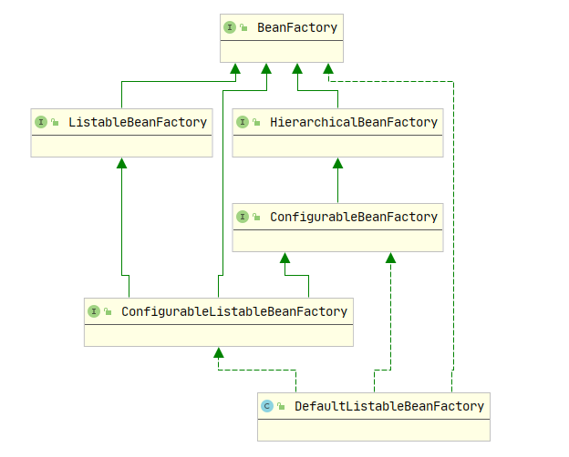
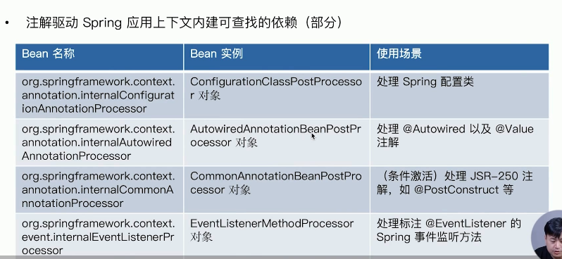
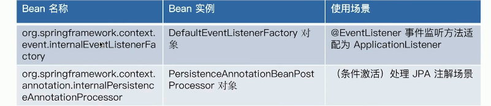
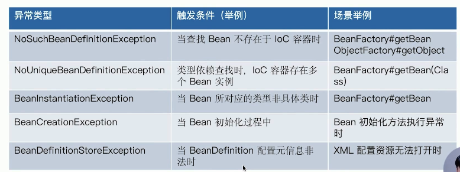
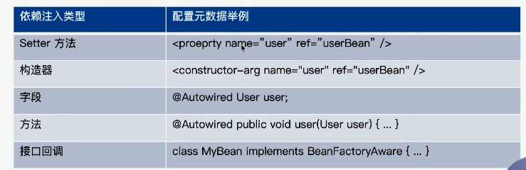
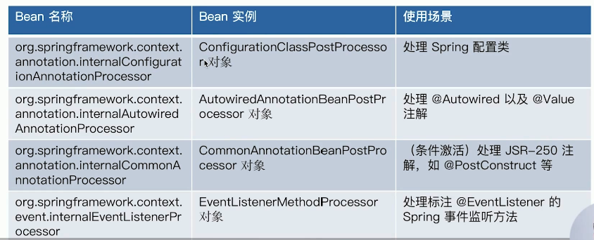
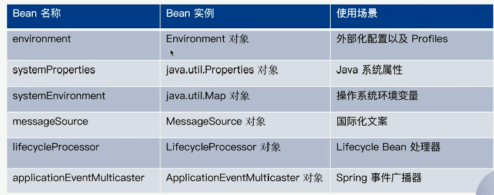
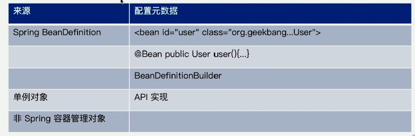
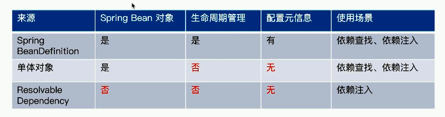

# 5. IOC 依赖查找 Dependency Lookup

## 5.1 依赖查找简介

Java 中其实已经有依赖查找了，java.beans.beancontext.BeanContext 就实现了依赖查找。


## 5.2 单一 Bean 的依赖查找

单一类型依赖查找接口 - BeanFactory

- 根据 Bean 名称查找：getString(String)
- 根据 Bean 类型查找
  - Bean 实时查找：getBean(Class)
  - Bean 延迟查找：getBeanProvider(Class) , getBeanProvider(ResolvableType) 
- 根据 Bean 名称 + 类型查找：getBean(String, Class)


1. 延迟查找 getBeanProvider(Class)

```java
public static void main(String[] args) {
    // 1.创建 ApplicationContext 容器, 使用注解配置
    AnnotationConfigApplicationContext applicationContext = new AnnotationConfigApplicationContext();
    // 2.将当前类作为配置类
    applicationContext.register(ObjectProviderDemo.class);
    // 3.启动应用上下文
    applicationContext.refresh();

    // 4.依赖查找
    lookupByObjectProvider(applicationContext);

    // 5.停止应用上下文
    applicationContext.close();
}

@Bean
public String helloWorld() {
    return "HelloWorld";
}

private static void lookupByObjectProvider(AnnotationConfigApplicationContext applicationContext) {
    ObjectProvider<String> objectProvider = applicationContext.getBeanProvider(String.class);
    String hello = objectProvider.getObject();

    System.out.println(hello);
}
```

输出结果

```
HelloWorld
```


还有根据 Bean 名称或类型查找的方式，在前面章节已经多次使用，就不一一举例了。

// 补充: 源码分析，查找过程

// 补充: 什么是延迟查找，有什么用？参考课程评论

```java
public interface BeanFactory {

	String FACTORY_BEAN_PREFIX = "&";

    // 获取名称为name的bean实例
	Object getBean(String name) throws BeansException;
    // 获取类型为requiredType的bean实例
	<T> T getBean(Class<T> requiredType) throws BeansException;
    // 获取名称为name,类型为requiredType的bean实例
	<T> T getBean(String name, Class<T> requiredType) throws BeansException;
	// 延迟查找
	<T> ObjectProvider<T> getBeanProvider(Class<T> requiredType);

	<T> ObjectProvider<T> getBeanProvider(ResolvableType requiredType);

	boolean containsBean(String name);

	boolean isSingleton(String name) throws NoSuchBeanDefinitionException;

	boolean isPrototype(String name) throws NoSuchBeanDefinitionException;

	boolean isTypeMatch(String name, ResolvableType typeToMatch) throws NoSuchBeanDefinitionException;

	boolean isTypeMatch(String name, Class<?> typeToMatch) throws NoSuchBeanDefinitionException;

	Class<?> getType(String name) throws NoSuchBeanDefinitionException;

	Class<?> getType(String name, boolean allowFactoryBeanInit) throws NoSuchBeanDefinitionException;
	// 获取bean的所有别名
	String[] getAliases(String name);
}
```


## 5.3 列表 Bean 的依赖查找

集合型依赖查找接口 - ListableBeanFactory 

- 根据 bean 类型查找

  - 获取同类型 bean 名称列表
    - getBeanNameForType(Class)
    - getBeanNameForType(ResolvableType)
  - 获取同类型 bean 实例列表：getBeansOfType(Class)

- 通过注解类型查找

  - 获取标记的 bean 名称列表：getBeanNamesForAnnotation(Class <? extends Annotation>)

  - 获取标记的 bean 实例列表：getBeanWithAnnotation(Class <? extends Annotation>)

  - 获取指定名称 + 标记的 bean 实例：findAnnotationOnBean(String, Class <? extends Annotation>)

    

ListableBeanFactory 就是 BeanFactory 接口的实现类，针对某一个类型去查找一个集合列表（Listable），ListableBeanFactory 规定了集合类型的依赖查找方法，源码如下所示

```java
ListableBeanFactory.java
    
public interface ListableBeanFactory extends BeanFactory {
    boolean containsBeanDefinition(String beanName);
    
	int getBeanDefinitionCount();
    
	String[] getBeanDefinitionNames();
    // 获取type类型的bean名称列表
    String[] getBeanNamesForType(Class<?> type);
    // 获取type类型的bean名称列表
	String[] getBeanNamesForType(ResolvableType type);
    // 获取type类型的bean实例列表
	<T> Map<String, T> getBeansOfType(Class<T> type) throws BeansException;
    // 获取annotationType注解标记的bean名称列表
	String[] getBeanNamesForAnnotation(Class<? extends Annotation> annotationType);
    // 获取annotationType注解标记的bean实例列表
	Map<String, Object> getBeansWithAnnotation(Class<? extends Annotation> annotationType) throws BeansException;
    // 获取名称为beanName, annotationType注解标记的bean实例
	<A extends Annotation> A findAnnotationOnBean(String beanName, Class<A> annotationType)
			throws NoSuchBeanDefinitionException;
}
```


## 5.4 层次性依赖查找

层次性依赖查找接口 - HierarchicalBeanFactory

- 双亲 BeanFactory：getParentBeanFactory()
- 层次性查找
  - 根据 Bean 名称查找
    - 基于 HierarchicalBeanFactory#containsLocalBean 方法实现
  - 根据 Bean 类型查找 Bean 实例
    - 单一实例：BeanFactoryUtils#beanOfTypeIncludingAncestors
    - 集合实例：BeanFactoryUtils#beansOfTypeIncludingAncestors
  - 根据 Java 注解查找 Bean 名称列表：BeanFactoryUtils#beanNamesForTypeIncludingAncestors


**源码分析**

HierarchicalBeanFactory 是 BeanFactory 的实现类，规定了层次性的依赖查找方法，源码如下所示：

```java
public interface HierarchicalBeanFactory extends BeanFactory {

    // 获取父容器BeanFactory
	BeanFactory getParentBeanFactory();

    // 查看当前BeanFactory是否包含bean,忽略父容器BeanFactory中的bean
	boolean containsLocalBean(String name);

}
```



**DefaultListableBeanFactory 是 Spring 中最常见的兜底的容器**，它实现了 BeanFactory 接口，可以根据 bean 名称，根据 bean 类型进行依赖查找；实现了 ListableBeanFactory，可以根据 bean 类型查找所有 bean 实例列表，根据 注解标记查找所有 bean 实例列表；实现了 HierarchicalBeanFactory 接口，可以根据 bean 名称进行层次性依赖查找，可以根据 bean 类型层次性查找所有 bean 实例列表。


### 1. 根据 Bean 名称层次性依赖查找

根据 Bean 的名称层次性查找当前容器及其祖先容器是否存在 bean

1. 创建一个父容器，并加载 xml 中的bean，包括`user`bean等

```xml
<bean id="user" class="org.geekbang.ioc.overview.lookup.domain.User">
    <property name="id" value="1"/>
    <property name="name" value="tracccer"/>
</bean>
```

```java
// 创建一个容器 BeanFactory, 该xml中定义了user等bean
private static HierarchicalBeanFactory createParentBeanFactory() {
    // 创建BeanFactory容器
    DefaultListableBeanFactory beanFactory = new DefaultListableBeanFactory();
    XmlBeanDefinitionReader reader = new XmlBeanDefinitionReader(beanFactory);
    // bean 配置文件路径
    String location = "dependcy-lookup-context.xml";
    // 加载xml配置文件中的bean
    reader.loadBeanDefinitions(location);

    return beanFactory;
}
```

2. 判断当前容器本地是否存在 bean，忽略父容器中 bean

```java
private static void displayLocalBean(HierarchicalBeanFactory beanFactory, String beanName, String BeanFactoryMode) {
    if (beanFactory.containsLocalBean(beanName)) {
        Object bean = beanFactory.getBean(beanName);
        System.out.println(BeanFactoryMode + "存在bean: " + beanName + ", " + bean);
    } else {
        System.out.println(BeanFactoryMode + "不存在bean: " + beanName);
    }
}
```

3. 判断当前容器是否存在 bean，包括父容器中的 bean，会依次向上查找父容器。

```java
private static void displayBean(HierarchicalBeanFactory beanFactory, String beanName) {
    System.out.println("层次性查找当前容器是否包含bean=" 
			+ beanName + ": "+ 
        	containsBean(beanFactory, beanName));
}

// 递归查询容器及其父容器是否存在bean
private static boolean containsBean(HierarchicalBeanFactory beanFactory, String beanName) {
    // 获取父容器
    BeanFactory parentBeanFactory = beanFactory.getParentBeanFactory();
    // 父容器是HierarchicalBeanFactory类型, 正面其还有父容器
    if (parentBeanFactory instanceof HierarchicalBeanFactory) {
        HierarchicalBeanFactory hierarchicalBeanFactory = (HierarchicalBeanFactory) parentBeanFactory;
        // 递归调用, 判断父容器中是否包含bean
        if (containsBean(hierarchicalBeanFactory, beanName)) {
            // 父容器中包含bean, 返回true
            return true;
        }
    }
    // 返回当前容器是否包含bean
    return beanFactory.containsLocalBean(beanName);
}
```

4. 为当前容器设置设置父容器，并判断`user`bean 在本地容器还是在父容器，然后使用递归的方式层次性向上查找父容器中是否存在`user` bean

   ConfigurableListableBeanFactory 实现了 HierarchicalBeanFactory 和 ListableBeanFactory 接口，提供了设置父容器的`setParentBeanFactory()`方法。

```java
public static void main(String[] args) {
    // 1.创建应用上下文, 使用注解配置, 并启动
    AnnotationConfigApplicationContext applicationContext = new AnnotationConfigApplicationContext();
    applicationContext.register(DependpencyLookupHierarchicalDemo.class);

    // 2.获取 HierarchicalBeanFactory 的实现类 ConfigurableListableBeanFactory
    // HierarchicalBeanFactory -> ConfigurableBeanFactory -> ConfigurableListableBeanFactory
    ConfigurableListableBeanFactory beanFactory = applicationContext.getBeanFactory();
    System.out.println("当前BeanFactory的父容器ParentBeanFactory: " + beanFactory.getParentBeanFactory());

    // 3.设置 parent BeanFactory
    HierarchicalBeanFactory parentBeanFactory = createParentBeanFactory();
    beanFactory.setParentBeanFactory(parentBeanFactory);
    System.out.println("当前BeanFactory的父容器ParentBeanFactory: " + beanFactory.getParentBeanFactory());

    // 4.判断bean在本地容器还是在父容器
    displayLocalBean(beanFactory, "user", "本地容器LocalBeanFactory");
    displayLocalBean(parentBeanFactory, "user", "父容器ParentBeanFactory");

    // 注解bean在容器启动时才会加载
    applicationContext.refresh();
    displayLocalBean(beanFactory, "hello", "本地容器LocalBeanFactory");

    // 5.层次性查找bean是否在当前容器及其祖先容器
    System.out.println("====层次性查找bean是否在当前容器及其祖先容器=====");
    displayBean(beanFactory, "user");
}

@Bean
public String hello() {
    return "HelloWorld";
}
```

输出结果

```
当前BeanFactory的父容器ParentBeanFactory: null
当前BeanFactory的父容器ParentBeanFactory: org.springframework.beans.factory.support.DefaultListableBeanFactory@7ac7a4e4: defining beans [user,objectFactory,org.geekbang.ioc.overview.lookup.domain.SuperUser#0]; root of factory hierarchy

本地容器LocalBeanFactory不存在bean: user
父容器ParentBeanFactory存在bean: user, User{id=1, name='tracccer'}
本地容器LocalBeanFactory存在bean: hello, HelloWorld

====层次性查找bean是否在当前容器及其祖先容器=====
层次性查找当前容器是否包含bean=user: true
```


### 2. 根据 Bean 类型层次性依赖查找

1. 创建一个父容器，并加载 xml 中的 bean，有两个 User 类型的 bean

```xml
<bean id="user" class="org.geekbang.ioc.overview.lookup.domain.User">
    <property name="id" value="1"/>
    <property name="name" value="tracccer"/>
</bean>

<bean  class="org.geekbang.ioc.overview.lookup.domain.SuperUser" parent="user" primary="true">
    <property name="address" value="杭州"/>
</bean>
```

2. 创建应用上下文，设置父容器，然后使用 BeanFactoryUtils.beansOfTypeIncludingAncestors 依次向上查找（层次性查找）当前容器及其祖先容器中是否存在 bean

```java
public static void main(String[] args) {
    // 1.创建应用上下文, 使用注解配置, 并启动
    AnnotationConfigApplicationContext applicationContext = new AnnotationConfigApplicationContext();
    applicationContext.register(DependpencyLookupHierarchicalDemo.class);

    // 2.获取 HierarchicalBeanFactory 的实现类 ConfigurableListableBeanFactory
    // HierarchicalBeanFactory -> ConfigurableBeanFactory -> ConfigurableListableBeanFactory
    ConfigurableListableBeanFactory beanFactory = applicationContext.getBeanFactory();
    System.out.println("当前BeanFactory的父容器ParentBeanFactory: " + beanFactory.getParentBeanFactory());

    // 3.设置 parent BeanFactory
    HierarchicalBeanFactory parentBeanFactory = createParentBeanFactory();
    beanFactory.setParentBeanFactory(parentBeanFactory);
    System.out.println("当前BeanFactory的父容器ParentBeanFactory: " + beanFactory.getParentBeanFactory());

    // 6.使用BeanFactoryUtils查找当前容器及其祖先容器是否存在bean
    Map<String, User> users = BeanFactoryUtils.beansOfTypeIncludingAncestors(beanFactory, User.class);
    System.out.println("user类型bean列表: " + users);
}
```

输出结果：查找出了当前容器及其祖先容器中存在两个 User 类型的bean，分别是 user 和 SuperUser#0

```
当前BeanFactory的父容器ParentBeanFactory: null
当前BeanFactory的父容器ParentBeanFactory: org.springframework.beans.factory.support.DefaultListableBeanFactory@6ca8564a: defining beans [user,objectFactory,org.geekbang.ioc.overview.lookup.domain.SuperUser#0]; root of factory hierarchy

user类型bean列表: {user=User{id=1, name='tracccer'}, org....SuperUser#0=User{id=1, name='tracccer, address='杭州'}}
```


源码分析，BeanFactoryUtils 是如何依次查找当前容器及其祖先容器（层次性查找）中是否存在 type 类型的 bean，源码如下所示：

```java
BeanFactoryUtils.java

public static <T> Map<String, T> beansOfTypeIncludingAncestors(ListableBeanFactory lbf, Class<T> type)
    throws BeansException {

    Assert.notNull(lbf, "ListableBeanFactory must not be null");
    Map<String, T> result = new LinkedHashMap<>(4);
    result.putAll(lbf.getBeansOfType(type));
    // 若当前容器是不是层次性Hierarchical容器, 则存在父容器
    if (lbf instanceof HierarchicalBeanFactory) {
        HierarchicalBeanFactory hbf = (HierarchicalBeanFactory) lbf;
        // 获取父容器
        if (hbf.getParentBeanFactory() instanceof ListableBeanFactory) {
            // 查找父容器中type类型的bean, 递归调用
            Map<String, T> parentResult = beansOfTypeIncludingAncestors(
                (ListableBeanFactory) hbf.getParentBeanFactory(), type);
            
            // 遍历查找到的bean
            parentResult.forEach((beanName, beanInstance) -> {
                // 子容器不存在且当前容器存在该bean, 则将其加入result
                // 若子容器存在则不加入,即忽略了父容器中的同名bean
                if (!result.containsKey(beanName) && !hbf.containsLocalBean(beanName)) {
                    result.put(beanName, beanInstance);
                }
            });
        }
    }
    // 返回查找到的bean
    return result;
}
```

从源码也可以看出，如果父容器和子容器存在同名的 bean，则优先选择子容器中的 bean。

根据 Bean 类型层次性查找 Bean 的单一实例的逻辑与上面的源码相同，当查找结果同在多个该类型的 Bean 则抛出异常，源码如下所示

```java
BeanFactoryUtils.java
    
public static <T> T beanOfTypeIncludingAncestors(ListableBeanFactory lbf, Class<T> type)
    throws BeansException {
	// 层次性查找容器及其祖先容器中type类型的所有bean
    Map<String, T> beansOfType = beansOfTypeIncludingAncestors(lbf, type);
    // 返回查找到的单个bean
    return uniqueBean(type, beansOfType);
}

private static <T> T uniqueBean(Class<T> type, Map<String, T> matchingBeans) {
    int count = matchingBeans.size();
    if (count == 1) {
        // 如果查找到的bean为1个, 则返回bean
        return matchingBeans.values().iterator().next();
    }
    else if (count > 1) {
        // 如果查找到的bean为多个, 则抛出异常
        throw new NoUniqueBeanDefinitionException(type, matchingBeans.keySet());
    }
    else {
        // 如果未查找到bean, 则抛出异常
        throw new NoSuchBeanDefinitionException(type);
    }
}
```


### 3. 应用场景

比如 Spring MVC 中，Biz 组件放在 Root ApplicationContext，而 Web 组件放在 DispatcherServlet 的 ApplicationContext，后者是前者的子 ApplicationContext，所以，子 ApplicationContext 可以读取父 ApplicationContext


## 5.5 延迟依赖查找

Bean 延迟依赖查找接口 

- ObjectFactory
- ObjectProvider，是 ObjectFactory 的子接口
  - getIfAvailable()  如果 bean 不存在，返回 null
  - getIfAvailable(Supplier defaultSupplier)  如果 bean 不存在，返回默认值
  - objectProvider.getObject()  如果 bean 不存在，抛出异常
  - getIfUnique(Supplier defaultSupplier)  如果 bean 不唯一，返回默认值


所谓的延迟查找，就是`applicationContext.getBeanProvider(User.class)`并没有真正去容器中查找，当调用`objectProvider#getxxx`时才会真的去容器进行依赖查找，故称之为延迟依赖查找，本节并没有演示其延迟的特性，只演示了其 api 的使用。


**应用场景：**延迟查找并非是Bean的延迟加载，跟@Lazy是两码事，ObjectProvider#getxxx 方法 底层还是通过BeanFactory来进行依赖查找的，但是在进行依赖查找前，可以制定以下规则，比如Bean找到后，再设置额外的属性，完成一些用户的自定义需求；Bean没有找到，该如何处理。ObjectProvider 在 Springboot，SpringCloud 中大量使用。


1. ObjectProvider 接口的依赖查找示例

```java
private static void lookupByIfAvaiable(AnnotationConfigApplicationContext applicationContext) {
    // 查找User类型的bean, 肯定找不到，由于是延迟查找，并不会报错
    ObjectProvider<User> objectProvider = applicationContext.getBeanProvider(User.class);

    // 1.若找不到bean, 返回null
    User user = objectProvider.getIfAvailable();
    System.out.println("bean不存在返回null: " + user);

    // 2.若找不到bean, 返回默认bean
    User user2 = objectProvider.getIfAvailable(() -> new User());
    System.out.println("bean不存在返回默认bean: " + user2);

    // 3. 若找不到bean, 抛出异常
    System.out.println(objectProvider.getObject());
}
```

2. ObjectFactory 使用示例，参考 3.1 章节 根据Bean名称延迟查找


// 补充：延迟查找的应用场景，参考https://time.geekbang.org/course/detail/265-189603 评论区


## 5.6 依赖查找的安全性

依赖查找的安全性指的是否有可能抛出异常，如果有可能抛出异常，则该方法不安全。

| 依赖查找类型 | 代表实现                           | 是否安全 |
| ------------ | ---------------------------------- | -------- |
| 单一bean查找 | BeanFactory#getBean                | 否       |
|              | ObjectFactory#getObject            | 否       |
|              | ObjectProvider#getIfAvaiable       | 是       |
| 集合bean查找 | ListableBeanFactory#getBeansOfType | 是       |
|              | ObjectProvider#stream              | 是       |


推荐使用 ObjectProvider 查询，可以避免异常，SpringBoot 和 SpringCloud 大量使用。


## 5.7 内建可查找的依赖

AbstractApplicationContext 是 Spring 中所有应用上下文的一个基类，基本上所有的应用上下文的实现，包括注解类型的实现 AnnotationConfigApplicationContext 和 web 类型的实现都是基于 AbstractApplicationContext，该抽象类在应用上下文启动过程中会初始化一些相关的内部的一些依赖，这些内部的依赖我们称为**内建可查找的依赖**。

AbstractApplicationContext 内建可查找的依赖

| Bean 名称                   | Bean 类型                   | 使用场景                |
| --------------------------- | --------------------------- | ----------------------- |
| environment                 | Environment                 | 外部化配置以及 Profiles |
| systemProperties            | java.util.Properties        | Java 系统属性           |
| systemEnvironment           | java.util.Map               | 操作系统环境变量        |
| messageSource               | MessageSource               | 国际化文件              |
| lifecycleProcessor          | LifecycleProcessor          | Lifecycle Bean 处理器   |
| applicationEventMulticaster | ApplicationEventMulticaster | Spring 事件广播器       |

外部化配置指的是 `-D`那些启动参数，Java 系统属性包括`user.home` 等属性，操作系统环境变量包括`JAVA_HOME`等属性。






1. 用来处理 @Autowired 依赖注入，见 6.15 章节，在 AnnotationConfigUtils 中注册到容器中

```java
AutowiredAnnotationBeanPostProcessor.java
    
// 处理@Autowired @Value注解
public AutowiredAnnotationBeanPostProcessor() {
    this.autowiredAnnotationTypes.add(Autowired.class);
    this.autowiredAnnotationTypes.add(Value.class);

    this.autowiredAnnotationTypes.add((Class<? extends Annotation>)
                                      ClassUtils.forName("javax.inject.Inject", AutowiredAnnotationBeanPostProcessor.class.getClassLoader()));
}
```

```java
AnnotationConfigUtils.java

public static final String AUTOWIRED_ANNOTATION_PROCESSOR_BEAN_NAME =
			"org.springframework.context.annotation.internalAutowiredAnnotationProcessor";

public static Set<BeanDefinitionHolder> registerAnnotationConfigProcessors(
    BeanDefinitionRegistry registry, @Nullable Object source) {

	// .....

    // 向容器注册内建bean,名称为internalAutowiredAnnotationProcessor
    // 类型为AutowiredAnnotationBeanPostProcessor.class
    if (!registry.containsBeanDefinition(AUTOWIRED_ANNOTATION_PROCESSOR_BEAN_NAME)) {
        RootBeanDefinition def = new RootBeanDefinition(AutowiredAnnotationBeanPostProcessor.class);
        def.setSource(source);
        beanDefs.add(registerPostProcessor(registry, def, AUTOWIRED_ANNOTATION_PROCESSOR_BEAN_NAME));
    }
}
```

2. 用来处理 @Resource，@PostConstruct，@PreDestroy 等注解

```java
CommonAnnotationBeanPostProcessor.java

// 处理@PostConstruct @PreDestroy注解
public CommonAnnotationBeanPostProcessor() {
    setOrder(Ordered.LOWEST_PRECEDENCE - 3);
    setInitAnnotationType(PostConstruct.class);
    setDestroyAnnotationType(PreDestroy.class);
    ignoreResourceType("javax.xml.ws.WebServiceContext");
}
```

3. 用来处理 @EventListener 注解

```java
EventListenerMethodProcessor.java

// 处理@EventListener注解
public void postProcessBeanFactory(ConfigurableListableBeanFactory beanFactory) {
    this.beanFactory = beanFactory;

    // 获取容器中EventListenerFactory类型的bean
    Map<String, EventListenerFactory> beans = beanFactory.getBeansOfType(EventListenerFactory.class, false, false);
    List<EventListenerFactory> factories = new ArrayList<>(beans.values());
    AnnotationAwareOrderComparator.sort(factories);
    this.eventListenerFactories = factories;
}
```


## 5.8 依赖查找中的常见异常

BeansException 的子类型：




1. 指定 Bean 的类型为 Map 接口，Bean 实例化时，会抛出异常 BeanInstantiationException，提示"实例化失败，Map是一个接口" `Failed to instantiate [java.util.Map]: Specified class is an interface`

```java
public static void main(String[] args) {
    // 创建 BeanFactory 容器
    AnnotationConfigApplicationContext applicationContext = new AnnotationConfigApplicationContext();

    // 注册 BeanDefinition Bean Class 是一个 CharSequence 接口
    BeanDefinitionBuilder beanDefinitionBuilder = BeanDefinitionBuilder.genericBeanDefinition(Map.class);
    applicationContext.registerBeanDefinition("errorBean", beanDefinitionBuilder.getBeanDefinition());

    // 启动应用上下文
    applicationContext.refresh();
    // 关闭应用上下文
    applicationContext.close();
}
```

输出结果：

```
警告: Exception encountered during context initialization - cancelling refresh attempt: org.springframework.beans.factory.BeanCreationException: Error creating bean with name 'errorBean': Instantiation of bean failed; nested exception is org.springframework.beans.BeanInstantiationException: Failed to instantiate [java.util.Map]: Specified class is an interface
Exception in thread "main" org...BeanCreationException: 
	Error creating bean with name 'errorBean': Instantiation of bean failed; 
	nested exception is org..BeanInstantiationException: 
		Failed to instantiate [java.util.Map]: Specified class is an interface
Caused by: org....BeanInstantiationException: 
	Failed to instantiate [java.util.Map]: Specified class is an interface
```

2. 当容器中**不存在 Bean**，或者查找时写错了 Bean 的名称，会抛出 NoSuchBeanDefintionException
3. 当按类型查找时，容器中**存在多个**符合条件的 bean，会抛出 NoUniqueBeanDefintionException
4. Bean 在**实例化**时发生异常，如 Bean 类型是接口等，会抛出 BeanInstantiationException
5. Bean 在**初始化**时，如回调 @PostConstruct 方法发生异常，会抛出 BeanCreationExceptionDemo
6. 当指定的 xml 配置文件不存在时，或者写错了 xml 配置文件名称，**Bean 的定义读取失败**，会报这个异常 BeanDefinitionStoreException。


## 5.9 面试题

1. ObjectFactory 与 BeanFactory 的区别？

   二者均具备依赖查找能力，从名字可以看出二者都是工厂，ObjectFactory 仅关注一个或者一种类型的 Bean 依赖查找，是延迟查找，底层由 BeanFactory 执行查找逻辑。

   BeanFactory 则提供了单一 Bean，列表 Bean 和 层次性多种依赖查找方式。

2. BeanFactory.getBean 操作是否线程安全？

   是线程安全的，操作过程中会使用互斥锁 synchronized。这块并没有完全搞明白，视频其实也没讲清楚。参考AbstractAutowireCapableBeanFactory#doCreateBean 方法中 synchronized 关键字部分

3. Spring 依赖查找和依赖注入在来源上有什么区别？

   见后续 依赖注入 和 依赖来源 章节


# 6. IOC 依赖注入 Dependency Injection

## 6.1 依赖注入的模式和类型

依赖注入的两种模式：

1. 手动模式 - 配置或者编码的方式，提前安排注入规则
   - xml 资源配置 bean 元信息
   - 注解 @Bean 配置 bean 元信息
   - Spring api 配置 bean 元信息

2. 自动模式 - 实现方提供依赖自动关联的方式，按照内建的注入规则
   - Autowiring 自动绑定

依赖注入的 5 种类型：



Setter 方法注入与 字段注入并不相等，@Autowired 标记的字段可以不设置 Setter 方法，Spring 会使用 Java 的反射访问私有字段。https://blog.csdn.net/qq_19782019/article/details/85038081


## 6.2 自动绑定 Autowiring 简介

Spring 并不推荐使用自动绑定，这部分不是重点。

// 补充

## 6.3 自动绑定 Autowiring 模式

自动绑定 Autowiring 的4 种模式：

- no：默认值，关闭 Autowiring，Spring 并不推荐使用自动绑定，需要手动指定依赖注入的对象
- byName：根据被注入属性的名称，作为 Bean 的名称进行依赖查找，并将对象设置到该属性
- byType：根据被注入属性的类型，作为 Bean 的类型进行依赖查找，并将对象设置到该属性、
- constructor：特殊的 byType 类型，用于构造器参数


## 6.4 自动绑定 Autowiring 限制和不足


## 6.5 Setter 方法依赖注入

Setter 方法依赖注入 4 种方式，这 4 种方式**都会调用 Setter 方法进行依赖注入**，所谓的注入就是将容器中的 bean 注入到 setter 方法的参数上。

- xml 资源配置 bean 元信息
- @Bean 注解配置 bean 元信息
- spring api 配置 bean 元信息
- 自动绑定 autowiring


1. xml 中配置 bean 的属性，`<property name="user" ref="user1"/>`将 user1 注入到 user 属性中，详细见[Github](XmlDependencySetterInjectionDemo)

```xml
<bean id="user1" class="org.geekbang.ioc.overview.lookup.domain.User">
    <property name="id" value="1"/>
    <property name="name" value="tracccer"/>
</bean>

<!--  使用Setter注入字段  -->
<bean class="org.geekbang.dependency.injection.UserHolder">
    <!--  前面是属性名,后面是要注入的bean名称  -->
    <property name="user" ref="user1"/>
</bean>
```


2. 使用注解配置中设置 bean 的属性，`userHolder.setUser(user)`将 user 注入到 userHolder 的属性中，详细见[Github](AnnotationDependencySetterInjectionDemo)

```java
// 容器中必须已经存在一个User类型的bean,才能注入成功
@Bean(name = "userHolder1")
public UserHolder userHolder(User user) {
    UserHolder userHolder = new UserHolder();
    // Setter注入
    userHolder.setUser(user);
    return userHolder;
}
```


3. api 配置 BeanDefinition 时设置与属性绑定的 bean 名称，xml 配置文件设置 Setter 注入底层其实也是调用的 api，`builder.addPropertyReference("user", "user1");`

容器中已经注册了bean `user1`

```xml
<bean id="user1" class="org.geekbang.ioc.overview.lookup.domain.User">
    <property name="id" value="1"/>
    <property name="name" value="tracccer"/>
</bean>
```

创建 BeanDefinition，将 bean `user1`注入到 UserHolder 中，即设置到`UserHolder.user`属性中

```java
public static BeanDefinition createUserHolderBeanDefinition() {
    BeanDefinitionBuilder builder = BeanDefinitionBuilder.genericBeanDefinition(UserHolder.class);

    // setter 注入引用, 前面是字段名, 后面是bean名称
    builder.addPropertyReference("user", "user1");
    return builder.getBeanDefinition();
}
```

将 UserHolder 的 BeanDefinition 注册到容器中，然后从容器中查找 UserHolder，查看  bean `user1`是否注入成功

```java
public static void main(String[] args) {
    // 创建容器, 读取xml中的bean: user
    DefaultListableBeanFactory beanFactory = new DefaultListableBeanFactory();
    XmlBeanDefinitionReader reader = new XmlBeanDefinitionReader(beanFactory);
    String location = "dependcy-setter-injection.xml";
    reader.loadBeanDefinitions(location);

    // 1.创建 userHolder BeanDefinition
    BeanDefinition userHolderBeanDefinition = createUserHolderBeanDefinition();
    // 2.注册 userHolder1 到容器
    beanFactory.registerBeanDefinition("userHolder1", userHolderBeanDefinition);

    // 3.查找bean, 查看是否注入成功
    UserHolder userHolder = beanFactory.getBean("userHolder1", UserHolder.class);
    System.out.println(userHolder);
}
```

输出结果：可以看到 xml 中配置的 bean user1，成功注入到了 UserHolder 中

```
UserHolder{user=User{id=1, name='tracccer'}}
```

4. 自动绑定，这里使用 byName 的方式自动绑定，属性名要与 bean 名称相同。

```xml
<bean id="user" class="org.geekbang.ioc.overview.lookup.domain.User">
    <property name="id" value="1"/>
    <property name="name" value="tracccer"/>
</bean>

<!--  使用Setter注入字段, 自动绑定 autowire, 属性名要与bean名称相同  -->
<bean class="org.geekbang.dependency.injection.UserHolder"
      autowire="byName">
    <!-- 使用自动绑定autowire替换掉手动配置 -->
    <!-- <property name="user" ref="user1"/> -->
</bean>
```

```java
public static void main(String[] args) {
    // 加载配置文件中的bean
    ClassPathXmlApplicationContext applicationContext = new ClassPathXmlApplicationContext("autowiring-dependcy-setter-injection.xml");

    // 依赖查找并创建bean
    UserHolder userHolder = applicationContext.getBean(UserHolder.class);
    System.out.println(userHolder);
}
```

输出结果：说明自动绑定成功了

```
UserHolder{user=User{id=1, name='tracccer'}}
```


## 6.6 构造器依赖注入

构造方法依赖注入有 4 种方式，这 4 种方式**都会调用 构造方法 进行依赖注入****，所谓的注入就是将容器中的 bean 依赖注入到构造方法的参数上。

- xml 资源配置  bean 元信息
- @Bean 注解配置 bean 元信息
- spring api 构造 BeanDefinition 配置 bean 元信息
- 自动绑定 autowiring


1. xml 中配置 bean 的构造方法参数，`<constructor-arg name="user" ref="user1"/>`将容器中的 user1 实例注入到构造方法的 user 参数中

```xml
<bean id="user1" class="org.geekbang.ioc.overview.lookup.domain.User">
    <property name="id" value="1"/>
    <property name="name" value="tracccer"/>
</bean>

<!--  使用构造方法注入  -->
<bean class="org.geekbang.dependency.injection.UserHolder">
    <!--  前面是构造方法属性名,后面是要注入的bean名称  -->
    <constructor-arg name="user" ref="user1"/>
</bean>
```

```java
public static void main(String[] args) {
    // 读取xml中的配置, xml 中配置了构造器依赖注入
    ApplicationContext applicationContext = new ClassPathXmlApplicationContext("dependcy-constructor-injection.xml");

    // 查找bean, 查看依赖注入结果
    UserHolder userHolder = applicationContext.getBean(UserHolder.class);
    System.out.println(userHolder);
}
```

输出结果：user 属性为 user1，说明通过构造方法依赖注入成功

```
UserHolder{user=User{id=1, name='tracccer'}}
```

2. 使用注解 @Bean 配置 bean 时，`new UserHolder(user)`将容器中的 user 实例作为构造方法的参数注入到 UserHolder 中

```java
// 容器中必须已经存在一个User类型的bean,才能注入成功
@Bean(name = "userHolder1")
public UserHolder userHolder(User user) {

    // 构造器注入
    UserHolder userHolder = new UserHolder(user);
    return userHolder;
}
```

3. Spring api 依赖构造方法注入参数，创建 BeanDefinition 时，设置与构造器参数绑定的 bean 名称`builder.addConstructorArgReference("user1");`

```java
public static BeanDefinition createUserHolderBeanDefinition() {
    BeanDefinitionBuilder builder = BeanDefinitionBuilder.genericBeanDefinition(UserHolder.class);

    // 构造器注入, 将user1实例作为构造器第一个参数注入
    builder.addConstructorArgReference("user1");
    return builder.getBeanDefinition();
}
```

4. 自动绑定

```xml
<!--  使用构造器注入字段, 自动绑定 autowire -->
<bean class="org.geekbang.dependency.injection.UserHolder"
      autowire="constructor">
</bean>
```


这些东西都是Spring IOC 容器底层注册生命周期的基础，中间件开发基于 Spring api 开发时，也是非常重要。


## 6.7 字段注入

字段注入**只能使用注解**的方式进行依赖注入，而且没有自动绑定 Autowiring 模式

- @Autowired
- @Resource
- @Inject


源码分析：

其实在启动spring IoC时，容器自动装载了一个 AutowiredAnnotationBeanPostProcessor 后置处理器，当容器扫描到@Autowied、@Resource或@Inject时，就会在IoC容器自动查找需要的bean，并装配给该对象的属性。详细见 6.15 节


1. @Autowired，根据字段类型从容器中查找 bean，绑定到该属性上

```java
// 字段注入，根据类型
@Autowired
private UserHolder userHolder;

public static void main(String[] args) {
    // 创建容器, 加载xml中的bean
    AnnotationConfigApplicationContext applicationContext = getApplicationContext();
    // 启动应用上下文
    applicationContext.refresh();

    // 从容器获取当前主类, 该主类已经被注册到了容器
    AnnotationDependencyFieldInjectionDemo demo = applicationContext.getBean(AnnotationDependencyFieldInjectionDemo.class);
    System.out.println(demo.userHolder);

    // 关闭应用上下文
    applicationContext.close();
}
```

输出结果：说明字段注入成功，都注入到了当前类的属性中。

```
UserHolder{user=User{id=1, name='tracccer'}}
```


在使用@Autowired时，首先在容器中查询对应类型的bean, 　　　　

- 如果查询结果刚好为一个，就将该bean装配给@Autowired指定的数据 　　　　 　　　　
- 如果查询的结果不止一个，那么@Autowired会根据名称来查找。 　　　　 　　　　
- 如果查询的结果为空，那么会抛出异常。解决方法是，使用required=false　　
  

注意 @Autowired 会忽略掉 static 静态属性，即标记无效。


2. @Resource，有两个属性 name 和 type，如果指定了 name 或 type，则从容器中查找指定的 bean；如果都未指定，则先根据属性名作为 bean name 从容器中查找，再根据属性类型作为 bean type 从容器中查找。这个注解是属于 jdk 的，与 @Autowired 不同

```java
@Autowired
private UserHolder userHolder2;

@Resource
private UserHolder userHolder3;

public static void main(String[] args) {
    // 从容器获取当前主类, 该主类已经被注册到了容器
    AnnotationDependencyFieldInjectionDemo demo = applicationContext.getBean(AnnotationDependencyFieldInjectionDemo.class);
    System.out.println("userHolder2: " + demo.userHolder2);
    System.out.println("userHolder3: " + demo.userHolder3);
    System.out.println("userHolder2 == userHolder3: " + (demo.userHolder2 == demo.userHolder3));
}
```

输出结果：字段注入成功，而且两种方式注入的字段都是同一个 bean 实例。

```
userHolder2: UserHolder{user=User{id=1, name='tracccer'}}
userHolder3: UserHolder{user=User{id=1, name='tracccer'}}
userHolder2 == userHolder3: true
```


下面是为 @Resource 配置依赖注入 bean 的名称和类型的示例。

```java
    @Resource(name = "aaa", type = UserHolder.class, required=false)
    private UserHolder userHolder3;
```


3. @Inject


## 6.8 方法注入

方法注入就是容器会调用注解标记的方法，从容器中查找符合的 bean 注入到**方法参数**中，然后调用该方法。

- @Autowired
- @Resource
- @Inject
- @Bean

1. 方法注入的 3 个注解的演示

```java
    private UserHolder userHolder2;

    private UserHolder userHolder3;

    // 方法注入
    @Autowired
    public void initUserHolder2(UserHolder userHolder) {
        this.userHolder2 = userHolder;
    }

    // 方法注入
    @Resource
    public void initUserHolder3(UserHolder userHolder) {
        this.userHolder3 = userHolder;
    }

    // 方法注入
    @Bean
    public UserHolder myHolder(UserHolder userHolder) {
        return userHolder;
    }
```

2. 查询是否注入成功

```java
public static void main(String[] args) {
    // 创建容器, 加载xml中的bean
    AnnotationConfigApplicationContext applicationContext = getApplicationContext();
    // 启动应用上下文
    applicationContext.refresh();

    // 从容器获取当前主类, 该主类已经被注册到了容器
    AnnotationDependencyMethodInjectionDemo demo = applicationContext.getBean(AnnotationDependencyMethodInjectionDemo.class);
    System.out.println("userHolder2: " + demo.userHolder2);
    System.out.println("userHolder3: " + demo.userHolder3);
    UserHolder myHolder = applicationContext.getBean("myHolder", UserHolder.class);
    System.out.println("myHolder: " + myHolder);

    System.out.println("userHolder2 == userHolder3: " + (demo.userHolder2 == demo.userHolder3));

    // 关闭应用上下文
    applicationContext.close();
}
```

输出结果：三种方式都注入成功，且都注入的是同一个 bean

```
userHolder2: UserHolder{user=User{id=1, name='tracccer'}}
userHolder3: UserHolder{user=User{id=1, name='tracccer'}}
myHolder: UserHolder{user=User{id=1, name='tracccer'}}
userHolder2 == userHolder3: true
```


## 6.8 接口回调方法注入

Aware 系列接口回调注入，就是将 Spring 提供的 bean 注入到我们的属性中，从而利用这些 bean 操作容器等。Aware 接口用于辅助访问 Spring 容器的功能或资源。

- BeanFactoryAware：获取当前 IOC 容器 BeanFactory 对象
- ApplicationContextAware：获取 Spring 应用上下文 ApplicationContext  对象
- EnvironmentAware：获取 Environment 对象

- ResourceLoaderAware：获取资源加载器 ResourcesLoader 对象
- BeanClassLoaderAware：获取加载当前 Bean Class 的 ClassLoader
- BeanNameAware：获取当前 Bean 的名称
- MessageSourceAware：获取 MessageSource 对象，用于或计划
- ApplicationEventPublisherAware：获取 ApplicationEventPublisher 对象，用于 Spring 事件
- EmbeddedValueResolverAware：获取 StringValueResolver 对象，用于占位符处理


1. 实现 Aware 回调接口

```java
@Component
public class UserService implements BeanFactoryAware, ApplicationContextAware {

    private BeanFactory beanFactory;

    private ApplicationContext applicationContext;

    @Override
    public void setBeanFactory(BeanFactory beanFactory) throws BeansException {
        this.beanFactory = beanFactory;
    }

    @Override
    public void setApplicationContext(ApplicationContext applicationContext) throws BeansException {
        this.applicationContext = applicationContext;
    }
}
```

2. 查看 Aware 回调接口注入是否成功，注入的 beanFactory 是不是当前容器 beanFactory，注入的 applicationContext 是不是当前应用上下文 applicationContext

```java
public static void main(String[] args) {
    // 创建容器, 扫描当前包所有bean
    AnnotationConfigApplicationContext applicationContext = new AnnotationConfigApplicationContext("org.geekbang.dependency.injection.aware");

    // 获取bean
    UserService userService = applicationContext.getBean(UserService.class);

    // 判断aware接口回调注入的bean, 与容器中的bean是否同一个
    System.out.println(userService.getBeanFactory() == applicationContext.getBeanFactory());
    System.out.println(userService.getApplicationContext() == applicationContext);
}
```

输出结果：说明 Aware 回调接口注入成功，而且注入的 beanFactory 就是当前容器 beanFactory，注入的 applicationContext 就是当前应用上下文 applicationContext

```
true
true
```


## 6.9 依赖注入类型的选择

- 低依赖：构造方法注入
- 多依赖：Setter 方法注入
- 便利性：字段注入
- 声明类：方法注入


## 6.10 基础类型注入

基础类型

- 原生类型：byte, byte, char, int, long, double....
- 标量类型：Number，CHaracter，Boolean，Enum，Properties，UUID
- 常规类型：Object，String，TimeZone，Calendar，Optional
- Spring 类型：Resource，InputSource，Formatter


基础类型注入并不是一种注入方式，与 Setter 注入不是一类东西，是指所有的依赖注入时设置的类型，比如 Setter 注入时 xml 设置的 bean 属性值都是 String 类型，Spring 可以将 String 转为这些基础类型，比如配置的属性值是 `classpath:/aa.xml`，Spring 会将其转为属性值的类型 Resource。在构造器注入时其实也是一样的原理。


类型转换的源码分析见 Spring 类型转换 和 元信息配置 章节。


将配置的 String 类型属性转换为属性的类型，源码再 AbstractNestablePropertyAccessor#convertForProperty


1. 创建 pojo 类，并为 bean 配置属性，其中包括 Long，Enum，Resource 类型的属性

```java
public class Docter {
    private Long id;
    private String name;
    private CityEnum city;
    private Resource resource;

    // 省略setter/getter
    
    @Override
    public String toString() {
        return "Docter{" +
                "id=" + id +
                ", name='" + name + '\'' +
                ", city=" + city +
                ", resource=" + resource +
                '}';
    }
}
```

```xml
<bean id="docter" class="org.geekbang.dependency.injection.type.Docter">
    <property name="id" value="1"/>
    <property name="name" value="tracccer"/>
    <property name="city" value="XIAN"/>
    <property name="resource" value="user.properties"/>
</bean>
```

查看 bean 的属性类型是否转换成功

```java
public static void main(String[] args) throws IOException {
    BeanFactory beanFactory = new ClassPathXmlApplicationContext("dependcy-type-injection.xml");

    Docter docter = beanFactory.getBean("docter", Docter.class);
    System.out.println("docter: " + docter);

    boolean flag = (docter.getCity() instanceof CityEnum);
    System.out.println("city属性值类型为CityEnum： " + flag);

    Resource resource = docter.getResource();
    System.out.println("URL: " + resource.getURL().toString());
}
```


输出结果：说明配置的 Enum 类型，Long 类型，Resource 类型的属性都成功转换

```
docter: Docter{id=1, name='tracccer', city=XIAN, resource=class path resource [user.properties]}
city属性值类型为CityEnum： true
URL: file:/D:/MyProjects/idea/...target/classes/user.properties
```


## 6.11 集合类型注入

- 数组类型 Array：基础类型组成的数组
- 集合类型 Collection：List，Set，Properties

1. pojo 类中有数组属性，List 属性

```java
public class Docter {
    private Long id;
    private String name;
    private CityEnum city;
    private Resource resource;

    private CityEnum[] workCitys;
    private List<CityEnum> lifeCitys;
}
```

2. 为数组属性 workCitys，List 属性 lifeCitys 配置值，用逗号分隔即可

```xml
<bean id="docter" class="org.geekbang.dependency.injection.type.Docter">
    <property name="id" value="1"/>
    <property name="name" value="tracccer"/>
    <property name="city" value="XIAN"/>
    <property name="workCitys" value="XIAN,BEIJING"/>
    <property name="lifeCitys" value="HANGZHOU,XIAN"/>
    <property name="resource" value="user.properties"/>
</bean>
```

3. 查看集合类型的属性是否注入成功

```java
public static void main(String[] args) throws IOException {
    BeanFactory beanFactory = new ClassPathXmlApplicationContext("dependcy-type-injection.xml");
    Docter docter = beanFactory.getBean("docter", Docter.class);

    System.out.println("========集合类型的配置=========");
    CityEnum[] workCitys = docter.getWorkCitys();
    System.out.println("workCitys数组:" + workCitys[0] + ", " + workCitys[1]);

    List<CityEnum> lifeCitys = docter.getLifeCitys();
    System.out.println("lifeCitys集合: " + lifeCitys);
}
```

输出结果：数组类型，集合类型的属性都配置成功

```
========集合类型的配置=========
workCitys数组:XIAN, BEIJING
lifeCitys集合: [HANGZHOU, XIAN]
```


下面两种配置集合属性的方式作用是一致的。

```xml
<property name="lifeCitys" value="HANGZHOU,XIAN"/>

<property name="lifeCitys">
    <list>
        <value>HANGZHOU</value>
        <value>BEIJING</value>
    </list>
</property>
```


## 6.12 限定注入

用注解 @Qualifier 限制依赖注入的 Bean，一般配合 @Autowired 使用

- 指定 Bean 名称
- 指定 @Qualifier 标记的 Bean（不常用）

基于注解 @Qualifier 的扩展限定注入的 Bean

- 自定义注解 - 如 Spring Cloud 的 @LoadBalanced


**依赖注入 @Qualifier 指定 Bean 名称**

1. 容器中存个 2 个 User 类型的 bean

```java
    @Bean
    public User user1() {
        return createUser(1L);
    }

    @Bean
    public User user2() {
        return createUser(2L);
    }

    private User createUser(Long id) {
        User user = new User();
        user.setId(id);
        return user;
    }
```

2. 依赖注入，使用 `@Qualifier("user1")`限制注入的 bean 的名称，否则会报异常 UnsatisfiedDependencyException，NoUniqueBeanDefinitionException

```java
    @Autowired
	@Qualifier("user1")
    private User user;
```


**依赖注入 @Qualifier 标记的 Bean**

1. 容器中存在多个 User 类型的 bean

```java
    @Bean
    public User user2() {
        return createUser(2L);
    }

    @Bean
    @Qualifier
    public User user3() {
        return createUser(3L);
    }
```

2. 依赖注入，使用`@Qualifier`限制注入的 bean 必须是被`@Qualifier`标记的， 即`user3`，否则也会报异常
```java
    @Autowired
    @Qualifier
    private User admin;
```


**依赖注入@Qualifier派生注解标记的 Bean**

1. 创建自定义注解，必须是 @Qualifier 的派生，用于标记 bean

```java
@Target({ElementType.FIELD, ElementType.PARAMETER, ElementType.METHOD})
@Retention(RetentionPolicy.RUNTIME)
@Documented
@Inherited
@Qualifier
public @interface UserGroup {
}
```

2. 容器中存在多个 User 类型的 bean

```java
    @Bean
    public User user2() {
        return createUser(2L);
    }

    @Bean
    @Qualifier
    public User user3() {
        return createUser(3L);
    }

    @Bean
    @UserGroup
	// 使用@UserGroup标记bean
    public User user4() {
        return createUser(4L);
    }
```

3. 依赖注入，通过自定义扩展`@UserGroup`，限制注入被 `@UserGroup`标记的 bean，即`user4`，否则会排除异常。需要注意的是使用 @Qualifier，会依赖注入被 @Qualifier 及其派生 @UserGroup 标记的 bean，即`user3,user4`

```java
    @Autowired
    @UserGroup
    private User manager;

    @Autowired
    @Qualifier
    private Collection<User> users;
```


**@LoadBalanced 的使用**

1. SpringCloud 中 @LoadBalanced 注解的使用，用来标记 RestTemplate 实例

```java
    @Bean  
	@LoadBalanced       
	// 不配置会报错 UnknownHostException: nacos-payment-provider
    public RestTemplate getRestTemplate() {
        return new RestTemplate();
    }
```

2. 通过 @LoadBalanced 源码可知，是 SpringCloud 自定义的 @Qualifier 注解的派生，用来给 bean 分组。

```java
@Target({ElementType.FIELD, ElementType.PARAMETER, ElementType.METHOD})
@Retention(RetentionPolicy.RUNTIME)
@Documented
@Inherited
@Qualifier
public @interface LoadBalanced {
}
```


## 6.13 延迟依赖注入

延迟依赖注入指不在容器启动时依赖注入，在查找 bean 时才进行依赖注入

- 使用 ObjectFactory 延迟注入
  - 单一 bean
  - 多个 bean
- 使用 ObjectProvider 延迟注入（推荐）
  - 单一 bean
  - 多个 bean


我创建了一个类，然后依赖多个 bean，但是这些 bean 是可配可不配的，就像是一些属性是可配可不配的，如果使用 @Autowired，找不到就会报异常 NoSuchBean，但是如果找不到 ObjectProvider#getObject() 只会返回空而不会抛出异常，保证应用的正常运行


**实时注入**

1. 容器中不存在 User 类型的 bean，使用 @Autowired 注入到 user 属性中

```java
// 实时注入
@Autowired
private User user;
```

2. 创建容器并启动，加载bean并进行依赖注入，由于 bean 不存在，会报错异常UnsatisfiedDependencyException 和 NoSuchBeanDefinitionException，所以依赖注入失败

```java
public static void main(String[] args) {
    // 创建容器并启动, 加载bean, 进行依赖注入
    ApplicationContext applicationContext = new AnnotationConfigApplicationContext(LazyAnnotationDependencyInjectionDemo.class);
}
```


**延迟注入**

1. 容器中不存在 User 类型的 bean，使用 @Autowired 注入到 ObjectProvider 中，是**延迟依赖注入**

```java
// 延迟注入
@Autowired
private ObjectProvider<User> objectProvider;
```

2. 创建容器并启动，加载 bean 进行依赖注入，虽然 user bean 不存在，但是 ObjectProvider 是延迟注入，即此时不依赖注入 user，故不会报错。

```java
public static void main(String[] args) {
    // 创建容器并启动, 加载bean, 进行依赖注入
    ApplicationContext applicationContext = new AnnotationConfigApplicationContext(LazyAnnotationDependencyInjectionDemo.class);
}
```

3. 获取 bean，此时才进行依赖注入，故称之为延迟依赖注入，因为 bean 不存在，报异常UnsatisfiedDependencyException 和 NoSuchBeanDefinitionException

```java
public static void main(String[] args) {
    // 创建容器并启动, 加载bean, 进行依赖注入
    ApplicationContext applicationContext = new AnnotationConfigApplicationContext(LazyAnnotationDependencyInjectionDemo.class);
    LazyAnnotationDependencyInjectionDemo demo = applicationContext.getBean(LazyAnnotationDependencyInjectionDemo.class);
    
    // 此时才进行依赖注入, 会报异常
    User user = demo.objectProvider.getObject();
}
```


## 6.14 依赖处理过程（重点）

- 入口 - DefaultListableBeanFactory#resolveDependency
- 依赖描述符 - DependencyDescriptor
- 自动绑定候选对象处理器 - AutowireCandidateResolver
- [Spring 处理依赖的流程图](https://www.processon.com/view/link/6084bfff5653bb5ff23f0859)
- 参考：[Spring依赖注入之注入Bean获取详解](https://blog.csdn.net/scjava/article/details/109276166)

```java
public interface AutowireCapableBeanFactory extends BeanFactory {
	@Nullable
	Object resolveDependency(DependencyDescriptor descriptor, @Nullable String requestingBeanName) throws BeansException;


	@Nullable
	Object resolveDependency(DependencyDescriptor descriptor, @Nullable String requestingBeanName,
			@Nullable Set<String> autowiredBeanNames, @Nullable TypeConverter typeConverter) throws BeansException;

}
```


依赖描述类，描述依赖的相关信息，包括注入的类，注入的字段，注入的字段名称等。

```java
public class DependencyDescriptor extends InjectionPoint implements Serializable {

    // 前3个属性继承自InjectionPoint
    // 注入的方法参数
	protected MethodParameter methodParameter;

	// 注入的字段
	protected Field field;

	// 注入的字段注解
	private volatile Annotation[] fieldAnnotations;
    
    // 注入的类名称
	private final Class<?> declaringClass;

	// 注入的方法名称
	private String methodName;

	// 注入方法的参数类型, Setter/构造器/自定义方法
	private Class<?>[] parameterTypes;

    // 注入方法的参数索引
	private int parameterIndex;

	// 对应注入的字段名称
	private String fieldName;

    // 对应@Autowired的required
	private final boolean required;

    // 饥饿, @Lazy为false, 实时为true
	private final boolean eager;

	private int nestingLevel = 1;
    
	// 
	private Class<?> containingClass;

    // 泛型处理
	private transient volatile ResolvableType resolvableType;
	// 类型描述
	private transient volatile TypeDescriptor typeDescriptor;
```


### 1. 源码分析

1. 首先创建一个容器，并且设置依赖注入，然后在 DefaultListableBeanFactory#resolveDependency 设置断点，进行 debug

```java
public class AnnotationDependencyInjectionResolutionDemo {
    /**
     * DependencyDescriptor:
     * 必须(required=true)
     * 实时注入(eager=true)
     * 通过类型(User.class)依赖查找
     * 字段名称("user")
     * 是否首要(primary=true)
     */
    @Autowired
    private User user;

    public static void main(String[] args) {
        // 创建容器, 加载当前类中的bean, 加载xml配置中的bean
        AnnotationConfigApplicationContext applicationContext = getApplicationContext();

        // 启动 Spring 应用上下文
        applicationContext.refresh();

        AnnotationDependencyInjectionResolutionDemo demo = applicationContext.getBean(AnnotationDependencyInjectionResolutionDemo.class);
        System.out.println(demo.user);
    }
}
```


2. 依赖注入的**入口方法**，`DefaultListableBeanFactory#resolveDependency`，在应用上下文启动完成 bean 实例化`refresh()->finishBeanFactoryInitialization(beanFactory)`的阶段进行调用

```java
@Override
public Object resolveDependency(DependencyDescriptor descriptor, @Nullable String requestingBeanName,
                                @Nullable Set<String> autowiredBeanNames, @Nullable TypeConverter typeConverter) throws BeansException {

    descriptor.initParameterNameDiscovery(getParameterNameDiscoverer());
    
    // descriptor.getDependencyType() 返回需要依赖注入字段的类型
    // 若注入的字段是Optional类型
    if (Optional.class == descriptor.getDependencyType()) {
        return createOptionalDependency(descriptor, requestingBeanName);
    }
    // 若注入的字段时ObjectFactory或ObjectProvider类型,即延迟注入
    else if (ObjectFactory.class == descriptor.getDependencyType() ||
             ObjectProvider.class == descriptor.getDependencyType()) {
        return new DependencyObjectProvider(descriptor, requestingBeanName);
    }

    else if (javaxInjectProviderClass == descriptor.getDependencyType()) {
        return new Jsr330Factory().createDependencyProvider(descriptor, requestingBeanName);
    }
    // 默认处理依赖
    else {
        // 这里返回null, 如果是@Lazy会返回CGLIB代理对象
        Object result = getAutowireCandidateResolver().getLazyResolutionProxyIfNecessary(
            descriptor, requestingBeanName);
        if (result == null) {
            // 处理依赖(重点)
            result = doResolveDependency(descriptor, requestingBeanName, autowiredBeanNames, typeConverter);
        }
        return result;
    }
}
```


3. 处理依赖，doXXX，是真正有业务逻辑的代码，处理依赖的逻辑非常简单，只是夹杂了很多判断和其他代码，处理依赖的步骤如下：
   ```
   1. 如果被注入的字段是集合类型，直接返回所有候选 bean
   2. 如果被注入的字段不是集合类型
      1. 从容器中根据类型查找 bean
      2. 如果只找到一个候选 bean，则直接返回
      3. 如果找到多个 bean，则根据优先级，primary 找到唯一符合条件的 bean
      4. 如果没找到符合条件的候选 bean，或者存在多个符合条件的候选 bean，则抛出异常
   ```

   更详细可以参考[Spring 处理依赖的流程图](https://www.processon.com/view/link/6084bfff5653bb5ff23f0859)

```java
public Object doResolveDependency(DependencyDescriptor descriptor, @Nullable String beanName,
                                  @Nullable Set<String> autowiredBeanNames, @Nullable TypeConverter typeConverter) throws BeansException {

    InjectionPoint previousInjectionPoint = ConstructorResolver.setCurrentInjectionPoint(descriptor);
    try {
        Object shortcut = descriptor.resolveShortcut(this);
        if (shortcut != null) {
            return shortcut;
        }

        // 获取需要依赖注入字段的类型, 这里是User.class
        Class<?> type = descriptor.getDependencyType();
        
        // 这里value为null, 跳过, 处理@Value注解, 见7.7章节
        Object value = getAutowireCandidateResolver().getSuggestedValue(descriptor);
        if (value != null) {}

        // 跳过，处理集合类型的bean, 见下方代码块
        // 如果返回为null说明不是集合类型, 如果是集合类型, 最多返回空的集合
        Object multipleBeans = resolveMultipleBeans(descriptor, beanName, autowiredBeanNames, typeConverter);
        if (multipleBeans != null) {
            // 直接返回
            return multipleBeans;
        }

        // (重点)查找需要注入的bean User,可能存在多个满足条件的候选bean
        // 这里返回两个 user, superUser
        Map<String, Object> matchingBeans = findAutowireCandidates(beanName, type, descriptor);
        
        // 符合条件的候选bean为空, 抛出异常NoSuchBeanDefinitionException
        if (matchingBeans.isEmpty()) {
            if (isRequired(descriptor)) {
                raiseNoMatchingBeanFound(type, descriptor.getResolvableType(), descriptor);
            }
            return null;
        }

        String autowiredBeanName;
        Object instanceCandidate;

        // 候选bean存在多个
        if (matchingBeans.size() > 1) {
            // 见第4步
            // 判断哪个候选bean是需要注入的bean, 判断条件包括@primary, 优先级@Order
            // 底层会使用AbstractBeanDefinition#isPrimary判断bean元信息中是否有primary
            // 这里superUser元信息中有primary, 所以返回"superUser"
            // 如果没有括@primary和@Priority,则按照bean名称进行查找, @Autowired使用字段名称作为bean名称
            autowiredBeanName = determineAutowireCandidate(matchingBeans, descriptor);
            
            // 存在多个符合条件的bean，无法确定注入的bean名称
            if (autowiredBeanName == null) {
                if (isRequired(descriptor) || !indicatesMultipleBeans(type)) {
                    // 如果依赖是必须的required-true, 则抛出异常NoUniqueBeanDefinitionException
                    return descriptor.resolveNotUnique(descriptor.getResolvableType(), matchingBeans);
                }
                else {
                	return null;
                }
            }
            // 根据注入bean名称"superUser", 从候选者中获取bean实例
            instanceCandidate = matchingBeans.get(autowiredBeanName);
        } else {
            // 只存在一个候选bean, 直接返回bean实例和bean名称即可
            Map.Entry<String, Object> entry = matchingBeans.entrySet().iterator().next();
            autowiredBeanName = entry.getKey();
            instanceCandidate = entry.getValue();
        }

        // 将要注入的bean名称superUser加入到Set集合中
        if (autowiredBeanNames != null) {
            autowiredBeanNames.add(autowiredBeanName);
        }
        if (instanceCandidate instanceof Class) {
            // 底层使用beanFactory.getBean(beanName)查找到bean实例
            // this.getBean(autowiredBeanName), 用不到type
            // 之前是SuperUser.class,之后是 superUser对象
            instanceCandidate = descriptor.resolveCandidate(autowiredBeanName, type, this);
        }
        
        Object result = instanceCandidate;
        // 跳过
        if (result instanceof NullBean) {
            if (isRequired(descriptor)) {
                raiseNoMatchingBeanFound(type, descriptor.getResolvableType(), descriptor);
            }
            result = null;
        }
        // 跳过
        if (!ClassUtils.isAssignableValue(type, result)) {
            throw new BeanNotOfRequiredTypeException(autowiredBeanName, type, instanceCandidate.getClass());
        }
        // 返回bean
        return result;
    }
    finally {
        ConstructorResolver.setCurrentInjectionPoint(previousInjectionPoint);
    }
}
```

存在多个候选 bean 时，会根据 @Primary，@Order，目标 bean 名称，确定唯一要进行依赖注入的 bean，如果确定不了唯一的一个，则返回 null

```java
protected String determineAutowireCandidate(Map<String, Object> candidates, DependencyDescriptor descriptor) {
    // 获取目标bean的类型
    Class<?> requiredType = descriptor.getDependencyType();
    // 找到标记了@Primary的bean
    String primaryCandidate = determinePrimaryCandidate(candidates, requiredType);
    if (primaryCandidate != null) {
        return primaryCandidate;
    }
    // 找到标记了@Order且优先级高的bean
    String priorityCandidate = determineHighestPriorityCandidate(candidates, requiredType);
    if (priorityCandidate != null) {
        return priorityCandidate;
    }
    
    // 遍历所有候选bean
    for (Map.Entry<String, Object> entry : candidates.entrySet()) {
        String candidateName = entry.getKey();
        Object beanInstance = entry.getValue();
        // 条件1: 目标bean实例不能为null, 且是游离对象，直接返回
        // 条件2: 目标bean名称与候选bean的名称或别名相同, 直接返回
        // 这里的目标bean名称就是@Autowired的字段名称, @Qualifier限定的字段名称不在这处理
        // 两个条件满足 或 关系,
        if ((beanInstance != null && this.resolvableDependencies.containsValue(beanInstance)) ||
            matchesBeanName(candidateName, descriptor.getDependencyName())) {
            
            return candidateName;
        }
    }
    return null;
}
```


1. 查找 bean(Demo) 需要注入的依赖 bean(User)

```java
// 查找依赖注入的候选bean
protected Map<String, Object> findAutowireCandidates(
    @Nullable String beanName, Class<?> requiredType, DependencyDescriptor descriptor) {

    // 从当前容器this查找所有类型为requiredType=User.class的候选bean名称, 
    // 包含非单例的, 且非@Lazy的, 这里会查找到两个
    // BeanFactoryUtils 我们之前使用过,会进行层次性查找祖先容器
    String[] candidateNames = BeanFactoryUtils.beanNamesForTypeIncludingAncestors(
        this, requiredType, true, descriptor.isEager());
    // 用于保存所有满足条件的候选bean: user,superUser
    Map<String, Object> result = new LinkedHashMap<>(candidateNames.length);

    // 跳过, 处理FactoryBean等接口的实现类
    for (Map.Entry<Class<?>, Object> classObjectEntry : this.resolvableDependencies.entrySet()) {
    }
    // 遍历候选bean, 将候选bean加入 result
    for (String candidate : candidateNames) {
        // 1.要注入的候选bean与被注入的bean名称不能相同,
        // 比如Userservice中注入了自己 private Userserivce us,那么容器中可能还有Userserivce类型的bean,应该把自身排除出去
        // 2.根据@Qualifier条件筛选bean
        // isAutowireCandidate()底层使用checkQualifiers()检查bean是否符合@Qualifier限定条件
        if (!isSelfReference(beanName, candidate) && isAutowireCandidate(candidate, descriptor)) {
            addCandidateEntry(result, candidate, descriptor, requiredType);
        }
    }
    
    // 这里不为空, 跳过
    if (result.isEmpty()) {
    }
    
    return result;
}
```


5. 处理集合类型，参考 6.11 章节的集合类型注入，下面的代码就是处理集合类型的依赖注入，Spring 支持 4 种集合类型：Stream, Array, Collection, Map。

```java
@Nullable
private Object resolveMultipleBeans(DependencyDescriptor descriptor, @Nullable String beanName,
                                    @Nullable Set<String> autowiredBeanNames, @Nullable TypeConverter typeConverter) {

    
    // 获取集合类型, Spring支持4种集合类型 Stream,Array,Collection,Map
    final Class<?> type = descriptor.getDependencyType();

    if (descriptor instanceof StreamDependencyDescriptor) {
        // 处理Stream类型
    }
    else if (type.isArray()) {
        // 处理数组类型
    }
    else if (Collection.class.isAssignableFrom(type) && type.isInterface()) {
		// 处理Collection类型
    }
    else if (Map.class == type) {
        // 获取Map中注入的bean类型, 这里为User.class
        ResolvableType mapType = descriptor.getResolvableType().asMap();
        // 获取key类型
        Class<?> keyType = mapType.resolveGeneric(0);
        if (String.class != keyType) {
            return null;
        }
        // 获取value类型
        Class<?> valueType = mapType.resolveGeneric(1);
        if (valueType == null) {
            return null;
        }
        
        // 从容器中查找所有User类型的bean
        Map<String, Object> matchingBeans = findAutowireCandidates(beanName, valueType,
                                               		new MultiElementDescriptor(descriptor));
        if (matchingBeans.isEmpty()) {
            return null;
        }
        // 将候选bean加入Set集合
        if (autowiredBeanNames != null) {
            autowiredBeanNames.addAll(matchingBeans.keySet());
        }
        // 返回所有候选bean
        return matchingBeans;
    }
    else {
        // 非上述4种集合类型, 返回null
        return null;
    }
}
```


### 2. 延迟依赖注入源码分析

6. ObjectProvider 延迟依赖注入源码分析，下面是一个延迟依赖注入的 demo

```java
public class LazyAnnotationDependencyInjectionDemo {
    // 延迟注入
    @Autowired
    private ObjectProvider<User> objectProvider;

    public static void main(String[] args) {
        // 创建容器并启动, 加载bean, 进行依赖注入,
        // 虽然 user bean 不存在, 但是ObjectProvider是延迟注入,所以不会报错
        // 这里会new DependencyObjectProvider()赋值给objectProvider 
        ApplicationContext applicationContext = new AnnotationConfigApplicationContext(LazyAnnotationDependencyInjectionDemo.class);
        System.out.println("依赖注入成功，延迟依赖未进行注入");

        LazyAnnotationDependencyInjectionDemo demo = applicationContext.getBean(LazyAnnotationDependencyInjectionDemo.class);
        System.out.println("查找bean，延迟注入的bean需要注入了...");
        User user = demo.objectProvider.getObject();
        System.out.println(user);
    }
    // @Bean
    // 注释掉@Bean, 虽然容器中不存在bean, 因为是延迟注入, 所以容器启动时不会报错,
    // 只有在objectProvider.getObject() 时才会进行依赖注入, 会报错
    public User user1() {
        User user = new User();
        user.setId(1L);
        return user;
    }
}
```

容器启动，处理依赖，对于延迟依赖注入的情况，即被注入字段是 ObjectFactory 或 ObjectProvider 类型，直接返回一个 DependencyObjectProvider 对象，注入到相应字段

```java
public Object resolveDependency(DependencyDescriptor descriptor, @Nullable String requestingBeanName,
                                @Nullable Set<String> autowiredBeanNames, @Nullable TypeConverter typeConverter) throws BeansException {

    descriptor.initParameterNameDiscovery(getParameterNameDiscoverer());
	// ....
    
    // 处理延迟依赖注入, 被注入字段是ObjectFactory和ObjectProvider
    else if (ObjectFactory.class == descriptor.getDependencyType() ||
             ObjectProvider.class == descriptor.getDependencyType()) {
        // 创建一个ObjectProvider对象并返回, 当后面查找对象时, 才进行依赖注入
        return new DependencyObjectProvider(descriptor, requestingBeanName);
    }
	// ....
}
```

在获取 bean 时，即调用 getObject() 时才进行依赖查找，依赖查找过程与普通的依赖注入过程一致

```java
DefaultListableBeanFactory.DependencyObjectProvider#getObject()

@Override
public Object getObject() throws BeansException {
    if (this.optional) {
        return createOptionalDependency(this.descriptor, this.beanName);
    }
    else {
        // 解析依赖, 参考第3步
        Object result = doResolveDependency(this.descriptor, this.beanName, null, null);
        if (result == null) {
            throw new NoSuchBeanDefinitionException(this.descriptor.getResolvableType());
        }
        return result;
    }
}
```


### 3. 延迟依赖注入 @Lazy 源码分析

7. @Lazy 标记在字段上表示延迟依赖注入，会给字段注入一个新创建 CGLIB 代理对象，下面是演示代码

```java
public class AnnotationDependencyInjectionResolutionDemo {
    // DependencyDescriptor:
    /**
     * DependencyDescriptor:
     * 必须(required=true)
     * 实时注入(eager=true)
     * 通过类型(User.class)依赖查找
     * 字段名称("user")
     * 是否首要(primary=true)
     */
    @Autowired
    private User user;

    @Autowired
    @Lazy
    private User lazyUser;    // superUser

    public static void main(String[] args) {
        // 创建容器, 加载当前类中的bean, 加载xml配置中的两个bean
        AnnotationConfigApplicationContext applicationContext = getApplicationContext();
        // 启动 Spring 应用上下文
        applicationContext.refresh();

        AnnotationDependencyInjectionResolutionDemo demo = applicationContext.getBean(AnnotationDependencyInjectionResolutionDemo.class);
        //期待输出 superUser
        System.out.println("User user: " + demo.user);

        // lazyUser是一个代理对象, 虽然和user属性完全一致, 但二者并不相等
        // 这里会调用targetSource.getTarget(), 然后处理依赖, 见debug点
        System.out.println("User lazyUser: " + demo.lazyUser);
        System.out.println("lazyUser==user: " + (demo.lazyUser == demo.user));
    }
}
```

入口方法，容器启动，处理依赖，对于被注入字段 @Lazy 标记，直接返回一个CGLIB 对象，注入到对应字段

```java
public Object resolveDependency(DependencyDescriptor descriptor, @Nullable String requestingBeanName,
                                @Nullable Set<String> autowiredBeanNames, @Nullable TypeConverter typeConverter) throws BeansException {

    descriptor.initParameterNameDiscovery(getParameterNameDiscoverer());
	// ...
    else {
        // 见下方代码块
        // 获取CGLIB对象，直接返回,见下方代码块
        Object result = getAutowireCandidateResolver().getLazyResolutionProxyIfNecessary(
            descriptor, requestingBeanName);
        if (result == null) {
            result = doResolveDependency(descriptor, requestingBeanName, autowiredBeanNames, typeConverter);
        }
        return result;
    }
}
```

创建 CGLIB 代理对象并返回，当使用该对象时，会调用`targetSource.getTarget()`获取被代理的对象，即第 3 步处理依赖，从容器中查找符合条件的 bean 并返回。

```java
protected Object buildLazyResolutionProxy(final DependencyDescriptor descriptor, final @Nullable String beanName) {
    Assert.state(getBeanFactory() instanceof DefaultListableBeanFactory,
                 "BeanFactory needs to be a DefaultListableBeanFactory");
    final DefaultListableBeanFactory beanFactory = (DefaultListableBeanFactory) getBeanFactory();
    TargetSource ts = new TargetSource() {
        @Override
        public Class<?> getTargetClass() {
            return descriptor.getDependencyType();
        }
        @Override
        public boolean isStatic() {
            return false;
        }
        // debug点
        @Override
        public Object getTarget() {
            // 处理依赖, 查找符合条件的bean, 见第3步
            Object target = beanFactory.doResolveDependency(descriptor, beanName, null, null);
            if (target == null) {
				// 处理找不到bean的情况, 返回空集合或抛出异常
            }
            // 返回符合条件的bean
            return target;
        }
        @Override
        public void releaseTarget(Object target) {
        }
    };
    // 创建代理工厂, 设置被代理的对象
    ProxyFactory pf = new ProxyFactory();
    pf.setTargetSource(ts);
    
    Class<?> dependencyType = descriptor.getDependencyType();
    if (dependencyType.isInterface()) {
        pf.addInterface(dependencyType);
    }
    // 返回代理对象
    return pf.getProxy(beanFactory.getBeanClassLoader());
}
```


// 补充：debug FactoryBean，List 集合注入，@Lazy，@Resource，Setter，构造器依赖注入，本章前面的各种依赖注入方式

看源码要多用折叠，将不会进入的条件分支，不是主业务逻辑的边角代码折叠起来


## 6.15 @Autowired 注入原理

@Autowired 注入过程的核心类是  AutowiredAnnotationBeanPostProcessor，分为以下两个步骤：

- 构建 @Autowired 字段元信息
- 处理字段进行依赖注入，会根据字段类型进行查找，如果存在多个，会先根据 @Qualifier 筛选，然后根据字段名称筛选
- 核心方法：AutowiredAnnotationBeanPostProcessor#postProcessProperties
- 参考 [Spring依赖注入@AutoWired](https://blog.csdn.net/scjava/article/details/109275867)


下面的例子用来讨论 bean 实例被创建时，以下统称为 Demo，Demo 使用@Autowired 注入字段 user

```java
public class AnnotationDependencyInjectionResolutionSimpleDemo {
    @Autowired
    private User user;

    public static void main(String[] args) {
        // 创建容器, 加载当前类中的bean, 加载xml配置中的两个bean
        // user, superUser, superUser有primary属性, 优先匹配, 且有 address属性
        AnnotationConfigApplicationContext applicationContext = getApplicationContext();
        // 启动 Spring 应用上下文
        applicationContext.refresh();

        AnnotationDependencyInjectionResolutionSimpleDemo demo = applicationContext.getBean(AnnotationDependencyInjectionResolutionSimpleDemo.class);
        //期待输出 superUser
        System.out.println("User user: " + demo.user);
    }
}
```


user 字段被解析为注入元信息 InjectionMetadata，源码如下所示

```java
public class InjectionMetadata {
	// 被注入的类,这里是 Demo
    private final Class<?> targetClass;
	// 被注入的字段或方法,如user
	private final Collection<InjectedElement> injectedElements;
    
	private volatile Set<InjectedElement> checkedElements;
}

public abstract static class InjectedElement {
	// 被@Autowired标记的字段或方法
    protected final Member member;
	// 被标记的成员是否为字段
    protected final boolean isField;

    // 使用它对属性进行反射的读和谐
    protected final PropertyDescriptor pd;
}
```


@Autowired 注入的核心类是 AutowiredAnnotationBeanPostProcessor，有两个重要功能：

1. 构建 @Autowired 字段元信息AutowiredAnnotationBeanPostProcessor#postProcessMergedBeanDefinition
2. 处理字段进行依赖注入 AutowiredAnnotationBeanPostProcessor#postProcessProperties

```java
// 用来表示处理的注解类型, 有序的
private final Set<Class<? extends Annotation>> autowiredAnnotationTypes = new LinkedHashSet<>(4);

// 构造方法, 表示这个类会处理@Autowired @Value @Inject 注解
public AutowiredAnnotationBeanPostProcessor() {
    this.autowiredAnnotationTypes.add(Autowired.class);
    this.autowiredAnnotationTypes.add(Value.class);
    try {
        // 如果@Inject.class存在,则会处理该注解,如果不存在则忽略
        // @Inject需要手动引入依赖
        this.autowiredAnnotationTypes.add((Class<? extends Annotation>)
                                          ClassUtils.forName("javax.inject.Inject", AutowiredAnnotationBeanPostProcessor.class.getClassLoader()));
        logger.trace("JSR-330 'javax.inject.Inject' annotation found and supported for autowiring");
    }
    catch (ClassNotFoundException ex) {
        // 找不到javax.inject.Inject,忽略该异常
    }
}
```


### 1. @Autowired 字段元信息解析

1. AutowiredAnnotationBeanPostProcessor 用来处理 @Autowired 标记的需要依赖注入的字段或方法记录下来，方便后续 populateBean() 创建bean实例时使用，方法中 merge 的含义是合并 bean 的字段与其父类的字段。

```java
AutowiredAnnotationBeanPostProcessor.java
    
@Override
public void postProcessMergedBeanDefinition(RootBeanDefinition beanDefinition, Class<?> beanType, String beanName) {
    // 查找@Autowired标记字段的元信息
    InjectionMetadata metadata = findAutowiringMetadata(beanName, beanType, null);
    // 将需要Spring依赖注入的字段保存到metadata.checkedElements
    // metadata调用inject()方法进行属性的注入, 具体参考6.14章节
    metadata.checkConfigMembers(beanDefinition);
}
```


2.  查找@Autowired标记字段的注入元信息，会先从缓存中查找，如果不存在则会手动构建。这里会将构建的注入元信息加入到缓存中，供后续创建bean处理依赖时使用。

```java

private InjectionMetadata findAutowiringMetadata(String beanName, Class<?> clazz, @Nullable PropertyValues pvs) {
	// bean名称作为缓存的key
    String cacheKey = (StringUtils.hasLength(beanName) ? beanName : clazz.getName());
	// 根据bean名称从缓存中查找bean的注入元信息是否存在, 第一次肯定不存在
    InjectionMetadata metadata = this.injectionMetadataCache.get(cacheKey);

    // metadata不为null则返回true, 且metadata要注入的目标类与clazz相同
    if (InjectionMetadata.needsRefresh(metadata, clazz)) {
        synchronized (this.injectionMetadataCache) {
            
            metadata = this.injectionMetadataCache.get(cacheKey);
            // 双重检测,保证缓存中没有需要当前bean需要注入的元信息
            if (InjectionMetadata.needsRefresh(metadata, clazz)) {
                if (metadata != null) {
                    metadata.clear(pvs);
                }
                
                // (重点)创建注入的元信息,见下方代码块
                metadata = buildAutowiringMetadata(clazz);
                // 将目标类cacheKey的@Autowired字段元信息保存到缓存中
                // 依赖注入时会从缓存中查找
                this.injectionMetadataCache.put(cacheKey, metadata);
            }
        }
    }
    return metadata;
}
```

3. 手动构建注入字段的元信息，遍历目标类的所有字段，统计被@Autowired或@Value标记的字段

```java
private InjectionMetadata buildAutowiringMetadata(final Class<?> clazz) {
    if (!AnnotationUtils.isCandidateClass(clazz, this.autowiredAnnotationTypes)) {
        return InjectionMetadata.EMPTY;
    }

    List<InjectionMetadata.InjectedElement> elements = new ArrayList<>();
    Class<?> targetClass = clazz;

    do {
        // 用来保存注入元信息
        final List<InjectionMetadata.InjectedElement> currElements = new ArrayList<>();

        // 处理被@Autowired或@Value标记的字段
        // doWithLocalFields 获取targetClass的所有字段, 见下方代码块
        ReflectionUtils.doWithLocalFields(targetClass, field -> {
            // 如果未被@Autowired或@Value标记返回null
            MergedAnnotation<?> ann = findAutowiredAnnotation(field);
            if (ann != null) {
                // 如果字段是static,则返回
                if (Modifier.isStatic(field.getModifiers())) {
                    if (logger.isInfoEnabled()) {
                        logger.info("Autowired annotation is not supported on static fields: " + field);
                    }
                    return;
                }
                // 获取@Autowired 的required属性
                boolean required = determineRequiredStatus(ann);
                // 将注入元信息即字段和required封装为AutowiredFieldElement加入到List集合中
                currElements.add(new AutowiredFieldElement(field, required));
            }
        });

        // 处理方法，这里省略
        ReflectionUtils.doWithLocalMethods(targetClass, method -> {});
		// 将注入元信息加入list
        elements.addAll(0, currElements);
        // 获取当前bean的父类, 需要对父类中依赖注入的属性进行处理
        targetClass = targetClass.getSuperclass();
    } while (targetClass != null && targetClass != Object.class);
    // 循环处理, 直至其父类是Object.class

    // 将bean的class作为key,注入字段的元信息作为value,封装为InjectionMetadata
    return (elements.isEmpty() ? InjectionMetadata.EMPTY : new InjectionMetadata(clazz, elements));}

```

获取 clazz 的所有字段，遍历所有字段，将字段作为参数，执行前面设置的函数表达式

```java
public static void doWithLocalFields(Class<?> clazz, FieldCallback fc) {
    for (Field field : getDeclaredFields(clazz)) {
        try {
            fc.doWith(field);
        }
        catch (IllegalAccessException ex) {
            throw new IllegalStateException("Not allowed to access field '" + field.getName() + "': " + ex);
        }
    }
}
```


### 2. 依赖注入过程

1. 处理字段，从缓存中查找当前 bean 的注入元信息，然后进行注入

```java
AutowiredAnnotationBeanPostProcessor.java
    
public PropertyValues postProcessProperties(PropertyValues pvs, Object bean, String beanName) {
    // 从缓存中查找当前bean的注入元信息, 上一步解析将注入元信息加入到缓存中
    InjectionMetadata metadata = findAutowiringMetadata(beanName, bean.getClass(), pvs);
    try {
        // 进行依赖注入，见下方代码块
        metadata.inject(bean, beanName, pvs);
    }
    catch (BeanCreationException ex) {
        throw ex;
    }
    catch (Throwable ex) {
        throw new BeanCreationException(beanName, "Injection of autowired dependencies failed", ex);
    }
    return pvs;
}
```

```java
InjectionMetadata.java

public void inject(Object target, @Nullable String beanName, @Nullable PropertyValues pvs) throws Throwable {
	// 从InjectionMetadata中获取需要注入的字段或方法
    Collection<InjectedElement> checkedElements = this.checkedElements;
    Collection<InjectedElement> elementsToIterate =
        (checkedElements != null ? checkedElements : this.injectedElements);
    
    if (!elementsToIterate.isEmpty()) {
        // 遍历需要注入的字段或方法,即注入元信息
        for (InjectedElement element : elementsToIterate) {
            if (logger.isTraceEnabled()) {
                logger.trace("Processing injected element of bean '" + beanName + "': " + element);
            }
            // 进行注入, 目标类是target, 注入字段的名称在element.field中
            // 见下方代码块
            element.inject(target, beanName, pvs);
        }
    }
}
```


3. 对字段进行注入，见6.14章节会调用 beanFactory.resolveDependency() 进行依赖查找，获取符合注入条件的 bean，通过反射将其写入到需要被注入的字段中。若使用 @Qualifier 设置了 bean 名称，也会在 beanFactory.resolveDependency() 依赖查找时，调用QualifierAnnotationAutowireCandidateResolver#checkQualifiers 来判断候选 bean 是否符合条件。

```java
// 该类是InjectedElement的子类,拥有注入元信息
AutowiredAnnotationBeanPostProcessor.AutowiredFieldElement.java
    
// 向bean的字段注入依赖
protected void inject(Object bean, String beanName, PropertyValues pvs) throws Throwable {
    // 获取被注入的字段， 从InjectedElement.member获取
    Field field = (Field) this.member;
    Object value;
    
    // 当前字段的注入元信息是否在缓存中, 第一次为false
    if (this.cached) {
        value = resolvedCachedArgument(beanName, this.cachedFieldValue);
    }
    else {
        // 获取被注入字段的依赖描述
        DependencyDescriptor desc = new DependencyDescriptor(field, this.required);
        desc.setContainingClass(bean.getClass());
        Set<String> autowiredBeanNames = new LinkedHashSet<>(1);
        Assert.state(beanFactory != null, "No BeanFactory available");
        TypeConverter typeConverter = beanFactory.getTypeConverter();
        try {
            // 解析依赖, 从容器中查找要注入的bean，见6.14节
            value = beanFactory.resolveDependency(desc, beanName, autowiredBeanNames, typeConverter);
        }
        catch (BeansException ex) {
            // 存在多个符合条件的bean或者不存在bean,抛出异常
            throw new UnsatisfiedDependencyException(null, beanName, new InjectionPoint(field), ex);
        }
        
        // 将注入元信息加入到缓存中
        synchronized (this) {
			// ...
        }
    }
    if (value != null) {
        // 使用反射将private字段修改为可访问
        // 这也说明了@Autowired本质上不是setter注入
        ReflectionUtils.makeAccessible(field);
        // 将bean的字段field设置值为value, 当然value也是容器中的bean
        field.set(bean, value);
    }
}
```

经过这个步骤，@Autowired 的注入过程就完全结束了，需要注意的是，这是一个递归的过程，Demo 的被@Autowired标记的字段注入时，会从容器中查找符合条件的bean，查找时如果这个 bean 也存在被@Autowired标记的字段，就会重复这个过程。


// 补充: 1. 本章节多参考 Spring 源码第8-6章节 攻坚Bean实例的创建  2[@Autowired 注入源码分析和自定义依赖注入](https://blog.csdn.net/qq_36697880/article/details/107186353) 3. 补充流程图  4. [Spring依赖注入之注入Bean获取详解](https://blog.csdn.net/scjava/article/details/109276166)

## 6.16 @Inject 注入原理

@Inject 可以和 @Named 配合使用，等价于 @Autowired + @Qualifier。JSR-330引入 @Inject 的目的是与 Spring 框架解耦，这样编写的代码，将 Spring 框架替换为支持 JSR-330 的其他 IOC 框架，依然可以正常使用。不过话说回来，最好的 IOC 框架依然是 Spring，似乎没有替换的必要。


1. 引入 @Inject 依赖

```xml
<dependency>
    <groupId>javax.inject</groupId>
    <artifactId>javax.inject</artifactId>
    <version>1</version>
</dependency>
```

 @Inject 注入原理与 @Autowired 完全相同，都是 AutowiredAnnotationBeanPostProcessor 进行处理，其构造方法源码可以看到，会处理 @Autowired @Value @Inject 注解的注入操作。

```java
AutowiredAnnotationBeanPostProcessor.java

// 用来表示处理的注解类型, 有序的
private final Set<Class<? extends Annotation>> autowiredAnnotationTypes = new LinkedHashSet<>(4);

// 构造方法, 表示这个类会处理@Autowired @Value @Inject 注解
public AutowiredAnnotationBeanPostProcessor() {
    this.autowiredAnnotationTypes.add(Autowired.class);
    this.autowiredAnnotationTypes.add(Value.class);
    try {
        // 如果@Inject.class存在,则会处理该注解,如果不存在则忽略
        // @Inject需要手动引入依赖
        this.autowiredAnnotationTypes.add((Class<? extends Annotation>)
                                          ClassUtils.forName("javax.inject.Inject", AutowiredAnnotationBeanPostProcessor.class.getClassLoader()));
        logger.trace("JSR-330 'javax.inject.Inject' annotation found and supported for autowiring");
    }
    catch (ClassNotFoundException ex) {
        // 找不到javax.inject.Inject,忽略该异常
    }
}
```

在字段元信息解析步骤中（见6.15.1.3章节），会查询字段的注解，如果是 @Autowired @Value @Inject 这三种类型，则进行处理。

```java
AutowiredAnnotationBeanPostProcessor.java

private MergedAnnotation<?> findAutowiredAnnotation(AccessibleObject ao) {
    MergedAnnotations annotations = MergedAnnotations.from(ao);
    // 查询字段注解是否在autowiredAnnotationTypes中
    for (Class<? extends Annotation> type : this.autowiredAnnotationTypes) {
        MergedAnnotation<?> annotation = annotations.get(type);
        if (annotation.isPresent()) {
            return annotation;
        }
    }
    return null;
}
```


## 6.17 Java 通用注解注入原理

将两个章节讲解了 AutowiredAnnotationBeanPostProcessor 处理 @Autowired，@Inject 注解。

这一节讲解 CommonAnnotationBeanPostProcessor，也是注入处理的核心类，主要处理以下注解标记的字段：

- java.annotation.Resource
- java.annotation.PostConstruct
- javax.annotation.PreDestroy
- javax.xml.ws.WebServiceRef
- java.ejb.EJB


```java
CommonAnnotationBeanPostProcessor.java

private static Class<? extends Annotation> webServiceRefClass;

private static Class<? extends Annotation> ejbRefClass;

private static Set<Class<? extends Annotation>> resourceAnnotationTypes = new LinkedHashSet<>(4);

static {
    // 处理的注解包括@WebServiceRef
    Class<? extends Annotation> clazz = (Class<? extends Annotation>)
        ClassUtils.forName("javax.xml.ws.WebServiceRef", CommonAnnotationBeanPostProcessor.class.getClassLoader());
    webServiceRefClass = clazz;

    // 处理的注解包括@EJB
    Class<? extends Annotation> clazz = (Class<? extends Annotation>)
        ClassUtils.forName("javax.ejb.EJB", CommonAnnotationBeanPostProcessor.class.getClassLoader());
    ejbRefClass = clazz;

    // 处理的注解包括@Resource
    resourceAnnotationTypes.add(Resource.class);
    if (webServiceRefClass != null) {
        resourceAnnotationTypes.add(webServiceRefClass);
    }
    if (ejbRefClass != null) {
        resourceAnnotationTypes.add(ejbRefClass);
    }
}

// 构造方法, 处理的注解包括@PostConstruct @PreDestroy @WebServiceContext
public CommonAnnotationBeanPostProcessor() {
    setOrder(Ordered.LOWEST_PRECEDENCE - 3);
    setInitAnnotationType(PostConstruct.class);
    setDestroyAnnotationType(PreDestroy.class);
    ignoreResourceType("javax.xml.ws.WebServiceContext");
}
```


### 1. @Resource 注入过程分析


1. 构建注入字段元信息，CommonAnnotationBeanPostProcessor#postProcessMergedBeanDefinition
2. 构建 @PostConstruct，@PreDestroy 方法元信息，InitDestroyAnnotationBeanPostProcessor#buildLifecycleMetadata
3. 构建 @Resource 字段元信息，CommonAnnotationBeanPostProcessor#buildResourceMetadata
4. 注入字段处理，CommonAnnotationBeanPostProcessor#postProcessProperties
5. 字段的注入，InjectionMetadata.InjectedElement#inject
6. 从容器中查找符合注入条件的bean，CommonAnnotationBeanPostProcessor#autowireResource


### 2. @Resource 注入规则分析


下面源码分析 @Resource 注入的规则：

1. bean 类型优先使用@Resource 的 type 属性，如果未设置则使用字段类型
2. @Resource 设置了 bean 名称即 name 属性，则根据 bean 名称 + bean 类型去容器查找，
3. @Resource 未设置 bean 名称即 name 属性，则将字段名称作为 bean 名称
   1. 若容器中存在与字段名称的同名bean，则根据 bean 名称 + bean 类型去容器查找
   2. 若容器中不存在与字段名称的同名bean，则根据 bean 类型去容器查找，**只有这一种情况会使用类型查找**

```java
    /**
     * 字段名称与bean名称相同的情况
     * factory.containsBean(name)为false
     * 将字段名作为bean名称, 字段类型作为bean类型去容器查找, 返回user
     */
    @Resource
    private User user;

    /**
     * 字段名称与bean名称不同的情况
     * element.isDefaultName为true, !factory.containsBean(name)为true
     * 根据字段类型去容器查找, 能找到两个, 返回primary类型的 superUser
     */
    @Resource
    private User user2;

    /**
     * 指定bean名称的情况
     * element.isDefaultName为false
     * 将name作为bean名称, 字段类型作为bean类型去容器查找, 返回user
     */
    @Resource(name="user")
    private User user3;

    /**
     * 指定bean类型的情况
     * !factory.containsBean(name)为false
     * 将type作为bean类型, 去容器查找, 返回superUser
     */
    @Resource(type= SuperUser.class)
    private User user4;
```


```java
CommonAnnotationBeanPostProcessor.java

protected Object autowireResource(BeanFactory factory, LookupElement element, @Nullable String requestingBeanName)
    throws NoSuchBeanDefinitionException {

    Object resource;
    Set<String> autowiredBeanNames;
    // @Resource未设置name时默认为字段名称
    String name = element.name;

    // 判断容器类型
    if (factory instanceof AutowireCapableBeanFactory) {
        AutowireCapableBeanFactory beanFactory = (AutowireCapableBeanFactory) factory;
        DependencyDescriptor descriptor = element.getDependencyDescriptor();

        // 若@Resource未显式设置bean名称,且容器中不包含与字段名的同名bean,则进入该分支,根据类型查找bean
        // @Resource未显式设置name使用字段名作为默认名称,则isDefaultName为true
        // !factory.containsBean(name)容器中存在名称为name的bean时返回false
        if (this.fallbackToDefaultTypeMatch && element.isDefaultName && !factory.containsBean(name)) {
            autowiredBeanNames = new LinkedHashSet<>();
            
            // 根据类型去容器中查找bean，见6.13节
            resource = beanFactory.resolveDependency(descriptor, requestingBeanName, autowiredBeanNames, null);
            if (resource == null) {
                throw new NoSuchBeanDefinitionException(element.getLookupType(), "No resolvable resource object");
            }
        }
        // @Resource显式设置了name, 或容器中存在名称为name的bean时, 则进入该分支
        else {
            // 根据名称+类型的方式去容器查找, descriptor.getDependencyType()获取字段类型
            resource = beanFactory.resolveBeanByName(name, descriptor);
            autowiredBeanNames = Collections.singleton(name);
        }
    }
    
    // ....

    return resource;
}
```


## 6.18 自定义依赖注入注解

1. 自定义依赖注入注解，派生 @Autowired，创建之后即可使用，不需要其他操作即可拥有与 @Autowired 同样的功能

```java
@Target({ElementType.CONSTRUCTOR, ElementType.METHOD, ElementType.FIELD})
@Retention(RetentionPolicy.RUNTIME)
@Documented
@Autowired
public @interface MyAutowired {
    boolean required() default true;
}
```

2. 自定义依赖注入注解，自己构建 PostProcessor 处理该注解

```java
@Target({ElementType.CONSTRUCTOR, ElementType.METHOD, ElementType.FIELD})
@Retention(RetentionPolicy.RUNTIME)
@Documented
public @interface InjectedUser {
}
```

```java
// 必须是static类型, 要在普通bean被读取之前加载
// 该bean与内建bean internalAutowiredAnnotationProcessor 都会生效,依次调用
@Bean
public static AutowiredAnnotationBeanPostProcessor beanPostProcessor() {
    AutowiredAnnotationBeanPostProcessor postProcessor = new AutowiredAnnotationBeanPostProcessor();
    // 替换AutowiredAnnotationBeanPostProcessor处理的注解类型，使其处理@InjectedUser标记的字段
    postProcessor.setAutowiredAnnotationType(InjectedUser.class);

    return postProcessor;
}
```

3. 使用自定义依赖注入注解

```java
public class AnnotationDependencyCustomInjectionDemo {
    @Autowired
    private User user;

    @MyAutowired
    private User myAutowiredUser;

    @InjectedUser
    private User myInjectedUser;

    public static void main(String[] args) {
        // 创建容器, 加载当前类中的bean, 加载xml配置中的两个bean
        // user, superUser, superUser有primary属性, 优先匹配, 且有 address属性
        AnnotationConfigApplicationContext applicationContext = getApplicationContext();
        // 启动 Spring 应用上下文
        applicationContext.refresh();

        AnnotationDependencyCustomInjectionDemo demo = applicationContext.getBean(AnnotationDependencyCustomInjectionDemo.class);
        //期待输出 user
        System.out.println("User user: " + demo.user);
        System.out.println("User myAutowiredUser: " + demo.myAutowiredUser);
        System.out.println("User myInjectedUser: " + demo.myInjectedUser);
    }
```

输出结果

```
User user: User{id=1, name='tracccer, address='杭州'}
User myAutowiredUser: User{id=1, name='tracccer, address='杭州'}
User myInjectedUser: User{id=1, name='tracccer, address='杭州'}
```


常见异常

UnsatisfiedDependencyException

## 6.19 面试题

1. 有多少种依赖注入的方式？

   答：构造器注入，Setter 注入，字段注入，方法注入，接口回调注入

2. 你是偏好构造器注入还是 Setter 注入？

   答：两种依赖注入均可以使用，如果是强依赖，推荐使用构造器注入，Setter 用于可选依赖

3. 讲述下依赖注入的处理过程，处理时机

   答：参考 6.14 章节

4. @Autowired 与 @Resource 依赖注入的区别？

   答：参考6.15 章节与 6.17章节
   
5. Spring 依赖注入的来源有哪些？

   答：依赖查找的来源相比依赖注入要少一些，详细见下一章 IOC 依赖来源


# 7. IOC 依赖来源 Dependency Sources


## 7.1 依赖查找的来源

依赖查找 Dependency Lookup 的来源：

- 外部： 

  - BeanDefinition
    - `<bean id='"user" class="org....User" >`
    - @Bean，@Component
    - BeanDefinitionBuilder 创建 BeanDefinition，并进行注册
  - 单例对象
    - api 手动注册外部单例对象，SingletonBeanRegistry#registerSingleton

- 内部：

  - Spring 内建 BeanDefinition

  

  - Spring 内建单例对象

  


## 7.2 依赖注入的来源

依赖注入的来源在依赖查找的基础上面，增加了两个新的来源：

1. 非 Spring 容器管理的对象 ResolvableDependency，也称为 **游离对象**，这些对象并没有注册到容器。
2. 外部配置，使用 @Value 引入



ResolvableDependency 非 Spring 容器管理的对象有 4 个： 

- BeanFactory
- ResourceLoader 
- ApplicationEventPublisher 
- ApplicationContext

> 为什么依赖查找的来源没有 ResolvableDependency ？

其实很容易想明白，依赖查找就是通过 BeanFactory 查找 bean，即已经得到 BeanFactory 和 ApplicationContext 了，自然就不需要去查找这几个对象了


1. 注册 4 个非Spring容器管理的对象到容器ResolvableDependency，保存在上下文的 resolvableDependencies 属性中

Spring 框架在应用上下文启动时`refresh()`会调用下面这个方法，注册 4 个非Spring容器管理的对象到容器，源码如下：

```java
AbstractApplicationContext.java

protected void prepareBeanFactory(ConfigurableListableBeanFactory beanFactory) {
	// 注册非容器管理对象ResolvableDependency, this是当前应用上下文	
    // 可以看到后3个其实是同一个对象this
	beanFactory.registerResolvableDependency(BeanFactory.class, beanFactory);
    beanFactory.registerResolvableDependency(ResourceLoader.class, this);
    beanFactory.registerResolvableDependency(ApplicationEventPublisher.class, this);
    beanFactory.registerResolvableDependency(ApplicationContext.class, this);
}

DefaultListableBeanFactory.java
    
// 注册ResolvableDependency, 将其保存到resolvableDependencies中
public void registerResolvableDependency(Class<?> dependencyType, @Nullable Object autowiredValue) {
    Assert.notNull(dependencyType, "Dependency type must not be null");
    if (autowiredValue != null) {
        this.resolvableDependencies.put(dependencyType, autowiredValue);
    }
}
```

2. 在6.14 章节，依赖处理时会根据目标 bean 的类型进行层次性查找，那如果目标 bean 是非 Spring 容器管理的对象即 ResolvableDependency 呢？下面这个例子就使用 @Autowired 依赖注入了 4 个 ResolvableDependency  对象

```java
public class ResolvableDependencySourceDemo {
    @Autowired
    private BeanFactory beanFactory;

    @Autowired
    private ResourceLoader resourceLoader;

    @Autowired
    private ApplicationEventPublisher applicationEventPublisher;

    @Autowired
    private ApplicationContext applicationContext;
        public static void main(String[] args) {
        AnnotationConfigApplicationContext applicationContext = new AnnotationConfigApplicationContext();
        applicationContext.register(DependencySourceDemo.class);
        applicationContext.refresh();
    }
}
```

3. 源码分析，在依赖处理过程中，会去容器中查找符合条件的目标 bean，上述例子中依赖的都是非 Spring 容器管理的对象，即`BeanFactoryUtils.beanNamesForTypeIncludingAncestors()`从容器中找不到这些类型的 bean，因此还会去 `this.resolvableDependencies` 中根据类型进行查找（无法根据名称查找）

```java
protected Map<String, Object> findAutowireCandidates(
    @Nullable String beanName, Class<?> requiredType, DependencyDescriptor descriptor) {

    // 根据bean类型进行层次性查找候选bean,
    String[] candidateNames = BeanFactoryUtils.beanNamesForTypeIncludingAncestors(
        this, requiredType, true, descriptor.isEager());
    Map<String, Object> result = new LinkedHashMap<>(candidateNames.length);
    
    // 遍历4个非 Spring 容器管理的对象 ResolvableDependency
    // 如果目标bean类型是ResolvableDependency 4个对象的类型, 则将该对象返回
    // ResolvableDependency包含BeanFactory,ResourceLoader,ApplicationEventPublisher,ApplicationContext
    for (Map.Entry<Class<?>, Object> classObjectEntry : this.resolvableDependencies.entrySet()) {
        Class<?> autowiringType = classObjectEntry.getKey();
        // 若目标bean类型是autowiringType
        if (autowiringType.isAssignableFrom(requiredType)) {
            Object autowiringValue = classObjectEntry.getValue();
            autowiringValue = AutowireUtils.resolveAutowiringValue(autowiringValue, requiredType);
            if (requiredType.isInstance(autowiringValue)) {
                // 将对象类名作为key,对象作为value加入到result并返回
                result.put(ObjectUtils.identityToString(autowiringValue), autowiringValue);
                break;
            }
        }
    }
    // 判断循环依赖? 跳过
    for (String candidate : candidateNames) {
        if (!isSelfReference(beanName, candidate) && isAutowireCandidate(candidate, descriptor)) {
            addCandidateEntry(result, candidate, descriptor, requiredType);
        }
    }
    if (result.isEmpty()) {
    }
    return result;
}
```

4. 查看是否注入成功。

```java
public static void main(String[] args) {
    AnnotationConfigApplicationContext applicationContext = new AnnotationConfigApplicationContext();
    applicationContext.register(DependencySourceDemo.class);
    applicationContext.refresh();

    DependencySourceDemo bean = applicationContext.getBean(DependencySourceDemo.class);
    System.out.println(bean.beanFactory);
    System.out.println(bean.resourceLoader);
    System.out.println(bean.applicationEventPublisher);
    System.out.println(bean.applicationContext);

    System.out.print("注入的applicationContext与当前应用上下文是同一个对象: ");
    System.out.println(bean.applicationContext == applicationContext);
    System.out.print("注入的BeanFactory与当前应用上下文中的BeanFactory是同一个对象: ");
    System.out.println((bean.beanFactory == applicationContext.getBeanFactory()));}
    // 检验容器中是否有 BeanFactory 类型的bean, 肯定没有,
    // 虽然可以进行依赖注入, 但是BeanFactory不是由 Spring 容器管理的
    try {
        applicationContext.getBean(BeanFactory.class);
    } catch (NoSuchBeanDefinitionException e) {
        System.out.println("容器中没有 BeanFactory 类型的 bean");
    }
}
```

输出结果：

- 可以看到注入的 BeanFactory 是 DefaultListableBeanFactory 类型，且与当前应用上下文的 BeanFactory 是同一个对象，
- 注入的 ApplicationContext 也与当前上下文 ApplicationContext 是同一个对象
- 注入的 resourceLoader，applicationEventPublisher，applicationContext 都是同一个对象，即当前应用上下文
- ResolvableDependency 对象可以用来依赖注入，但不能进行依赖查找

```
org.springframework.beans.factory.support.DefaultListableBeanFactory@3745e5c6: defining beans [org.springframework.context.annotation.internalConfigurationAnnotationProcessor,org.springframework.context.annotation.internalAutowiredAnnotationProcessor,org.springframework.context.annotation.internalCommonAnnotationProcessor,org.springframework.context.event.internalEventListenerProcessor,org.springframework.context.event.internalEventListenerFactory,dependencySourceDemo]; root of factory hierarchy
org.springframework.context.annotation.AnnotationConfigApplicationContext@7c75222b, started on Tue Apr 27 23:06:01 CST 2021
org.springframework.context.annotation.AnnotationConfigApplicationContext@7c75222b, started on Tue Apr 27 23:06:01 CST 2021
org.springframework.context.annotation.AnnotationConfigApplicationContext@7c75222b, started on Tue Apr 27 23:06:01 CST 2021
注入的applicationContext与当前应用上下文是同一个对象: true
注入的BeanFactory与当前应用上下文中的BeanFactory是同一个对象: true
容器中没有 BeanFactory 类型的 bean

```


## 7.3 Spring 容器管理和游离对象




## 7.4 BeanDefinition 作为依赖来源

通过 7.1 章节我们知道，依赖来源包括 BeanDefinition，包括 xml 配置，@Bean 注解配置，BeanDefinitionBuilder 手动创建的 BeanDefinition。

BeanDefinition 作为依赖来源，有以下几个特点：

- 元数据：BeanDefinition 由 xml 配置，@Bean 注解配置，BeanDefinitionBuilder 手动创建
- 注册到容器：BeanDefinitionRegistry#registerBeanDefinition
- 类型：延迟和非延迟
- 顺序：Bean 初始化时按照声明顺序进行
- 存储：DefaultListableBeanFactory.beanDefinitionMap 属性，是 ConcurrentHashMap 类型

### 1. 外部 BeanDefinition

通过 xml，@Bean 注解，BeanDefinitionBuilder 手动注册 bean 的方式，见 4.4 章节

1. 注册 BeanDefinition 到容器源码分析，无论是 Spring 内建 BeanDefinition，还是 xml 配置，@Bean 注解配置的 bean，都要调用下面的方法注册 BeanDefinition 到容器。DefaultListableBeanFactory 是 BeanDefinitionRegistry 接口的实现类，实现了注册 BeanDefinition 功能

```java
DefaultListableBeanFactory.java, 

// 保存BeanDefinition
private final Map<String, BeanDefinition> beanDefinitionMap = new ConcurrentHashMap<>(256);
// 保存bean名称, 有序
private volatile List<String> beanDefinitionNames = new ArrayList<>(256);

// 实现了BeanDefinitionRegistry接口registerBeanDefinition方法
@Override
public void registerBeanDefinition(String beanName, BeanDefinition beanDefinition)
    throws BeanDefinitionStoreException {

    Assert.hasText(beanName, "Bean name must not be empty");
    Assert.notNull(beanDefinition, "BeanDefinition must not be null");

    // 校验bean
    if (beanDefinition instanceof AbstractBeanDefinition) {
        try {
            ((AbstractBeanDefinition) beanDefinition).validate();
        }
        catch (BeanDefinitionValidationException ex) {
            throw new BeanDefinitionStoreException(beanDefinition.getResourceDescription(), beanName,
                                                   "Validation of bean definition failed", ex);
        }
    }

    // 查找bean名称是否已被占用
    BeanDefinition existingDefinition = this.beanDefinitionMap.get(beanName);
    if (existingDefinition != null) {
		// bean名称已被占用, 会使用当前bean进行覆盖
        // Springboot2.1中修改为抛出异常BeanDefinitionOverrideException
    } else {
        if (hasBeanCreationStarted()) {
            synchronized (this.beanDefinitionMap) {
                // 将BeanDefinition注册到容器,即保存到beanDefinitionMap
                this.beanDefinitionMap.put(beanName, beanDefinition);
                List<String> updatedDefinitions = new ArrayList<>(this.beanDefinitionNames.size() + 1);
                updatedDefinitions.addAll(this.beanDefinitionNames);
                // 添加bean的名称
                updatedDefinitions.add(beanName);
                // beanDefinitionNames是ArrayList,保证bean初始化的顺序与声明顺序相同
                this.beanDefinitionNames = updatedDefinitions;
                removeManualSingletonName(beanName);
            }
        } else {
            // 将BeanDefinition注册到容器,即保存到beanDefinitionMap
            this.beanDefinitionMap.put(beanName, beanDefinition);
            // 将bean名称保存到beanDefinitionNames
            this.beanDefinitionNames.add(beanName);
            removeManualSingletonName(beanName);
        }
        
        this.frozenBeanDefinitionNames = null;
    }

    if (existingDefinition != null || containsSingleton(beanName)) {
        resetBeanDefinition(beanName);
    }
}
```


// 补充: debug各种配置bean的方式, 看看注册beandefinition时是不是都一样, 已经debug了, 都是调用该方法


### 2. Spring 内建 BeanDefinition

通过 7.1 章节我们知道 Spring 有多个内建 BeanDefinition 会注册到容器。

1. 源码分析，注册 Spring 内建 BeanDefinition 到上下文。在注解驱动， Annotation 类型上下文等情况下都会调用该方法加载 Spring 内建 bean

```java
AnnotationConfigUtils.java
    
public static Set<BeanDefinitionHolder> registerAnnotationConfigProcessors(
    BeanDefinitionRegistry registry, @Nullable Object source) {

	// .....

    Set<BeanDefinitionHolder> beanDefs = new LinkedHashSet<>(8);

    // 注册internalConfigurationAnnotationProcessor
    if (!registry.containsBeanDefinition(CONFIGURATION_ANNOTATION_PROCESSOR_BEAN_NAME)) {
        // 设置bean的class
        RootBeanDefinition def = new RootBeanDefinition(ConfigurationClassPostProcessor.class);
        def.setSource(source);
        // 注册bean到上下文registry, bean名称为CONFIGURATION_ANNOTATION_PROCESSOR_BEAN_NAME
        // registerPostProcessor 源码见下一个方法
        beanDefs.add(registerPostProcessor(registry, def, CONFIGURATION_ANNOTATION_PROCESSOR_BEAN_NAME));
    }

    // 注册internalAutowiredAnnotationProcessor
    if (!registry.containsBeanDefinition(AUTOWIRED_ANNOTATION_PROCESSOR_BEAN_NAME)) {
        RootBeanDefinition def = new RootBeanDefinition(AutowiredAnnotationBeanPostProcessor.class);
        def.setSource(source);
        beanDefs.add(registerPostProcessor(registry, def, AUTOWIRED_ANNOTATION_PROCESSOR_BEAN_NAME));
    }
	// 注册internalCommonAnnotationProcessor
    if (jsr250Present && !registry.containsBeanDefinition(COMMON_ANNOTATION_PROCESSOR_BEAN_NAME)) {
        RootBeanDefinition def = new RootBeanDefinition(CommonAnnotationBeanPostProcessor.class);
        def.setSource(source);
        beanDefs.add(registerPostProcessor(registry, def, COMMON_ANNOTATION_PROCESSOR_BEAN_NAME));
    }
	// 注册internalPersistenceAnnotationProcessor
    if (jpaPresent && !registry.containsBeanDefinition(PERSISTENCE_ANNOTATION_PROCESSOR_BEAN_NAME)) {
        RootBeanDefinition def = new RootBeanDefinition();
        try {
            def.setBeanClass(ClassUtils.forName(PERSISTENCE_ANNOTATION_PROCESSOR_CLASS_NAME,
                                                AnnotationConfigUtils.class.getClassLoader()));
        }
        catch (ClassNotFoundException ex) {
            throw new IllegalStateException(
                "Cannot load optional framework class: " + PERSISTENCE_ANNOTATION_PROCESSOR_CLASS_NAME, ex);
        }
        def.setSource(source);
        beanDefs.add(registerPostProcessor(registry, def, PERSISTENCE_ANNOTATION_PROCESSOR_BEAN_NAME));
    }
	// 注册internalEventListenerProcessor
    if (!registry.containsBeanDefinition(EVENT_LISTENER_PROCESSOR_BEAN_NAME)) {
        RootBeanDefinition def = new RootBeanDefinition(EventListenerMethodProcessor.class);
        def.setSource(source);
        beanDefs.add(registerPostProcessor(registry, def, EVENT_LISTENER_PROCESSOR_BEAN_NAME));
    }
	// 注册internalEventListenerFactory
    if (!registry.containsBeanDefinition(EVENT_LISTENER_FACTORY_BEAN_NAME)) {
        RootBeanDefinition def = new RootBeanDefinition(DefaultEventListenerFactory.class);
        def.setSource(source);
        beanDefs.add(registerPostProcessor(registry, def, EVENT_LISTENER_FACTORY_BEAN_NAME));
    }

    return beanDefs;
}

// 注册beanDefinition到registry
private static BeanDefinitionHolder registerPostProcessor(
    BeanDefinitionRegistry registry, RootBeanDefinition definition, String beanName) {

    definition.setRole(BeanDefinition.ROLE_INFRASTRUCTURE);
    // 见上个代码块
    registry.registerBeanDefinition(beanName, definition);
    return new BeanDefinitionHolder(definition, beanName);
}
```

2. // 补充: 依赖注入Spring内建BeanDefinition


## 7.5 单例对象作为依赖来源

- 来源：外部普通 java 对象，不一定是 pojo
- 注册：SingletonBeanRegistry#RegisterSingleton
- 无生命周期管理
- 无法实现延迟初始化，因为在外部已经初始化，然后才注册到容器的
- 存储：DefaultSingletonBeanRegistry.singletonObjects 属性，ConcurrentHashMap类型
- 处理依赖：DefaultSingletonBeanRegistry#getSingleton


### 1. 外部单例对象

1. 参考 4.4.4 章节 外部对象注册到容器，下面的例子是手动创建一个 user 对象，将user 对象注册到容器，显而易见，容器无法对 user 进行延迟初始化，也无法进行生命周期管理

```java
public static void main(String[] args) {
    // 1. 创建应用上下文
    AnnotationConfigApplicationContext applicationContext = new AnnotationConfigApplicationContext();
    // 2. 创建一个外部 user 对象
    User user = new User();

    // 3. 注册外部对象到容器
    SingletonBeanRegistry beanFactory = applicationContext.getBeanFactory();
    beanFactory.registerSingleton("mercy", user);
    // 4. 启动应用上下文
    applicationContext.refresh();

    // 5. 依赖查找, 会优先从容器的 singletonObjects 属性中查找 bean
    User mercy = applicationContext.getBean("mercy", User.class);
    // 6. 判断容器中的 bean 是否是那个外部对象
    System.out.println("mercy == user: " + (mercy == user));

    // 7. 关闭应用上下文
    applicationContext.close();
}
```

输出结果：

```
User{id=null, name='null'}
mercy == user: true
```


2. 注册外部单例对象到容器源码分析，外部 java 对象注册到容器，是保存到容器的 singletonObjects 属性中，是一个ConcurrentHashMap 集合 

```java
DefaultSingletonBeanRegistry.java

// 保存外部对象
private final Map<String, Object> singletonObjects = new ConcurrentHashMap<>(256);
// 保存外部对象bean名称顺序
private final Set<String> registeredSingletons = new LinkedHashSet<>(256);
    
// DefaultListableBeanFactory继承了DefaultSingletonBeanRegistry
public void registerSingleton(String beanName, Object singletonObject) throws IllegalStateException {
    Assert.notNull(beanName, "Bean name must not be null");
    Assert.notNull(singletonObject, "Singleton object must not be null");
    
    synchronized (this.singletonObjects) {
        Object oldObject = this.singletonObjects.get(beanName);
        // 容器中已经存在同名bean, 抛出异常
        if (oldObject != null) {
            throw new IllegalStateException("Could not register object [" + singletonObject +
                                            "] under bean name '" + beanName + "': there is already object [" + oldObject + "] bound");
        }
        // 将外部java对象保存到ConcurrentHashMap集合singletonObjects
        addSingleton(beanName, singletonObject);
    }
}

protected void addSingleton(String beanName, Object singletonObject) {
    synchronized (this.singletonObjects) {
        this.singletonObjects.put(beanName, singletonObject);
        // singleton和factoryBean互斥
        this.singletonFactories.remove(beanName);
        this.earlySingletonObjects.remove(beanName);
        // 保存外部对象到LinkedHashSet集合中, 可以保证顺序
        this.registeredSingletons.add(beanName);
    }
}
```


3. 依赖查找单例 bean 源码分析，在以来查找 getBean() 时会优先从容器的 singletonObjects 属性中查找 bean，查找不到才去 BeanDefinitionMap 中查找。依赖注入底层也是通过依赖查找获取 bean 的，也要执行下面这块代码，调用时机是处理依赖查找候选bean `findAutowireCandidates()`

```java
DefaultSingletonBeanRegistry.java

protected Object getSingleton(String beanName, boolean allowEarlyReference) {
    // 查找外部单例对象user
    Object singletonObject = this.singletonObjects.get(beanName);
    // 跳过
    if (singletonObject == null && isSingletonCurrentlyInCreation(beanName)) {
		// ...
    }
    return singletonObject;
}
```


// 补充: 这里的单例是什么意思？经测试，两个 user 对象都可以注册到容器，只要 bean 名称不同即可

这个 singleton 和 spring 的 scope 里面的单例是一回事


### 2. Spring 内部单例对象

1. 通过 7.1 章节我们知道 Spring 内建单例对象有 environment，systemProperties 等，下面的例子我们依赖注入Spring 内建单例对象，也可以通过依赖查找 Spring 内建单例对象

```java
public class SingletonDependencySourceDemo {

    @Autowired
    private Environment environment;

    // 注入spring内建单例对象,
    // 将字段名称作为 bean 名称去容器 singletonObjects 属性中查找
    @Autowired
    private Map systemProperties;

    @Autowired
    private Map systemEnvironment;

    @Autowired
    private MessageSource messageSource;

    public static void main(String[] args) {
        AnnotationConfigApplicationContext applicationContext = new AnnotationConfigApplicationContext();
        applicationContext.register(SingletonDependencySourceDemo.class);
        applicationContext.refresh();

        SingletonDependencySourceDemo demo = applicationContext.getBean(SingletonDependencySourceDemo.class);
        System.out.println(demo.environment);
        System.out.println(demo.systemProperties.get("java.runtime.name"));
        System.out.println(demo.systemEnvironment.get("JAVA_HOME"));
        System.out.println(demo.messageSource);

        // 依赖查找
        Environment environment = applicationContext.getBean(Environment.class);
        System.out.println(environment==demo.environment);
    }
}
```

输出结果

```
StandardEnvironment {activeProfiles=[], defaultProfiles=[default],...}
Java(TM) SE Runtime Environment
C:\local\Java\jdk1.8.0_201
Empty MessageSource
true
```

2. Spring 框架在应用上下文启动时`refresh()`会调用下面这几个方法，注册 6 个内建单例 bean，源码如下：

```java
AbstractApplicationContext.java

protected void prepareBeanFactory(ConfigurableListableBeanFactory beanFactory) {
	// ....

    // 注册内建environment bean
    if (!beanFactory.containsLocalBean(ENVIRONMENT_BEAN_NAME)) {
        beanFactory.registerSingleton(ENVIRONMENT_BEAN_NAME, getEnvironment());
    }
    // 注册内建systemProperties bean
    if (!beanFactory.containsLocalBean(SYSTEM_PROPERTIES_BEAN_NAME)) {
        beanFactory.registerSingleton(SYSTEM_PROPERTIES_BEAN_NAME, getEnvironment().getSystemProperties());
    }
    // 注册内建systemEnvironment bean
    if (!beanFactory.containsLocalBean(SYSTEM_ENVIRONMENT_BEAN_NAME)) {
        beanFactory.registerSingleton(SYSTEM_ENVIRONMENT_BEAN_NAME, getEnvironment().getSystemEnvironment());
    }
}

// 注册内建bean messageSource
protected void initMessageSource() {}

// 注册内建bean applicationEventMulticaster
protected void initApplicationEventMulticaster() {}

// 注册内建bean lifecycleProcessor
protected void initLifecycleProcessor() {}

```

3. 具体注册到容器的代码与上一小节 7.7.1 SingletonBeanRegistry#RegisterSingleton 相同，依赖注入或依赖查找 Spring 内建单例 bean 的源码与上一小节 7.7.1 DefaultSingletonBeanRegistry#getSingleton 相同


## 7.6 游离对象作为依赖来源

- 注册：ConfigurableListableBeanFactory#registerResolvableDependency 
- 无生命周期管理
- 无法实现延迟初始化 bean 
- 可以依赖注入，无法通过依赖查找
- 处理依赖：DefaultListableBeanFactory#doResolveDependency -> findAutowireCandidates

### 1. 外部游离对象

1. 手动注册游离对象到容器，ConfigurableListableBeanFactory#registerResolvableDependency

```java
public class ResolvableDependencySourceDemo {
    @Autowired
    private String value;

    @PostConstruct
    public void init() {
        System.out.println("依赖注入成功, value: " + value);
    }

    public static void main(String[] args) {
        AnnotationConfigApplicationContext applicationContext = new AnnotationConfigApplicationContext();
        applicationContext.register(ResolvableDependencySourceDemo.class);

        ConfigurableListableBeanFactory beanFactory = applicationContext.getBeanFactory();
        // 手动注册游离对象
        beanFactory.registerResolvableDependency(String.class, "hello world");
        // 启动上下文
        applicationContext.refresh();

        try {
            applicationContext.getBean(String.class);
        } catch (NoSuchBeanDefinitionException e) {
            System.out.println("容器中没有找到 String 类型的 bean, 说明 ResolvableDependency 对象无法进行依赖查找");
        }
    }
}
```

输出结果：

```
依赖注入成功, value: hello world
容器中没有找到 String 类型的 bean, 说明 ResolvableDependency 对象无法进行依赖查找
```


2. 源码分析，DefaultListableBeanFactory 实现了 ConfigurableListableBeanFactory 接口的 registerResolvableDependency 方法，负责将游离对象注册到容器中，保存到容器的`resolvableDependencies`属性中，与 Spring 内建游离对象一样

```java
DefaultListableBeanFactory.java

private final Map<Class<?>, Object> resolvableDependencies = new ConcurrentHashMap<>(16);

public void registerResolvableDependency(Class<?> dependencyType, Object autowiredValue) {
    Assert.notNull(dependencyType, "Dependency type must not be null");
    if (autowiredValue != null) {
        // 判断游离对象autowiredValue是不是指定的类型dependencyType
        // 判断游离对象是不是ObjectFactory类型
        if (!(autowiredValue instanceof ObjectFactory || dependencyType.isInstance(autowiredValue))) {
            throw new IllegalArgumentException("Value [" + autowiredValue +
                                               "] does not implement specified dependency type [" + dependencyType.getName() + "]");
        }
        // 将游离对象保存到resolvableDependencies集合中
        this.resolvableDependencies.put(dependencyType, autowiredValue);
    }
}
```


3. 游离对象如何进行依赖注入，以及 Spring 框架默认注册的游离对象和注册时机，见7.2章节


## 7.7 外部配置作为依赖来源


- 使用 @Value 将外部配置作为依赖来源
- 处理外部化配置的依赖：DefaultListableBeanFactory#doResolveDependency
- 非常规的 Spring 对象依赖来源
- 无生命周期管理
- 无法实现延迟初始化
- 无法通过依赖查找


1. 首先创建一个 default.properties 文件，作为外部化配置

```properties
user.id = 22
user.name=巴蒂斯特
hero.name=巴蒂斯特
user.resource = aaa
```

2. 使用 @Value 注解依赖注入外部化配置，使用 @PropertySource 指定配置文件

```java
@Configuration  // 这个是必须的
@PropertySource("default.properties")
public class ExternalConfigurationDependencySourceDemo {

    // 设置默认值为-1
    @Value("${user.id:-1}")
    private Long id;

    // 这里会注入优先级更高的系统属性，即当前操作系统用户的名称
    @Value("${user.name}")
    private String name;

    @Value("${hero.name}")
    private String heroName;
    
    public static void main(String[] args) {
        AnnotationConfigApplicationContext applicationContext = new AnnotationConfigApplicationContext();
        applicationContext.register(ExternalConfigurationDependencySourceDemo.class);

        // 启动上下文
        applicationContext.refresh();
        ExternalConfigurationDependencySourceDemo bean = applicationContext.getBean(ExternalConfigurationDependencySourceDemo.class);
        System.out.println("user.id: " + bean.id);
        System.out.println("user.name: " + bean.name);
        System.out.println("hero.name: " + bean.heroName);
    }
}
```

输出结果

```
user.id: 22
user.name: mao		# 这里会注入优先级更高的系统属性, 即当前操作系统用户名称
hero.name: 巴蒂斯特
```


3. 源码分析，处理依赖的逻辑依然在 DefaultListableBeanFactory#doResolveDependency 中，与处理 BeanDefinition 和 游离对象作为依赖来源的方法是同一个，与 @Autowired 的处理类相同都是 AutowireAnnotationBeanPostProcessor

```java
DefaultListableBeanFactory.java

public Object doResolveDependency(DependencyDescriptor descriptor, @Nullable String beanName,
                                  Set<String> autowiredBeanNames, @Nullable TypeConverter typeConverter) throws BeansException {

    InjectionPoint previousInjectionPoint = ConstructorResolver.setCurrentInjectionPoint(descriptor);
    Object shortcut = descriptor.resolveShortcut(this);
    if (shortcut != null) {
        return shortcut;
    }

    // 获取要注入的bean类型
    Class<?> type = descriptor.getDependencyType();
    // 6.14 章节跳过了这部分, 因为这里是处理 @Value注解的
    // 查找@Value 的信息, 这里是${user.id}
    // 见下方代码块
    Object value = getAutowireCandidateResolver().getSuggestedValue(descriptor);
    if (value != null) {
        if (value instanceof String) {
            // 解析配置文件中的user.id, 返回"22" 
            String strVal = resolveEmbeddedValue((String) value);
            BeanDefinition bd = (beanName != null && containsBean(beanName) ?
                                 getMergedBeanDefinition(beanName) : null);
            value = evaluateBeanDefinitionString(strVal, bd);
        }
        TypeConverter converter = (typeConverter != null ? typeConverter : getTypeConverter());
        try {
            // 将"22"转为Long类型的22L
            // 将value转为type类型, 若类型不匹配抛出TypeMismatchException
            // 详细见类型转换章节
            return converter.convertIfNecessary(value, type, descriptor.getTypeDescriptor());
        }
        catch (UnsupportedOperationException ex) {
            return (descriptor.getField() != null ?
                    converter.convertIfNecessary(value, type, descriptor.getField()) :
                    converter.convertIfNecessary(value, type, descriptor.getMethodParameter()));
        }
    }
    // 处理集合类型的依赖
    Object multipleBeans = resolveMultipleBeans(descriptor, beanName, autowiredBeanNames, typeConverter);
    if (multipleBeans != null) {
        return multipleBeans;
    }
    // 处理单个类型的依赖
    Map<String, Object> matchingBeans = findAutowireCandidates(beanName, type, descriptor);

    //....
}
```

```java
public Object getSuggestedValue(DependencyDescriptor descriptor) {
    // 查找@Value注解的值, 这里是${user.id}
    Object value = findValue(descriptor.getAnnotations());
    // 跳过, 
    if (value == null) {
        MethodParameter methodParam = descriptor.getMethodParameter();
        if (methodParam != null) {
            value = findValue(methodParam.getMethodAnnotations());
        }
    }
    return value;
}
```


## 7.8 面试题

1. 依赖注入和依赖查找的来源有哪些，是否相同？

   答：依赖查找的来源有 2 处：

   - BeanDefinition，外部包括 xml 配置，@Bean 配置，@BeanDefinitionBuilder 手动注册，Spring 内建的 BeanDefinition 

   - 单例对象，Spring 内建的单例对象，外部手动注册的单例对象 

   依赖注入的来源相比依赖查找多了 2 处：

   - ResolveDependency 游离对象，包括 Spring 内建的和外部手动注册的
   - 外部配置使用 @Value 依赖注入

2. 单例对象能在 IoC 容器启动后注册吗？

   答：可以，单例对象的注册与 BeanDefinition 不同，BeanDefinition 会被 ConfigurableListableBeanFactory#freezeConfiguration 方法影响，从而冻结注册，单例对象则没有这个限制。

3. Spring 依赖注入的来源有哪些？

   答：1. Spring BeanDefinition，外部 xml 配置，@Bean，BeanDefinition 手动注册，Spring 内建的BeanDefinition。

   		2. 单例对象，外部手动注册的，Spring 内建的单例对象，如 Environment
   		3. 游离对象 Resolvable Dependency，如 BeanFactory
   		4. @Value 外部配置

   

   