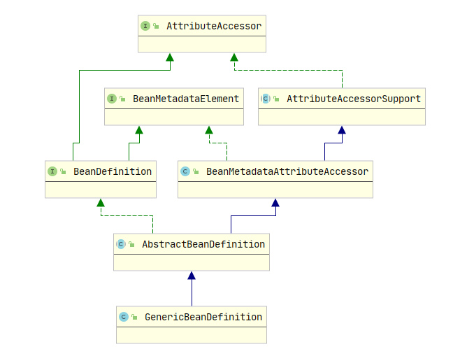
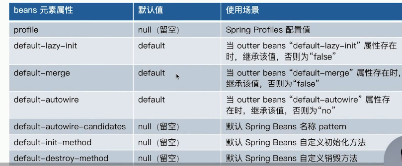
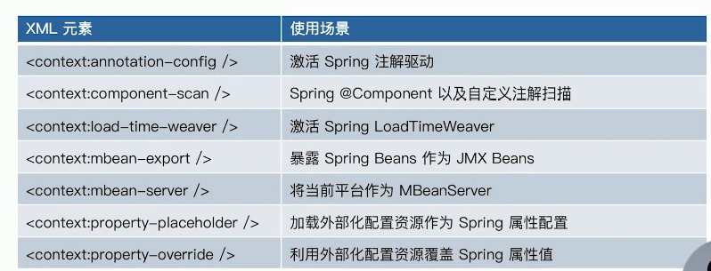

# 10. 配置元信息 Configuration Metadata

## 10.1 Spring 配置元信息

Spring 的配置元信息，可以大致分为 5 个类型：

1. Bean 的配置元信息 - BeanDefinition
2. Bean 的属性元信息 - PropertyValues
3. 容器配置元信息
4. 外部化配置元信息 - PropertySource
5. Profile 元信息 - @Profile 指定活跃的配置文件


> 什么是外部化配置？

即不是来自程序内部的配置，包括 properties，yaml 文件中的配置，--spring.xx ，-Dspring.xx 之类的配置。


## 10.2 Bean 配置元信息

Bean 的配置元信息 BeanDefinition 常见的实现有以下 3 种

1. GenericBeanDefinition：通用型 BeanDefinition，不包含 parent bean 的元信息
2. RootBeanDefinition：无 Parent 的 BeanDefinition，或是合并后的 BeanDefinition
3. AnnotatedBeanDefinition：注解标记的 BeanDefinition
4. ScannedGenericBeanDefinition：@ComponentScan 扫描出来的类


结合 **4.1 章节，9.2 章节，9.4 章节，10.7.1 章节**比较这几种 BeanDefinition 的作用和区别。


配置父子 bean，在 xml 配置 bean 时可以使用`parent`属性指定父 bean，根据这个配置来分析各个 BeanDefinition 的不同

```xml
<bean id="user" class="org.geekbang.ioc.overview.lookup.domain.User">
    <property name="id" value="1"/>
    <property name="name" value="tracccer"/>
</bean>

<bean  class="org.geekbang.ioc.overview.lookup.domain.SuperUser" parent="user" primary="true">
    <property name="address" value="杭州"/>
</bean>
```

在注解配置 bean 时，java 代码中的继承 extend 也相当于指定了父 bean


1. GenericBeanDefinition 表示 Bean 的元信息，但是不包括 Bean parent 中的元信息。上面的两个 Bean user, superUser，开始都会被解析为 GenericBeanDefinition，只不过后者设置了 parent

```java
public class GenericBeanDefinition extends AbstractBeanDefinition {

	private String parentName;

    @Override
    public void setParentName(@Nullable String parentName) {
        this.parentName = parentName;
    }
}
```


2. RootBeanDefinition 表示一个 Bean 完整的元信息，包括 parent bean 中的信息。

user 在经过 MergedBeanDefinition 操作后，直接将 GenericBeanDefinition 修改为 RootBeanDefinition

superUser 在经过 MergedBeanDefinition 操作后，会将其与 parent 中的元信息 BeanDefinition 合并，然后得到 RootBeanDefinition

```java
public class RootBeanDefinition extends AbstractBeanDefinition {
    // 不能设置父bean的名称, 否则会抛出异常
    public void setParentName(@Nullable String parentName) {
        if (parentName != null) {
            throw new IllegalArgumentException("Root bean cannot be changed into a child bean with parent reference");
        }
    }
}
```


3. AnnotatedBeanDefinition 接口的源码如下所示

```java
public interface AnnotatedBeanDefinition extends BeanDefinition {

	// 注解元信息
	AnnotationMetadata getMetadata();
	
	// 获取factory-method方法元信息
	MethodMetadata getFactoryMethodMetadata();
}
```


## 10.3 Bean 属性元信息

- Bean 属性元信息 - PropertyValues，其经典实现是 MutablePropertyValues
- Bean 附加属性 - AttributeAccessor
- Bean 的来源 - BeanMetadataElement


### 1. 使用示例

下面的代码演示了

- 创建 BeanDefinition，并为其设置 beanClass，设置 bean 对象的属性
- 为 BeanDefinition 设置附加属性 attribute
- 为 BeanDefinition 设置来源 source
- 创建创建容器并注册bean
- 自定义BeanPostProcessor，应用前面设置的 attribute 和 source，当 user bean 的来源是前面指定的 source 时，将其name 属性修改为 attribute 的值`小毛`
- 进行依赖查找，查看 user bean 的输出结果

```java
public static void main(String[] args) {
    // 1.创建BeanDefinition, 为bean设置属性
    AbstractBeanDefinition beanDefinition = BeanDefinitionBuilder
        .genericBeanDefinition(User.class)
        .addPropertyValue("name", "tracccer")
        .getBeanDefinition();

    // 2.附加属性, 注意不是bean的属性, 不影响bean的实例化初始化
    beanDefinition.setAttribute("aaa", "小毛");
    // 3.设置当前Bean的来源为当前类, 可以是Class,也可以是Resource
    beanDefinition.setSource(ConfigurationMetadataDemo.class);

    // 4.创建容器并注册bean
    DefaultListableBeanFactory beanFactory = new DefaultListableBeanFactory();
    beanFactory.registerBeanDefinition("user", beanDefinition);

    // 5.beanDefinition的Attribute属性的应用, 在bean初始化后, 对bean做一些修改
    // 应用之后输出bean的name为小毛, 之前为tracccer
    beanFactory.addBeanPostProcessor(new BeanPostProcessor() {
        @Override
        public Object postProcessAfterInitialization(Object bean, String beanName) throws BeansException {
            if ("user".equals(beanName)) {
                BeanDefinition userBd = beanFactory.getBeanDefinition(beanName);
                PropertyValue property = userBd.getPropertyValues().getPropertyValue("name");
                System.out.println("bean 修改之前的属性: name -> " + property.getValue());
                
                // 修改的bean名称必须为user,来源必须是这个类
                if (userBd.getSource().equals(ConfigurationMetadataDemo.class)) {
                    // 获取前面设置的Attribute值
                    String attr = (String) userBd.getAttribute("aaa");
                    User user = (User) bean;
                    user.setName(attr);
                    return user;
                }
                return null;
            }
            return null;
        }
    });

    // 6.依赖查找
    User user = beanFactory.getBean(User.class);
    System.out.println(user);
}
```

输出结果

```
bean 修改之前的属性: name -> tracccer
User{id=null, name='小毛'}
```


### 2. 源码分析

1. **AttributeAccessor** 存储 BeanDefinition 的附加属性

前面演示代码中为 BeanDefinition 设置附加属性 attribute，就是 AttributeAccessor 接口定义的功能

```java
public interface AttributeAccessor {

	void setAttribute(String name, @Nullable Object value);

	@Nullable
	Object getAttribute(String name);

	@Nullable
	Object removeAttribute(String name);

	String[] attributeNames();
}
```

保存附加属性的具体实现在 AttributeAccessorSupport 中，会将附加属性保存到一个 LinkedHashMap 集合当中

```java
public abstract class AttributeAccessorSupport implements AttributeAccessor, Serializable {
	// 用于存储BeanDefinition的附加属性
	private final Map<String, Object> attributes = new LinkedHashMap<>();

	@Override
	public void setAttribute(String name, @Nullable Object value) {
		Assert.notNull(name, "Name must not be null");
		if (value != null) {
			this.attributes.put(name, value);
		}
		else {
			removeAttribute(name);
		}
	}
}
```


2. **BeanMetadataElement** 存储 BeanDefinition 的来源

前面演示代码中，会对 BeanDefinition 设置来源 source，就是 BeanMetadataElement 接口定义的功能

```java
public interface BeanMetadataElement {

	@Nullable
	default Object getSource() {
		return null;
	}
}
```

具体实现在 BeanMetadataAttributeAccessor 中，会将来源 source 保存到字段中

```java
public class BeanMetadataAttributeAccessor extends AttributeAccessorSupport implements BeanMetadataElement {

    // 用于保存BeanDefinition的来源
	@Nullable
	private Object source;
    
	public void setSource(@Nullable Object source) {
		this.source = source;
	}

	@Override
	@Nullable
	public Object getSource() {
		return this.source;
	}
}
```

3. **PropertyValues** 存储 BeanDefinition 的来源

前面演示代码中，会从 BeanDefinition 中获取属性值 propertyValue，就是 PropertyValues 接口定义的功能

```java
public interface PropertyValues extends Iterable<PropertyValue> {
    
    // 使得PropertyValues可以使用foreach循环遍历
    default Iterator<PropertyValue> iterator() {
		return Arrays.asList(getPropertyValues()).iterator();
	}

    // 根据属性名称获取属性值
    PropertyValue getPropertyValue(String propertyName);
}
```

具体实现在 MutablePropertyValues 中，会将 bean 的属性值映射保存到 `List<PropertyValue>` 集合当中

```java
public class MutablePropertyValues implements PropertyValues, Serializable {

    // 保存bean的属性和属性值
	private final List<PropertyValue> propertyValueList;	
	
    // 根据属性名称查找属性值
    public PropertyValue getPropertyValue(String propertyName) {
		for (PropertyValue pv : this.propertyValueList) {
			if (pv.getName().equals(propertyName)) {
				return pv;
			}
		}
		return null;
	}
    // 增加属性
    public MutablePropertyValues addPropertyValue(PropertyValue pv) {
		for (int i = 0; i < this.propertyValueList.size(); i++) {
			PropertyValue currentPv = this.propertyValueList.get(i);
			if (currentPv.getName().equals(pv.getName())) {
				pv = mergeIfRequired(pv, currentPv);
				setPropertyValueAt(pv, i);
				return this;
			}
		}
		this.propertyValueList.add(pv);
		return this;
	}
```





// 补充 PropertyValues 继承了 Iterable，使用了组合模式/迭代器模式

// AttributeAccessorSupport Support的意思是? 参考 Reslover  


## 10.4 容器配置元信息

- Spring XML 配置元信息 - `<beans >` 元素相关，很少使用，熟悉即可



- Spring XML 配置元信息 - 应用上下文相关



- 解析 xml 配置的核心类 - BeanDefinitionParserDelegate

### 1. beans 相关配置

1. 设置全局懒加载`default-lazy-init="true"`

下面的 xml 配置信息中，`<import >`标签引入的 bean 称为 inner beans，`<beans >`标签中配置的 bean 称为  outter beans。

```xml
<beans xmlns="http://www.springframework.org/schema/beans"
       xmlns:xsi="http://www.w3.org/2001/XMLSchema-instance"
       xsi:schemaLocation="http://www.springframework.org/schema/beans
        https://www.springframework.org/schema/beans/spring-beans.xsd"

       default-lazy-init="true">

    <import resource="dependcy-lookup-context.xml"/>

    <bean id="user2" class="org.geekbang.ioc.overview.lookup.domain.User">
        <property name="id" value="1"/>
        <property name="name" value="outter"/>
    </bean>
</beans>
```

上面配置中为将所有 bean 设置懒加载 `default-lazy-init="true"`，然后查看 bean 的元信息，判断配置是否生效

```java
public static void main(String[] args) {
    ClassPathXmlApplicationContext applicationContext = new ClassPathXmlApplicationContext("bean-configuration-metadata.xml");
    ConfigurableListableBeanFactory beanFactory = applicationContext.getBeanFactory();

    // 获取inner beans, 查看是否继承了outter配置的default-lazy-init属性
    BeanDefinition bd = beanFactory.getBeanDefinition("user");
    System.out.println("inner bean 是否为懒加载: " + bd.isLazyInit());
    User user = applicationContext.getBean("user", User.class);
    System.out.println(user);

    // 获取outter beans, 查看utter配置的default-lazy-init属性是否生效
    BeanDefinition bd2 = beanFactory.getBeanDefinition("user2");
    System.out.println("outter bean 是否为懒加载: " + bd2.isLazyInit());
    User user2 = applicationContext.getBean("user2", User.class);
    System.out.println(user2);
}
```

输出结果如下，说明 outter 配置的全局懒加载只对 outter bean 生效

```java
inner bean 是否为懒加载: false
User{id=1, name='tracccer'}

outter bean 是否为懒加载: true
User{id=1, name='outter'}
```

为什么 inner bean 没有继承，与视频中所说的不符？


2. 设置全局 bean 合并 `default-merge="default"`

若 bean 的配置中设置了parent bean，会将两个 bean 的信息进行合并。

经过测试，将其设置为 `false`，并不会影响 bean 的合并


3. 设置全局 bean 初始化方法 `default-init-method="xxx"`

bean 初始化时会调用自身创建的 xx 方法，也就是说这个方法需要在每个 bean 中都定义


### 2. context 相关配置

1. 想要使用 `<context: >`命名空间，必须在 xml 开头引入，后面 context 相关的标签开头都必须加上 `<context:xxx>`，aop 也是一个命名空间，beans 是默认的命名空间，所以前面没加命名空间的xml标签，默认为 beans

```xml
<?xml version="1.0" encoding="UTF-8"?>
<beans xmlns="http://www.springframework.org/schema/beans"
       xmlns:xsi="http://www.w3.org/2001/XMLSchema-instance"
       xmlns:context="http://www.springframework.org/schema/context"
       xsi:schemaLocation="http://www.springframework.org/schema/beans
       http://www.springframework.org/schema/beans/spring-beans.xsd
       http://www.springframework.org/schema/context
       https://www.springframework.org/schema/context/spring-context.xsd">
       
    <context:annotation-config></context:annotation-config>
</beans>
```


```java
BeanDefinitionParserDelegate.java

public static final String DEFAULT_LAZY_INIT_ATTRIBUTE = "default-lazy-init";

public static final String DEFAULT_MERGE_ATTRIBUTE = "default-merge";	

protected void populateDefaults(DocumentDefaultsDefinition defaults, @Nullable DocumentDefaultsDefinition parentDefaults, Element root) {
    // 获取xml中配置的default-lazy-init
    String lazyInit = root.getAttribute(DEFAULT_LAZY_INIT_ATTRIBUTE);
    // 如果是默认值,则继承父配置中的default-lazy-init
    if (isDefaultValue(lazyInit)) {
        lazyInit = (parentDefaults != null ? parentDefaults.getLazyInit() : FALSE_VALUE);
    }
    defaults.setLazyInit(lazyInit);

    String merge = root.getAttribute(DEFAULT_MERGE_ATTRIBUTE);
    if (isDefaultValue(merge)) {
        merge = (parentDefaults != null ? parentDefaults.getMerge() : FALSE_VALUE);
    }
    defaults.setMerge(merge);

    // ....
}

```


## 10.5 XML 装载 Bean 配置元信息


| XML元素          | 使用场景                                      |
| ---------------- | --------------------------------------------- |
| <beans:beans />  | 单个 XML 资源下的多个 Spring Beans 配置       |
| <beans:bean />   | 单个 Spring Bean 的配置 BeanDefinition        |
| <beans:alias />  | 为 Spring Bean 的配置 BeanDefinition 映射别名 |
| <beans:import /> | 加载外部 Spring xml 配置资源                  |


Spring XML 资源 BeanDefinition 解析与注册

- 核心 api - XMLBeanDefinitionReader
  - 资源 - Resource
  - 底层 - BeanDefinitionDocumentReader
    - XML 解析 - Java dom api
    - BeanDefinition 解析 - BeanDefinitionParserDelegate
    - BeanDefinition 注册 - BeanDefinitionRegistry

Spring 解析 xml 配置文件，解析并注册bean，源码如下所示

```java
XmlBeanDefinitionReader.java
// 加载xml资源中的BeanDefinition
protected int doLoadBeanDefinitions(InputSource inputSource, Resource resource)
    throws BeanDefinitionStoreException {

    try {
        // 1.加载xml
        Document doc = doLoadDocument(inputSource, resource);
        // 2.解析xml, 注册bean
        int count = registerBeanDefinitions(doc, resource);
        
        if (logger.isDebugEnabled()) {
            // 打印注册bean的数量
            logger.debug("Loaded " + count + " bean definitions from " + resource);
        }
        return count;
    }
    catch (BeanDefinitionStoreException ex) {
        throw ex;
    }
    catch (SAXParseException ex) {
        // xml格式不合法
        throw new XmlBeanDefinitionStoreException(resource.getDescription(),
             "Line " + ex.getLineNumber() + " in XML document from " + resource + " is invalid", ex);
    }
    // .....省略其他异常
}
```


在 xml 中可以使用 `<beans profile="dev">` 设置活跃的 bean 配置文件

```xml
  <!-- 开发配置 -->
  <beans profile="dev">
    <context:property-placeholder location="classpath:config/application.properties, classpath:config/application-dev.properties"/>
    <import resource="spring-hadoop-dev.xml"/>
  </beans>
 
  <!-- 测试配置 -->
  <beans profile="test">
    <context:property-placeholder location="classpath:config/application.properties, classpath:config/application-prd.properties, classpath:config/application-test.properties"/>
    <import resource="spring-hadoop-test.xml"/>
  </beans>
```

解析 xml 之前首先判断一下，当前的 profile 是否生效，若不生效则退出。若 profile 生效或 profile 不存在，则正常解析 xml，注册 bean

```java

protected void doRegisterBeanDefinitions(Element root) {

    BeanDefinitionParserDelegate parent = this.delegate;
    this.delegate = createDelegate(getReaderContext(), root, parent);

    // 判断xml根节点是否为默认的namespace
    if (this.delegate.isDefaultNamespace(root)) {
        String profileSpec = root.getAttribute(PROFILE_ATTRIBUTE);
        // 判断profile是否存在
        if (StringUtils.hasText(profileSpec)) {
			//....若当前profile不生效,则直接return
        }
    }
	// 解析xml前的钩子方法,空实现
    preProcessXml(root);
    // (重点)解析xml,注册bean
    parseBeanDefinitions(root, this.delegate);
    // 解析xml后的钩子方法,空实现
    postProcessXml(root);

    this.delegate = parent;
}
```


## 10.6 Properties 装载 Bean 配置元信息


## 10.7 Java 注解装载 Bean 配置元信息

| Spring 注解    | 场景                         | 起始版本 |
| -------------- | ---------------------------- | -------- |
| @Repository    | 数据仓储模式注解             | 2.0      |
| @Component     | 通用组件模式注解             | 2.5      |
| @Named         | 类似于 @Component            | 2.5      |
| @Service       | 服务模式注解                 | 2.5      |
| @Controller    | Web 控制器模式注解           | 2.5      |
| @Configuration | 配置类模式注解               | 3.0      |
| @Autowired     | Bean 依赖注入                | 2.5      |
| @Qualifier     | 细粒度的 @Autowired 依赖查找 | 2.5      |
| @Resource      | 类似于 @Autowired            | 2.5      |
| @Inject        | 类似于 @Autowired            | 2.5      |
| @Profile       | 配置化条件装配               | 3.1      |
| @Conditional   | 编程条件装配                 | 4.0      |

- Bean 扫描处理核心类 - ClassPathScanningCandidateComponentProvider

- Bean 依赖注入处理核心类 - AutowiredAnnotationBeanPostProcessor

- Bean 依赖注入处理核心类 - CommonAnnotationBeanPostProcessor

  


### 1. @Component 注解扫描过程源码分析

Spring 应用上下文**初始化**时（注意是初始化，不是启动refresh），会扫描指定的多个包下的所有 @Component 类，源码如下所示

```java
ClassPathBeanDefinitionScanner.java
    
protected Set<BeanDefinitionHolder> doScan(String... basePackages) {
    Assert.notEmpty(basePackages, "At least one base package must be specified");
    
    // 保存扫描到的BeanDefinition
    Set<BeanDefinitionHolder> beanDefinitions = new LinkedHashSet<>();

    // 遍历所有需要扫描的包
    for (String basePackage : basePackages) {
        // 扫描包下所有的@Component类, 见7-2代码块
        Set<BeanDefinition> candidates = findCandidateComponents(basePackage);

        // 遍历所有@Component类
        for (BeanDefinition candidate : candidates) {
            ScopeMetadata scopeMetadata = this.scopeMetadataResolver.resolveScopeMetadata(candidate);
            // 为BeanDefinition设置scope
            candidate.setScope(scopeMetadata.getScopeName());
            // 为BeanDefinition生成名称,为bean首字母小写的类名
            // 见4.2.2源码分析
            String beanName = this.beanNameGenerator.generateBeanName(candidate, this.registry);

            if (candidate instanceof AbstractBeanDefinition) {
                // 为bean的属性设置默认值,包括lazy,autowireMode,initMethodName,destroyMethodName
                postProcessBeanDefinition((AbstractBeanDefinition) candidate, beanName);
            }
            if (candidate instanceof AnnotatedBeanDefinition) {
                // 为bean的属性设置指定的值,值根据注解@Lazy,@Primary,@DependsOn来获取
                AnnotationConfigUtils.processCommonDefinitionAnnotations((AnnotatedBeanDefinition) candidate);
            }
            if (checkCandidate(beanName, candidate)) {
                BeanDefinitionHolder definitionHolder = new BeanDefinitionHolder(candidate, beanName);
                // BeanDefinitionHolder包含两个属性beanName和BeanDefinition
                definitionHolder =
                    AnnotationConfigUtils.applyScopedProxyMode(scopeMetadata, definitionHolder, this.registry);
                // 将BeanDefinitionHolder保存到Set集合中
                beanDefinitions.add(definitionHolder);

                // 注册BeanDefinition到应用上下文
                registerBeanDefinition(definitionHolder, this.registry);
            }
        }
    }
    return beanDefinitions;
}
```

扫描指定包下所有 Class 文件，并过滤出被 @Componet 标记的 Class，然后生成 BeanDefinition 并返回。

```java
ClassPathScanningCandidateComponentProvider.java

// 代码块7-2  扫描指定包下的所有@Component类
private Set<BeanDefinition> scanCandidateComponents(String basePackage) {
    Set<BeanDefinition> candidates = new LinkedHashSet<>();
    try {
        // 获取要扫描的包路径
        String packageSearchPath = ResourcePatternResolver.CLASSPATH_ALL_URL_PREFIX +
            resolveBasePackage(basePackage) + '/' + this.resourcePattern;
        // 获取扫描路径下的所有 class 文件
        Resource[] resources = getResourcePatternResolver().getResources(packageSearchPath);
        boolean traceEnabled = logger.isTraceEnabled();
        boolean debugEnabled = logger.isDebugEnabled();
        
        // 遍历扫描到的所有class文件
        for (Resource resource : resources) {
            if (traceEnabled) {
                logger.trace("Scanning " + resource);
            }
            // class文件可读
            if (resource.isReadable()) {
                try {
                    // 获取class文件的注解元信息
                    MetadataReader metadataReader = getMetadataReaderFactory().getMetadataReader(resource);

                    // 判断该class是否被@Component注解标记
                    if (isCandidateComponent(metadataReader)) {
                        // 生成BeanDefinition
                        ScannedGenericBeanDefinition sbd = new ScannedGenericBeanDefinition(metadataReader);
						// 设置BeanDefinition所属的资源
                        sbd.setResource(resource);
                        // 设置BeanDefinition的来源
                        sbd.setSource(resource);
                        
                        // 判断BeanDefinition是否合规, 如不能是接口抽象类等
                        if (isCandidateComponent(sbd)) {
                            if (debugEnabled) {
                                logger.debug("Identified candidate component class: " + resource);
                            }
                            // 添加到候选BeanDefinition集合中
                            candidates.add(sbd);
                        }
                        else {
                            if (debugEnabled) {
                                logger.debug("Ignored because not a concrete top-level class: " + resource);
                            }
                        }
                    }
                    else {
                        if (traceEnabled) {
                            logger.trace("Ignored because not matching any filter: " + resource);
                        }
                    }
                }
                catch (Throwable ex) {
                    throw new BeanDefinitionStoreException(
                        "Failed to read candidate component class: " + resource, ex);
                }
            }
            else {
                if (traceEnabled) {
                    logger.trace("Ignored because not readable: " + resource);
                }
            }
        }
    }
    catch (IOException ex) {
        throw new BeanDefinitionStoreException("I/O failure during classpath scanning", ex);
    }
    return candidates;
}
```


判断一个 Class 是否是我们想要扫描的 @Component bean，源码如下所示：

```java
// 判断该class是否被@Component注解标记
protected boolean isCandidateComponent(MetadataReader metadataReader) throws IOException {
    // 遍历所有要避免扫描的注解,这里为空
    for (TypeFilter tf : this.excludeFilters) {
        // 若该类中包含指定注解, 则返回false, 表示不是候选bean
        if (tf.match(metadataReader, getMetadataReaderFactory())) {
            return false;
        }
    }
    // 遍历所有要扫描的注解,这里是@Componet,@Named
    for (TypeFilter tf : this.includeFilters) {
        // 判断该类的注解是否为@Componet
        if (tf.match(metadataReader, getMetadataReaderFactory())) {
            return isConditionMatch(metadataReader);
        }
    }
    return false;
}

// 注册过滤器, 包含@Component,@ManagedBean,@Named
protected void registerDefaultFilters() {
    this.includeFilters.add(new AnnotationTypeFilter(Component.class));
    ClassLoader cl = ClassPathScanningCandidateComponentProvider.class.getClassLoader();
    try {
        this.includeFilters.add(new AnnotationTypeFilter(
            ((Class<? extends Annotation>) ClassUtils.forName("javax.annotation.ManagedBean", cl)), false));
        logger.trace("JSR-250 'javax.annotation.ManagedBean' found and supported for component scanning");
    }
    catch (ClassNotFoundException ex) {
    }
    try {
        // JSR-330提出的由JDK实现的一套IOC注解,为了和Spring解耦,和@Inject作用一样
        this.includeFilters.add(new AnnotationTypeFilter(
            ((Class<? extends Annotation>) ClassUtils.forName("javax.inject.Named", cl)), false));
        logger.trace("JSR-330 'javax.inject.Named' annotation found and supported for component scanning");
    }
    catch (ClassNotFoundException ex) {
    }
}
```


### 2. Java 注解配置的 Bean 解析与注册

- 核心 - AnnotatedBeanDefinitionReader
  - 资源 - 被注解标记的 Class 
  - 条件评估 - ConditionEvaluator
  - Bean 范围解析 - ScopeMetadataResolver
  - BeanDefinition 解析
  - BeanDefinition 处理 - AnnotationConfigUtils.processCommonDefinitionAnnotations
  - BeanDefinition 注册 - BeanDefinitionRegistry


AnnotatedBeanDefinitionReader 负责解析 Java 注解标记的 bean，有 4 个关键属性，源码如下所示：

```java
public class AnnotatedBeanDefinitionReader {

    // bean注册中心, 也就是容器
	private final BeanDefinitionRegistry registry;

    // bean名称生成器,注解类型的bean通常不会设置名称
	private BeanNameGenerator beanNameGenerator = AnnotationBeanNameGenerator.INSTANCE;

    // 类的解析方式,接口则使用动态代理,Class则使用Cglib
	private ScopeMetadataResolver scopeMetadataResolver = new AnnotationScopeMetadataResolver();

    // @Conditional条件通过则注册该bean,否则跳过该bean
	private ConditionEvaluator conditionEvaluator;
```


加载注解配置的 bean  包含两个阶段：

1. 解析 bean 得到 BeanDefinition
2. 注册 BeanDefinition 到容器

源码分析，注解类型配置的 bean，会解析 bean 配置元信息得到 BeanDefinition，封装为 BeanDefinitionHolder，最后注册到容器

```java
// 代码块1
AnnotatedBeanDefinitionReader.java

private <T> void doRegisterBean(Class<T> beanClass, @Nullable String name,
                                @Nullable Class<? extends Annotation>[] qualifiers, @Nullable Supplier<T> supplier,
                                @Nullable BeanDefinitionCustomizer[] customizers) {
	// 1.解析bean配置得到BeanDefinition
    // 生成BeanDefinition, 设置beanClass
    AnnotatedGenericBeanDefinition abd = new AnnotatedGenericBeanDefinition(beanClass);
    // 处理@Conditional,若条件不满足,则跳过该bean
    if (this.conditionEvaluator.shouldSkip(abd.getMetadata())) {
        return;
    }
	// 设置回调, 这里为null
    abd.setInstanceSupplier(supplier);
    // 解析并设置scope
    ScopeMetadata scopeMetadata = this.scopeMetadataResolver.resolveScopeMetadata(abd);
    abd.setScope(scopeMetadata.getScopeName());
    
    // 若未设置bean名称, 自动生成
    String beanName = (name != null ? name : this.beanNameGenerator.generateBeanName(abd, this.registry));

    // 解析@Lazy, @Primary, @Value, @DependsOn, @Description, 保存到BeanDefinition
    AnnotationConfigUtils.processCommonDefinitionAnnotations(abd);
    
    // 使用spring api注册bean时,可以在方法参数中手动设置 Lazy,Primary等, 这里跳过
    if (qualifiers != null) {
        for (Class<? extends Annotation> qualifier : qualifiers) {
            if (Primary.class == qualifier) {
                abd.setPrimary(true);
            }
            else if (Lazy.class == qualifier) {
                abd.setLazyInit(true);
            }
            else {
                abd.addQualifier(new AutowireCandidateQualifier(qualifier));
            }
        }
    }
    // 跳过
    if (customizers != null) {
        for (BeanDefinitionCustomizer customizer : customizers) {
            customizer.customize(abd);
        }
    }
	// 封装BeanDefinition到BeanDefinitionHolder
    BeanDefinitionHolder definitionHolder = new BeanDefinitionHolder(abd, beanName);
    // 设置代理模式,若是类,则使用Cglib,若是接口,则使用动态代理,或者不使用代理
    definitionHolder = AnnotationConfigUtils.applyScopedProxyMode(scopeMetadata, definitionHolder, this.registry);
    
    // 2.注册BeanDefinition到容器
    BeanDefinitionReaderUtils.registerBeanDefinition(definitionHolder, this.registry);
}
```


## 10.8 XML 装载 IoC 容器配置元信息


## 10.9 Java 注解装载 IoC 容器配置元信息


@ImpotResource：与 xml 中 `<import >`作用相同，引入其他配置文件

@Import：引入普通类，将其作为 bean 注册到容器；引入配置类，将其下的 bean 注册到容器

@PropertySource：与`<context:property-placeholder >`作用相同，与 @Value 配合使用，使用 properties 文件中的属性


### 1. @Import 的使用

@Import 注解有以下几种使用方式：

1. 引入普通类，将其作为 bean 注册到容器；需要注意的是，使用 @Import 标记的类，必须是配置类
2. 引入配置类，从而让配置类下所有的 bean 都注册到容器。在自定义 starter 时经常使用
3. @Import引入ImportSelector的实现类
4. 引入 ImportBeanDefinitionRegistrar 的实现类


1. 使用 @Import 注解引入普通类，使用 @Import 标记的类，必须是配置类

```java
@Import(User.class)
public class ImportDemo {
    public static void main(String[] args) {
        AnnotationConfigApplicationContext applicationContext = new AnnotationConfigApplicationContext();
        // 将当前类作为配置类注册到容器
        applicationContext.register(ImportDemo.class);

        applicationContext.refresh();
        User user = applicationContext.getBean(User.class);
        System.out.println(user);
    }
}
```

输出结果

```
User{id=null, name='null'}
```

2. 使用 @Import 注解引入配置类，使用 @Import 标记的类，必须是配置类。下面的 UserConfiguration 就是配置类

```java
@Configuration
public class UserConfiguration {

    @Bean("user")
    public User createUser() {
        User user = new User();
        user.setId(9L);
        user.setName("Sombra");
        return user;
    }
}
```

使用 @Import 引入配置类，可以将配置类中定义的 bean 注册到容器

```java
@Import(UserConfiguration.class)
public class ImportDemo2 {
    public static void main(String[] args) {
        AnnotationConfigApplicationContext applicationContext = new AnnotationConfigApplicationContext();
        applicationContext.register(ImportDemo2.class);

        applicationContext.refresh();
        User user = applicationContext.getBean(User.class);
        System.out.println(user);
    }
}
```

输出结果

```
User{id=9, name='Sombra'}
```


3. 更多的 @Import 使用方式，见文章[SpringBoot之@Import注解正确使用方式](https://www.jianshu.com/p/6b2f672e2446)

   

### 2. @ImportResource 的使用

@ImportResource 引入 spring 配置文件，会将其中的bean 注册到容器

```java
@ImportResource("classpath:/dependcy-lookup-context.xml")
public class ImportResourceDemo {
    public static void main(String[] args) {
        AnnotationConfigApplicationContext applicationContext = new AnnotationConfigApplicationContext();
        applicationContext.register(ImportResourceDemo.class);

        applicationContext.refresh();
        Map<String, User> userMap = applicationContext.getBeansOfType(User.class);
        for (Map.Entry<String, User> userEntry : userMap.entrySet()) {
            System.out.println(userEntry.getKey() + ": "+ userEntry.getValue());
        }
    }
}
```

输出结果，表示配置文件中的所有 bean 都被注册到了容器

```
user: User{id=1, name='tracccer'}
org.geekbang.ioc.overview.lookup.domain.SuperUser#0: User{id=1, name='tracccer, address='杭州'}
```


### 3. @PropertyResource 的使用

1. 创建 properties 属性文件

```properties
#student.properties
stu.name=Hammond
```

2. 使用 @PropertySource 引入属性文件，使用 @Value 和填充符来使用 properties 中的属性

```java
@Configuration		// 必须的
@PropertySource("classpath:/student.properties")
public class PropertySourceDemo {

    @Value("${stu.name}")
    private String stuName;

    public static void main(String[] args) {
        AnnotationConfigApplicationContext applicationContext = new AnnotationConfigApplicationContext();
        applicationContext.register(PropertySourceDemo.class);

        applicationContext.refresh();
        PropertySourceDemo demo = applicationContext.getBean(PropertySourceDemo.class);
        System.out.println(demo.stuName);
    }
}
```

输出结果

```
Hammond
```

3. 下面是使用 xml 的方式引入外部化配置，与 @PropertySource + @Value 的作用一样

```xml
<beans>
    <context:property-placeholder location="classpath:/com/acme/jdbc.properties"/>

    <bean class="org.springframework.jdbc.datasource.DriverManagerDataSource">
        <property name="url" value="${jdbc.url}"/>
        <property name="username" value="${jdbc.username}"/>
        <property name="password" value="${jdbc.password}"/>
    </bean>
</beans>
```


### 4. 源码分析

这种方式引入 spring 配置文件，并加载其中的 bean，原理与 10.7 章节 xml 方式装载 bean 配置元信息的方式相同，底层都是调用`XmlBeanDefinitionReader#doLoadBeanDefinitions`来解析 xml 并注册 bean的。具体流程如下所示：

1. 在应用上下文启动时，`invokeBeanFactoryPostProcessors`会回调所有 BeanFactoryPostProcessor
2. 这里只关注 ConfigurationClassPostProcessor，他会加载 @ImportResource 注解引入的 spring xml 配置文件
3. 调用`XmlBeanDefinitionReader#doLoadBeanDefinitions`来解析 xml 并注册 bean，具体与

```java
ConfigurationClassBeanDefinitionReader.java

private void loadBeanDefinitionsForConfigurationClass(
    ConfigurationClass configClass, TrackedConditionEvaluator trackedConditionEvaluator) {

    // 通过@Conditional注解判断该配置类是否需要加载
    if (trackedConditionEvaluator.shouldSkip(configClass)) {
        String beanName = configClass.getBeanName();
        if (StringUtils.hasLength(beanName) && this.registry.containsBeanDefinition(beanName)) {
            this.registry.removeBeanDefinition(beanName);
        }
        this.importRegistry.removeImportingClass(configClass.getMetadata().getClassName());
        return;
    }

    // 将@Import引入的bean,注册到容器
    if (configClass.isImported()) {
        registerBeanDefinitionForImportedConfigurationClass(configClass);
    }
    for (BeanMethod beanMethod : configClass.getBeanMethods()) {
        loadBeanDefinitionsForBeanMethod(beanMethod);
    }
	// 加载@ImportResource引入的xml配置文件,解析并注册bean
    loadBeanDefinitionsFromImportedResources(configClass.getImportedResources());
    // 加载@Import引入的ImportBeanDefinitionRegistrar实现类
    loadBeanDefinitionsFromRegistrars(configClass.getImportBeanDefinitionRegistrars());
}
```

通过以上源码分析，我们也知道了在框架启动时，回调 BeanFactoryPostProcessor 的其中一个作用就是加载和注册配置类。这一点可以结合 Bean 实例化章节深入理解。


## 10.10 Extensible XML authoring 扩展 Spring XML 元素

MyBatis，Dubbo 等整合 Spring 的框架时，就需要使用 Extensible XML authoring 扩展 Spring XML 元素

// 看着挺麻烦的，用到了再学吧


## 10.11 Properties 装载外部化配置

- 注解驱动 - @PropertySource
- Api 编程 - org.springframework.core.env.PropertySource
- xml 配置


Spring 应用上下文有多个属性源，如果属性源中存在同名的属性，则最先加载的属性源优先级最高，最常见的就是`user.name`属性，因为 Spring 会加载系统属性，`user.name`就是当前操作系统用户的名称。

下面的代码，演示了存在多个属性源时，属性优先级的问题，分别使用 @PropertySource 和 spring api 编程的方式引入了外部配置

```java
@Configuration
@PropertySource("classpath:/student.properties")
public class PropertySourceDemo2 {

    @Bean
    public User user(@Value("${user.name}") String name) {
        User user = new User();
        user.setName(name);
        return user;
    }

    public static void main(String[] args) {
        AnnotationConfigApplicationContext applicationContext = new AnnotationConfigApplicationContext();
        applicationContext.register(PropertySourceDemo2.class);

        // 使用spring api创建属性源
        Map<String, Object> map = new HashMap<>();
        map.put("user.name", "firstName");
        MapPropertySource mapPropertySource = new MapPropertySource("first-api-property-source", map);
        // 将该属性源添加到Spring应用上下文环境
        applicationContext.getEnvironment().getPropertySources().addFirst(mapPropertySource);

        applicationContext.refresh();
        User user = applicationContext.getBean(User.class);
        System.out.println(user);

        MutablePropertySources propertySources = applicationContext.getEnvironment().getPropertySources();
        System.out.println("============打印 Spring PropertySource 所有属性源==============");
        for (org.springframework.core.env.PropertySource<?> propertySource : propertySources) {
            System.out.println(propertySource);
        }
    }
}
```

输出结果如下，可以看到注入的`user.name`是我们使用 api 手动自定义的属性源 first-api-property-source。如果删除自定义的属性源，则`user.name`会使用 systemProperties 即系统属性中的`user.name`，即操作系统的当前用户名称，并不会使用 @PropertySource 引入的配置文件中的`user.name`，因为其优先级最低。

```
User{id=null, name='firstName'}
============打印 Spring PropertySource 所有属性源==============
MapPropertySource {name='first-api-property-source'}
PropertiesPropertySource {name='systemProperties'}
SystemEnvironmentPropertySource {name='systemEnvironment'}
ResourcePropertySource {name='class path resource [student.properties]'}
```


@Value 注解的处理过程，在前面章节已经分析过，与 @Autowired 的处理过程一样。

更多属性源的细节见 Environment 章节。


## 10.12 YAML 装载外部化配置

- YamlProcessor
- YamlMapFactoryBean
- YamlPropertieFactoryBean

### 1. XML

1. 创建 yaml 属性文件 student.yml

```yaml
student:
  id: 3
  name: mei
doctor:
  id: 9
  name: anna
```

2. 在 Spring  配置文件中引入 yaml 属性文件，注入的类型本身就可以是 Resource 类型，Spring 会将`classpath:student.yml`自动转换为 Resource 对象，这里是通过 FactoryBean 接口实例化 bean

```xml
<bean id="yamlMap" class="org.springframework.beans.factory.config.YamlMapFactoryBean">
    <property name="resources" value="classpath:student.yml"/>
</bean>
```

3. 创建容器，加载 spring xml 配置文件，会将 yaml 属性文件以 bean 的方式注册到容器

```java
public static void main(String[] args) {
    DefaultListableBeanFactory beanFactory = new DefaultListableBeanFactory();
    XmlBeanDefinitionReader reader = new XmlBeanDefinitionReader(beanFactory);
    reader.loadBeanDefinitions("yaml-property-source-context.xml");

    Map yamlMap = beanFactory.getBean("yamlMap", Map.class);
    System.out.println(yamlMap);
}
```

输出结果，Spring 是将 yaml 文件转换为 map，然后以 bean 的方式注册到容器，因此我们可以通过依赖查找，获取所有 yaml 中设置的属性

```
{student={id=3, name=mei}, doctor={id=9, name=anna}}
```

4. 源码分析，实现了 FactoryBean 和 InitializingBean 接口

```java
public class YamlMapFactoryBean extends YamlProcessor implements FactoryBean<Map<String, Object>>, InitializingBean {

	private Resource[] resources = new Resource[0];

	private Map<String, Object> map;

    // 在bean初始化完成后回调
	@Override
	public void afterPropertiesSet() {
		if (isSingleton()) {
			this.map = createMap();
		}
	}
	// 获取bean,会将yaml中的属性解析为Map集合
	@Override
	public Map<String, Object> getObject() {
		return (this.map != null ? this.map : createMap());
	}

    // 该FactoryBean生产的bean是Map类型
	@Override
	public Class<?> getObjectType() {
		return Map.class;
	}
    
    public void setResources(Resource... resources) {
		this.resources = resources;
	}
}
```


### 2. 注解方式引入 YAML 配置

1. 实现 PropertySourceFactory 接口，重写方法。这个方法的作用是将 yaml Resource 对象转换为外部化配置 PropertiesPropertySource

```java
public class YamlPropertySourceFactory implements PropertySourceFactory {
    @Override
    public PropertySource<?> createPropertySource(String name, EncodedResource resource) throws IOException {
        YamlPropertiesFactoryBean factoryBean = new YamlPropertiesFactoryBean();
        factoryBean.setResources(resource.getResource());
        Properties yamlProperties = factoryBean.getObject();

        return new PropertiesPropertySource(name, yamlProperties);
    }
}
```

2. 使用 @PropertySource 引入 yaml 配置文件，设置 factory 为 YamlPropertySourceFactory.class，表示由该类来将配置的 `classpath:/student.yml`解析为外部化配置

```java
@PropertySource(name = "yamlPropertySource",
        value = "classpath:/student.yml",
        factory = YamlPropertySourceFactory.class)
public class AnnotatedYamlPropertySourceDemo {

    @Bean
    public User user(@Value("${student.name}") String name) {
        User user = new User();
        user.setName(name);
        return user;
    }

    public static void main(String[] args) {
        AnnotationConfigApplicationContext applicationContext = new AnnotationConfigApplicationContext();
        applicationContext.register(AnnotatedYamlPropertySourceDemo.class);

        applicationContext.refresh();
        User user = applicationContext.getBean(User.class);
        System.out.println(user);
    }
}
```

输出结果

```
User{id=null, name='mei'}
```


// 原理并没有搞清楚, factorybean 的作用又是什么呢?


## 10.13 面试题

1. Spring 内建 XML Schema 常见有哪些？


2. Spring 配置元信息具体有哪些？

   答：

3. Yaml 属性文件如何生效？

4. Java 注解装载 IoC 容器配置元信息有几种方式？

5. @ComponentScan 扫描过程


# 11. 资源管理 Resources

> Resource 都包括哪些东西 ？

基本上可以理解为项目中 `resources` 目录下的所有内容

1. Spring 配置 xml 文件
2. 外部化配置，properties 文件或 yaml 文件
3. Class 文件，被 @Component 标记的 Class 文件 ？算吗


## 11.1 引入动机

> 为什么 Spring 不使用 Java 标准资源管理，而选择重新发明轮子？

- Java 标准资源管理虽然强大，但是扩展复杂，资源存储的方式并不统一
- Spring 要自立门户
- Spring 三个原则，抄，超，潮；抄 java，也要超越 java，还要使用新潮的技术和思想


## 11.2 Java 标准资源管理


## 11.3 Spring 资源接口


```java
public interface Resource extends InputStreamSource {

	boolean exists();

	default boolean isReadable() {
		return exists();
	}

	default boolean isOpen() {
		return false;
	}

	default boolean isFile() {
		return false;
	}

	URL getURL() throws IOException;

	URI getURI() throws IOException;

	File getFile() throws IOException;
}
```


## 11.4 Spring 内建 Resource 实现

Spring 内建 Resource 实现，这些类都是 Resource 接口的实现类：


## 11.5 Spring 资源加载器

1. 使用 FileSystemResource 读取当前 class 文件内容，代码如下所示：

```java
/**
 * 读取当前class文件内容
 *
 * @author mao  2021/5/21 1:49
 */
public class EncodeFileSystemResourceDemo {
    public static void main(String[] args) throws IOException {
        String path = System.getProperty("user.dir")
                + "\\thinking-in-spring\\resource\\src\\main\\java\\org\\geekbang\\resource\\EncodeFileSystemResourceDemo.java";
        System.out.println(path);

        FileSystemResource fileSystemResource = new FileSystemResource(path);
        EncodedResource encodedResource = new EncodedResource(fileSystemResource, "UTF-8");
        Reader reader = encodedResource.getReader();
        System.out.println(IOUtils.toString(reader));
    }
}
```

输出结果，输出当前 class 文件的路径，输出 class 文件的内容

```
D:\MyProjects\idea\think-in-spring\thinking-in-spring\resource\src\main\java\org\geekbang\resource\EncodeFileSystemResourceDemo.java

package org.geekbang.resource;

import com.sun.javafx.runtime.SystemProperties;
import org.apache.commons.io.IOUtils;
import org.springframework.core.io.FileSystemResource;
import org.springframework.core.io.support.EncodedResource;


import java.io.IOException;
import java.io.Reader;

/**
 * 读取当前class文件内容
 * 
 * @author mao  2021/5/21 1:49
 */
public class EncodeFileSystemResourceDemo {
    public static void main(String[] args) throws IOException {
        String path = System.getProperty("user.dir")
                + "\\thinking-in-spring\\resource\\src\\main\\java\\org\\geekbang\\resource\\EncodeFileSystemResourceDemo.java";
        System.out.println(path);

        FileSystemResource fileSystemResource = new FileSystemResource(path);
        EncodedResource encodedResource = new EncodedResource(fileSystemResource, "UTF-8");
        try (Reader reader = encodedResource.getReader()) {
            System.out.println(IOUtils.toString(reader));
        }
    }
}
```


2. 使用 FileSystemResourceLoader 读取当前 class 文件内容，代码如下所示：

```java
public static void main(String[] args) throws IOException {
    String path = System.getProperty("user.dir")
        + "\\thinking-in-spring\\resource\\src\\main\\java\\org\\geekbang\\resource\\EncodeFileSystemResourceDemo.java";
    System.out.println(path);

    FileSystemResourceLoader resourceLoader = new FileSystemResourceLoader();
    // 本质是创建了一个 ClassPathContextResource
    Resource resource = resourceLoader.getResource(path);

    EncodedResource encodedResource = new EncodedResource(resource, "UTF-8");
    try (Reader reader = encodedResource.getReader()) {
        System.out.println(IOUtils.toString(reader));
    }
}
```

输出结果

```
D:\MyProjects\idea\think-in-spring\thinking-in-spring\resource\src\main\java\org\geekbang\resource\EncodeFileSystemResourceDemo.java
package org.geekbang.resource;

import org.apache.commons.io.IOUtils;
import org.springframework.core.io.FileSystemResource;
import org.springframework.core.io.support.EncodedResource;


import java.io.IOException;
import java.io.Reader;

/**
 * 读取当前class文件内容
 * {@link FileSystemResource} 示例
 * @author mao  2021/5/21 1:49
 */
public class EncodeFileSystemResourceDemo {
    public static void main(String[] args) throws IOException {
        String path = System.getProperty("user.dir")
                + "\\thinking-in-spring\\resource\\src\\main\\java\\org\\geekbang\\resource\\EncodeFileSystemResourceDemo.java";
        System.out.println(path);

        FileSystemResource fileSystemResource = new FileSystemResource(path);
        EncodedResource encodedResource = new EncodedResource(fileSystemResource, "UTF-8");
        Reader reader = encodedResource.getReader();
        System.out.println(IOUtils.toString(reader));
    }
}
```


## 11.6 Spring 通配路径资源加载器

- 通配路径解析
  - 接口 - ResourcePatternResolver
  - 实现类 - PathMatchingResourcePatternResolver
- 路径匹配
  - 接口 - 
  - 实现 - AntPathMatcher

源码如下

```java
public interface ResourcePatternResolver extends ResourceLoader {

	String CLASSPATH_ALL_URL_PREFIX = "classpath*:";

	Resource[] getResources(String locationPattern) throws IOException;
}
```


```java
public class PathMatchingResourcePatternResolver implements ResourcePatternResolver {
	private final ResourceLoader resourceLoader;

	private PathMatcher pathMatcher = new AntPathMatcher();
    // 底层还是ResourceLoader来获取资源
    public Resource getResource(String location) {
		return getResourceLoader().getResource(location);
	}
	public Resource[] getResources(String locationPattern) throws IOException {
		Assert.notNull(locationPattern, "Location pattern must not be null");

        // 资源路径是 classpath*: 开头的
		if (locationPattern.startsWith(CLASSPATH_ALL_URL_PREFIX)) {
            // 如果路径匹配,则去查找资源
			if (getPathMatcher().isPattern(locationPattern.substring(CLASSPATH_ALL_URL_PREFIX.length()))) {
				return findPathMatchingResources(locationPattern);
			}
			else {
				return findAllClassPathResources(locationPattern.substring(CLASSPATH_ALL_URL_PREFIX.length()));
			}
		}
		else {
			int prefixEnd = (locationPattern.startsWith("war:") ? locationPattern.indexOf("*/") + 1 :
					locationPattern.indexOf(':') + 1);
			if (getPathMatcher().isPattern(locationPattern.substring(prefixEnd))) {
				return findPathMatchingResources(locationPattern);
			}
			else {
				return new Resource[] {getResourceLoader().getResource(locationPattern)};
			}
		}
	}
}
```


## 11.7 Spring 通配路径资源扩展


## 11.8 依赖注入 Resource

- 基于 @Value 注入 - `@Value("classpath:/...")`
- 不能通过 @Autowired 注入，Spring 内建单例对象并没有 Resource，不要记混了

```java
public class InjectingResourceDemo {

    @Value("classpath:/hello.properties")
    private Resource helloResource;

    public static void main(String[] args) throws IOException {
        AnnotationConfigApplicationContext applicationContext = new AnnotationConfigApplicationContext();
        applicationContext.register(InjectingResourceDemo.class);

        applicationContext.refresh();
        InjectingResourceDemo bean = applicationContext.getBean(InjectingResourceDemo.class);
        System.out.println(bean.helloResource);
        
        EncodedResource encodedResource = new EncodedResource(bean.helloResource);
        try (Reader reader = encodedResource.getReader()) {
            System.out.println(IOUtils.toString(reader));
        }
    }
}
```

输出结果

```
class path resource [hello.properties]
name=tracccer
```


## 11.9 依赖注入 ResourceLoader

- @Autowired 注入 ResourceLoader
- 注入 ApplicationContext 作为 ResourceLoader
- 实现 ResourceLoaderAware 回调方法


1. 下面的代码演示了上述三种方式，依赖注入 ResourceLoader

```java
public class InjectingResourceLoaderDemo implements ResourceLoaderAware {

    public static final String LOCATION = "classpath:/hello.properties";

    // 1.@Autowired 注入 ResourceLoader
    @Autowired
    private ResourceLoader resourceLoader;

    // 2.注入 ApplicationContext 作为 ResourceLoader
    @Autowired
    private ApplicationContext applicationContext;

    public static void main(String[] args) throws IOException {
        AnnotationConfigApplicationContext applicationContext = new AnnotationConfigApplicationContext();
        applicationContext.register(InjectingResourceLoaderDemo.class);

        applicationContext.refresh();
        InjectingResourceLoaderDemo bean = applicationContext.getBean(InjectingResourceLoaderDemo.class);
        System.out.println(bean.resourceLoader);

        // 获取@Autowired注入的resourceLoader
        Resource resource = bean.resourceLoader.getResource(LOCATION);
        getContent(resource);

        // 通过@Autowired注入的ApplicationContext,获取resourceLoader
        Resource resource1 = bean.resourceLoader.getResource(LOCATION);
        getContent(resource1);
        
        // 二者其实是同一个对象
        System.out.println(bean.resourceLoader == bean.applicationContext);
    }

    // 3. 实现ResourceLoaderAware回调方法, 加载resource, 打印内容
    @Override
    public void setResourceLoader(ResourceLoader resourceLoader) {
        Resource resource1 = resourceLoader.getResource(LOCATION);
        try {
            getContent(resource1);
        } catch (IOException e) {
            e.printStackTrace();
        }
    }

    // 打印资源的内容
    private static void getContent(Resource resource) throws IOException {
        EncodedResource encodedResource = new EncodedResource(resource);
        try (Reader reader = encodedResource.getReader()) {
            System.out.println(IOUtils.toString(reader));
        }
    }
}
```

输出结果

```
name=tracccer
org.springframework.context.annotation.AnnotationConfigApplicationContext@1a6c5a9e, started on Fri May 21 03:04:55 CST 2021
name=tracccer
name=tracccer
true
```


2. Spring 框架在应用上下文启动时`refresh()`会调用下面这个方法，注册 4 个非Spring容器管理的对象到容器，其中就包括我们上面使用的 ResourceLoader 和 ApplicationContext，源码如下：

```java
AbstractApplicationContext.java

protected void prepareBeanFactory(ConfigurableListableBeanFactory beanFactory) {
	// 注册ApplicationContextAwareProcessor,用于在初始化前回调各个Aware
    beanFactory.addBeanPostProcessor(new ApplicationContextAwareProcessor(this));
    
    // 注册非容器管理对象ResolvableDependency, this是当前应用上下文	
    // 可以看到后3个其实是同一个对象this
	beanFactory.registerResolvableDependency(BeanFactory.class, beanFactory);
    beanFactory.registerResolvableDependency(ResourceLoader.class, this);
    beanFactory.registerResolvableDependency(ApplicationEventPublisher.class, this);
    beanFactory.registerResolvableDependency(ApplicationContext.class, this);
}

DefaultListableBeanFactory.java
    
// 注册ResolvableDependency, 将其保存到resolvableDependencies中
public void registerResolvableDependency(Class<?> dependencyType, @Nullable Object autowiredValue) {
    Assert.notNull(dependencyType, "Dependency type must not be null");
    if (autowiredValue != null) {
        this.resolvableDependencies.put(dependencyType, autowiredValue);
    }
}
```

至于依赖查找是如果找到 ResourceLoader 对象的，见 7.2.3 章节 依赖注入的来源


3. ApplicationContextAwareProcessor 实现了 BeanPostProcessor#postProcessBeforeInitialization 方法，该方法会在 bean 初始化前被回调，该方法会对调用所有 Aware 接口的实现类，也就包括我们前面示例代码中实现的 ResourceLoaderAware 接口。

```java
ApplicationContextAwareProcessor.java

@Override
public Object postProcessBeforeInitialization(Object bean, String beanName) throws BeansException {
    if (!(bean instanceof EnvironmentAware || bean instanceof EmbeddedValueResolverAware ||
          bean instanceof ResourceLoaderAware || bean instanceof ApplicationEventPublisherAware ||
          bean instanceof MessageSourceAware || bean instanceof ApplicationContextAware)){
        return bean;
    }
    // 调用Aware接口，见下个方法
    invokeAwareInterfaces(bean);
    return bean;
}

private void invokeAwareInterfaces(Object bean) {
    if (bean instanceof EnvironmentAware) {
        ((EnvironmentAware) bean).setEnvironment(this.applicationContext.getEnvironment());
    }
	// 回调ResourceLoaderAware的setResourceLoader方法
    // 也就是我们重写的方法
    if (bean instanceof ResourceLoaderAware) {
        ((ResourceLoaderAware) bean).setResourceLoader(this.applicationContext);
    }
}
```

这也恰好说明了，示例代码中，最先输出的是实现 ResourceLoaderAware 接口的方式依赖注入的 Resource，因为是在 bean 初始化前执行的。


## 11.10 面试题

1. Spring 配置资源中有哪些常见类型？

   1. xml 资源
      - BeanDefinition 配置资源
   2. properties 资源
      - 外部化配置 properties 
      - Spring Handler 实现类资源文件 - spring.handlers
      - Spring Schema 资源映射文件 - spring.schemas
   3. yaml 资源
      - 外部化配置 yaml 

2. Resource 与 ResourceLoader 的区别

   

3. 依赖注入 Resource 和 ResourceLoader 有哪几种方式？


